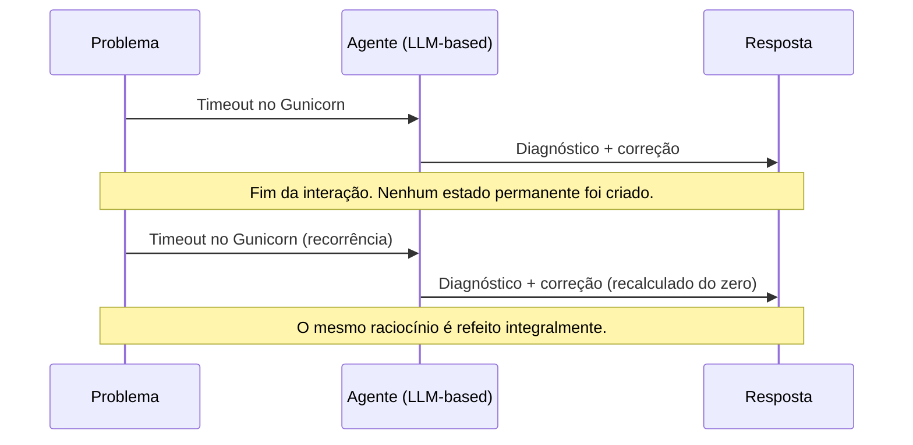
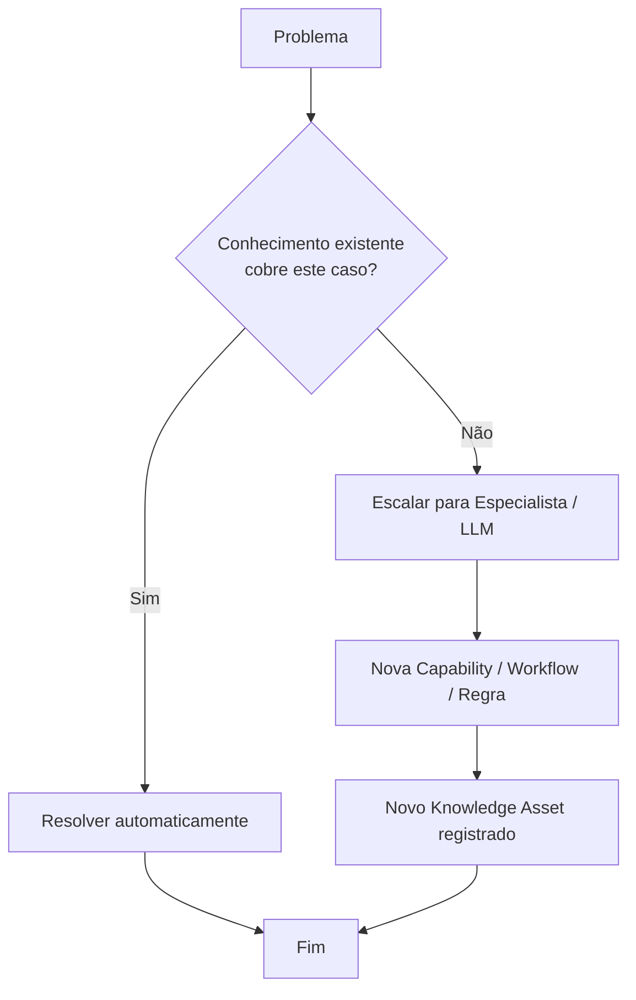

# Capítulo 1 — O Problema

**Volume:** I — Foundation
**Status da especificação:** v0.1 (Draft)

---

## 1.0 Objetivo do capítulo

Estabelecer, sem ambiguidade, qual problema o Batman OS resolve e por que esse problema não é resolvido pela geração atual de agentes de IA. Este capítulo é a justificativa de existência de todo o resto da obra: nenhuma decisão arquitetural nos próximos 29 capítulos deve contradizer o diagnóstico feito aqui.

## 1.1 Motivação

Nos últimos anos, uma categoria de produto se popularizou sob o nome de "AI Agents": Cursor, Claude Code, Devin, OpenHands, GitHub Copilot, entre outros. Todos compartilham uma característica arquitetural comum, não uma limitação incidental, mas uma escolha de design:

> **O raciocínio depende continuamente de um modelo de linguagem.**

Isso não é um defeito de implementação — é a própria proposta de valor desses produtos: flexibilidade máxima, generalização máxima, custo de raciocínio pago a cada execução. Para tarefas exploratórias, ad-hoc, ou de baixa criticidade, essa troca é aceitável e até desejável.

O Batman OS parte da premissa de que, para **engenharia crítica e recorrente**, essa mesma troca se torna um passivo.

## 1.2 O problema em detalhe

### 1.2.1 Custo variável e imprevisível

Cada execução tem custo de inferência. Não há economia de escala: resolver o mesmo problema 1.000 vezes custa aproximadamente 1.000 vezes o custo de resolvê-lo uma vez, menos algum cache incidental.

### 1.2.2 Comportamento não determinístico

A mesma entrada pode produzir saídas diferentes em execuções diferentes. Isso é aceitável em contextos criativos; é inaceitável em pipelines de decisão que precisam ser auditados, replicados ou certificados.

### 1.2.3 Baixa auditabilidade

Quando um agente decide algo com base em um modelo de linguagem, a "explicação" da decisão é, na melhor das hipóteses, uma racionalização pós-hoc gerada pelo próprio modelo — não um traço causal verificável.

### 1.2.4 Ausência de acúmulo de conhecimento

Este é o ponto central do capítulo e a tese fundadora do Batman OS.



O conhecimento não permanece no sistema. Ele é **alugado** a cada execução, nunca **adquirido**.

## 1.3 O desperdício sistêmico

Considere o padrão mais comum em times de engenharia hoje:

1. Um incidente ocorre (ex.: timeout de Gunicorn sob carga).
2. Um especialista investiga.
3. A causa raiz é encontrada.
4. A correção é aplicada.
5. O conhecimento gerado morre em um canal do Slack, um ticket fechado, ou na memória de uma pessoa.

Nenhum software aprendeu com o incidente. Da próxima vez que o mesmo padrão ocorrer — mesmo que seja outro serviço, outro time, ou até a mesma pessoa seis meses depois — o ciclo de investigação é refeito do zero.

## 1.4 A hipótese Batman

> **Hipótese central:** todo problema recorrente pode e deve tornar-se patrimônio permanente do sistema, de forma que a mesma classe de problema nunca precise de duas intervenções humanas independentes.

Isso reformula o fluxo de resolução de problemas de:

```
Problema → Humano → Solução → (conhecimento descartado)
```

para:



A diferença estrutural não é "ter mais regras". É que **toda intervenção externa (humana ou de LLM) é, por definição arquitetural, um evento de aquisição de conhecimento** — nunca um evento isolado e descartável.

## 1.5 O que o Batman OS não é

Para evitar ambiguidade nos capítulos seguintes, fixamos aqui o que o Batman **não** é:

- **Não é** um chatbot ou assistente conversacional.
- **Não é** um agente cujo núcleo de raciocínio é um LLM.
- **Não é** um motor de regras estático e imutável.
- **Não é** um substituto para especialistas humanos — é um mecanismo para que o trabalho desses especialistas nunca precise ser refeito.

## 1.6 O que o Batman OS é

> O Batman OS é um **Sistema Operacional Cognitivo Determinístico**, capaz de planejar, decidir, operar, aprender e evoluir a partir de conhecimento estruturado, tratando humanos e modelos de linguagem como **mecanismos de aquisição de novo conhecimento** — nunca como dependências operacionais contínuas.

Esta frase é normativa: qualquer componente descrito nos volumes seguintes que violar esta definição está, por construção, fora de especificação e exige uma ADR para justificar a excepcionalidade.

## 1.7 Status da Implementação

| Já existe | Precisa refatorar | Ainda não existe |
|---|---|---|
| Diagnóstico do problema documentado nesta especificação | — | Nenhum componente de software ainda; este capítulo é puramente conceitual/fundacional |

---

**Próximo capítulo:** [Capítulo 2 — A Filosofia Batman](./02-philosophy.md)
