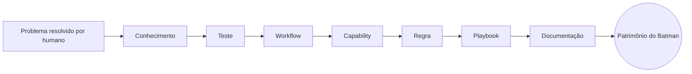

# Capítulo 2 — A Filosofia Batman

**Volume:** I — Foundation
**Status da especificação:** v0.1 (Draft)

---

## 2.0 Objetivo do capítulo

Traduzir o diagnóstico do Capítulo 1 em uma postura filosófica coerente, que sirva de critério de decisão para toda escolha arquitetural futura. Onde o Capítulo 1 respondeu "qual problema existe", este capítulo responde "que tipo de sistema resolve esse problema, e por quê".

## 2.1 A frase fundadora

> "Um sistema inteligente não é aquele que responde todas as perguntas. É aquele que reduz continuamente a quantidade de perguntas que precisam ser feitas."

Esta frase abre a obra porque estabelece a métrica de sucesso do Batman OS: não é *qualidade média da resposta*, é **taxa de redução de perguntas recorrentes ao longo do tempo**. Um sistema que responde brilhantemente à mesma pergunta 10.000 vezes é, sob esta filosofia, um sistema que falhou.

## 2.2 Operar, não conversar

O Batman não existe para conversar. O Batman existe para **operar**.

Isso tem consequências de design concretas, detalhadas nos volumes de Kernel e Runtime, mas que introduzimos aqui como princípio:

- A interface primária do Batman não é um chat — é uma **Missão** (ver Capítulo 3).
- Toda entrada no sistema é tratada como uma unidade de trabalho a ser planejada, decidida e executada, não como um turno de diálogo.
- A qualidade de uma resposta em linguagem natural é irrelevante se a ação subjacente não foi executada corretamente, de forma auditável e repetível.

## 2.3 Conhecimento como patrimônio, não como cache

Sistemas convencionais tratam conhecimento como cache: útil, descartável, reconstituível a qualquer momento a partir da fonte (o LLM, o especialista). O Batman trata conhecimento como **patrimônio**: um ativo que, uma vez adquirido, nunca deveria precisar ser readquirido pela mesma razão duas vezes.

A partir do momento em que um problema é resolvido, o conhecimento gerado **deixa de pertencer à pessoa que o resolveu** e passa a pertencer ao sistema. Esse é o mecanismo pelo qual o Batman se torna mais capaz com o tempo, independentemente de rotatividade de equipe.

## 2.4 Determinismo como valor, não como limitação

Em contextos de produto voltados a criatividade e exploração, determinismo é frequentemente visto como limitação. No contexto de engenharia crítica que o Batman OS endereça, determinismo é o próprio valor entregue: a mesma entrada produz a mesma saída, sempre, e essa saída pode ser auditada, testada e certificada como qualquer outro software.

Isso não significa ausência de aprendizado ou evolução — significa que **a evolução do comportamento do sistema é ela própria um evento governado, versionado e auditável** (ver Volume VI — Learning Engine e Volume VII — Governance), e não uma variação estocástica de uma execução para outra.

## 2.5 Hierarquia de recursos: do determinístico ao probabilístico

A filosofia Batman estabelece uma ordem estrita de preferência de mecanismos para resolver qualquer problema:

1. **Conhecimento estruturado existente** (regras, Capabilities, Playbooks) — custo ~zero, determinístico.
2. **Escalação para especialista humano** — custo alto, mas gera patrimônio permanente.
3. **Escalação para modelo de linguagem** — usado apenas quando as duas opções anteriores se esgotam, e sempre com o objetivo de produzir conhecimento reutilizável, não apenas uma resposta pontual.

Esta hierarquia é formalizada nos Princípios 5 e 6 do Capítulo 3 (*Human Last*, *LLM Last*) e será o critério de decisão do Decision Engine (Volume II).

## 2.6 Por que isso não é "só automação"

Automação tradicional resolve tarefas repetitivas com scripts fixos. O Batman resolve um problema de ordem superior: **a curva de conhecimento organizacional em si**. A diferença é que scripts de automação não decidem quando escalar, não aprendem novos casos, e não transformam intervenções humanas em capacidade permanente do sistema. O Batman formaliza esse ciclo como parte do seu núcleo, não como um processo externo de "documentação".

## 2.7 Status da Implementação

| Já existe | Precisa refatorar | Ainda não existe |
|---|---|---|
| Postura filosófica documentada e aceita como base normativa | — | Todo o maquinário que operacionaliza esta filosofia (Decision Engine, Learning Engine, Governance Engine) — especificado nos volumes II, VI e VII |

---

**Capítulo anterior:** [Capítulo 1 — O Problema](./01-introduction.md)
**Próximo capítulo:** [Capítulo 3 — Princípios Fundamentais](./03-principles.md)
