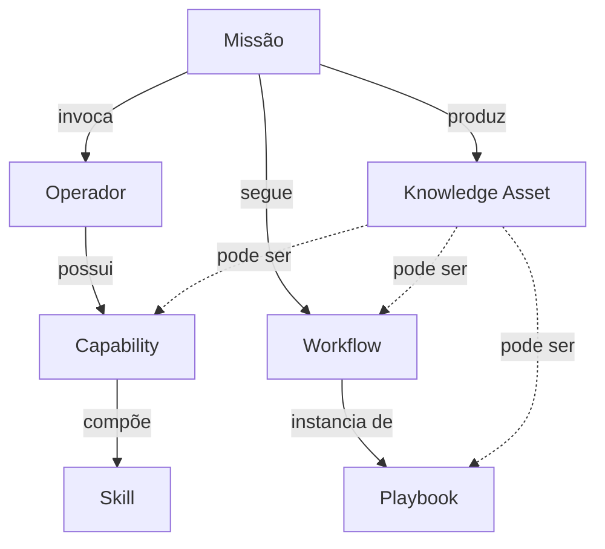
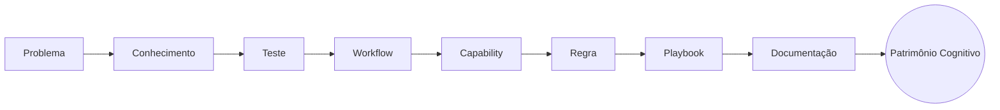

# Capítulo 4 — Definições Oficiais (Glossário)

**Volume:** I — Foundation
**Status da especificação:** v0.1 (Draft)

---

## 4.0 Objetivo do capítulo

Fixar o vocabulário oficial e obrigatório do Batman OS. A partir deste capítulo, nenhum termo abaixo pode ser usado com sentido diferente em qualquer outro capítulo desta obra ou em qualquer artefato de código do sistema. Divergências de nomenclatura no código legado devem ser tratadas como dívida técnica a corrigir, não como sinônimo válido.

## 4.1 Missão

**Definição:** a maior unidade operacional do Batman. Toda atividade do sistema existe dentro do contexto de uma Missão — não há execução "solta" (ver Princípio 4, Mission Driven).

**Exemplos:**
- Preparar Deploy
- Analisar Pull Request
- Investigar Incidente
- Cancelar Benefício
- Provisionar Ambiente

**Propriedades formais** (contrato completo especificado no Volume II — Mission Runtime):
- Possui identificador único, imutável.
- Possui estado (ver máquina de estados no Volume II, Capítulo 6).
- Referencia um ou mais Operadores.
- Produz um resultado auditável e, potencialmente, Knowledge Assets.

## 4.2 Capability

**Definição:** uma capacidade permanente do sistema — algo que o Batman **sabe fazer** de forma determinística e reutilizável.

**Exemplos:**
- Detectar SQL Injection
- Executar Rollback
- Consultar SponsorApp
- Validar JWT
- Gerar Relatório

**Distinção crítica com Missão:** uma Missão é uma *instância de trabalho*; uma Capability é uma *função permanente do catálogo do sistema*, invocada por uma ou mais Missões.

## 4.3 Skill

**Definição:** conhecimento especializado, tipicamente técnico ou de domínio, utilizado internamente por uma Capability para executar sua função.

**Exemplos:**
- Regex
- AST
- Semgrep
- Docker
- Git
- Kubernetes
- Filesystem
- REST
- SQL

**Distinção crítica com Capability:** uma Skill não é invocada diretamente por uma Missão — ela é um insumo interno de uma ou mais Capabilities. Uma Capability pode compor múltiplas Skills.

## 4.4 Operador

**Definição:** o executor especializado do Batman — a entidade que efetivamente realiza o trabalho dentro de uma Missão.

**Um Operador possui:**
- Capacidades (Capabilities associadas)
- Ferramentas (Tools)
- Memória Operacional
- Estado
- Permissões

*(Detalhamento completo do contrato de Operador no Volume IV — Capabilities, Capítulo 16.)*

## 4.5 Workflow

**Definição:** uma sequência determinística de execução — os passos concretos, ordenados e com transições explícitas, que uma Missão percorre.

**Distinção com Playbook:** um Workflow é a sequência *executada de fato*; um Playbook (abaixo) é o *padrão reutilizável* do qual Workflows concretos derivam.

## 4.6 Playbook

**Definição:** uma estratégia operacional reutilizável — o "molde" a partir do qual Workflows são instanciados para resolver uma classe de problema.

## 4.7 Knowledge Asset

**Definição:** qualquer artefato que aumente permanentemente o conhecimento do Batman. É o conceito guarda-chuva que operacionaliza o Princípio 7 (Learn Forever).

**Exemplos de Knowledge Asset:**
- Regra
- Teste
- Workflow
- Capability
- Skill
- Evidência
- ADR
- Playbook

**Regra geral:** toda intervenção humana ou de LLM que resolve um problema deve produzir ao menos um Knowledge Asset novo ou atualizado (ver Capítulo 3, Princípio 7).

## 4.8 Relação entre os conceitos



## 4.9 Métricas oficiais definidas neste volume

Dois conceitos métricos são introduzidos formalmente na Fundação e detalhados no Volume VII — Governance:

### 4.9.1 Cognitive Debt

Mede o quanto o Batman ainda depende de inteligência externa (humana ou de LLM) para resolver missões, em oposição a resolvê-las autonomamente com conhecimento já adquirido.

```
Cognitive Debt (exemplo ilustrativo)
─────────────────────────────────────
Missões totais:                 12.483
  Resolvidas autonomamente:     12.177  (97,55%)
  Precisaram de humano:            281  ( 2,25%)
  Precisaram de LLM:                25  ( 0,20%)
```

**Interpretação:** Cognitive Debt é um KPI estratégico cujo objetivo estrutural é convergir para zero ao longo do tempo — nunca "resolvido de uma vez", conforme discutido na seção 3.13 do Capítulo 3.

### 4.9.2 Patrimônio Cognitivo

O conjunto acumulado de Knowledge Assets do sistema — a materialização, ao longo do tempo, do Princípio 7 (Learn Forever). É o que torna o Batman mais capaz sem depender de crescimento de equipe ou de gasto recorrente com LLMs.



## 4.10 Status da Implementação

| Já existe | Precisa refatorar | Ainda não existe |
|---|---|---|
| Vocabulário oficial fixado e consistente com Capítulos 1–3; IDs/Evidence/KnowledgeAssetRef implementados em `src/batman_os/foundation/types.py` | Nomenclatura em sistemas correlatos já existentes (ex.: Batman Observe, SuperMan) deve ser auditada contra este glossário em um capítulo de migração, a ser incluído no Volume IX | Catálogo real de Capabilities/Skills/Playbooks *povoado* (o framework para catalogá-los existe desde o Volume IV; migrar as 270 regras do Batman atual é trabalho futuro, fora desta construção) |

---

**Capítulo anterior:** [Capítulo 3 — Princípios Fundamentais](./03-principles.md)
**Próxima seção:** [ADR-0001 — Batman será um Sistema Cognitivo Determinístico](./ADR/ADR-0001-deterministic-cognitive-system.md)
**Próximo volume:** Volume II — Kernel Architecture (a iniciar)
