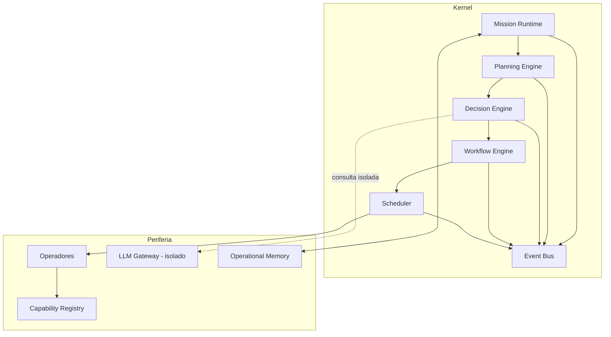

# Capítulo 5 — Kernel: Visão Geral e Responsabilidades

**Volume:** II — Kernel Architecture
**Status da especificação:** v0.1 (Draft)
**Depende de:** Volume I (Foundation) — em particular Princípios 2, 3, 4, 9

---

## 5.0 Objetivo do capítulo

Definir o que é o Kernel do Batman OS, suas fronteiras de responsabilidade, e o contrato que ele expõe para todo o resto do sistema. Este capítulo não implementa nada — estabelece o mapa que os Capítulos 6–10 preenchem.

## 5.1 Motivação

O Capítulo 1 estabeleceu que o Batman não pode depender continuamente de um LLM para operar. Isso exige um núcleo determinístico capaz de: receber uma intenção de trabalho, transformá-la em um plano executável, decidir entre alternativas com base em conhecimento existente, executar esse plano, e emitir eventos auditáveis de tudo o que aconteceu. Esse núcleo é o **Kernel**.

## 5.2 Problema que o Kernel resolve

Sem um Kernel bem definido, cada Capability ou Operador reimplementaria, de forma inconsistente, os mesmos mecanismos: como uma missão nasce, como é decidida, como falha é tratada, como o estado é persistido. Isso violaria Determinism First (Princípio 2) e Full Governance (Princípio 9), porque cada implementação divergente seria uma fonte distinta de comportamento não auditável.

## 5.3 Princípios aplicados

| Princípio | Aplicação no Kernel |
|---|---|
| Determinism First | O Kernel nunca invoca um LLM diretamente; toda não-determinismo fica isolado em Capabilities periféricas (ver Cap. 8, Decision Engine) |
| Evidence First | Todo componente do Kernel emite evidências estruturadas para cada transição de estado |
| Mission Driven | O Kernel não tem conceito de "comando solto" — sua unidade atômica de trabalho é sempre a Missão |
| Full Governance | Todo evento do Kernel é publicado no Event Bus (Cap. 10) de forma imutável |

## 5.4 Arquitetura em camadas



**Leitura da camada:** o Kernel (topo) nunca chama Operadores ou o LLM Gateway diretamente — ele delega ao Scheduler, que por sua vez invoca Operadores através do Capability Registry. O LLM Gateway é acessado exclusivamente pelo Decision Engine, e apenas quando as condições de escalonamento do Princípio 6 (LLM Last) são satisfeitas.

## 5.5 Responsabilidades de cada componente (contrato de alto nível)

| Componente | Responsabilidade | Capítulo |
|---|---|---|
| Mission Runtime | Ciclo de vida completo de uma Missão: criação, estados, encerramento | 6 |
| Planning Engine | Transformar uma intenção em um plano de execução ordenado | 7 |
| Decision Engine | Escolher entre alternativas com base em conhecimento, aplicando a hierarquia Human Last / LLM Last | 8 |
| Workflow Engine | Executar o plano como uma sequência determinística de passos, com pontos de recuperação | 9 |
| Event Bus & Scheduler | Publicar eventos imutáveis e orquestrar a execução concorrente de missões | 10 |

## 5.6 O que o Kernel explicitamente não faz

- **Não implementa lógica de domínio.** Detecção de SQL Injection, execução de rollback, etc. são Capabilities (Volume IV), não Kernel.
- **Não decide sozinho quando chamar um humano ou um LLM em termos de *política de negócio*** — isso é conhecimento configurável consumido pelo Decision Engine, não lógica fixa no Kernel.
- **Não armazena conhecimento de domínio de forma permanente** — isso é responsabilidade do Learning Engine (Volume VI) e da Operational Memory.

## 5.7 Contrato mínimo de interface do Kernel

```typescript
interface KernelBoundary {
  // Ponto único de entrada de trabalho no sistema
  submitMission(intent: MissionIntent): MissionHandle;

  // Consulta de estado — nunca modifica estado
  getMissionState(missionId: MissionId): MissionState;

  // Cancelamento controlado — sempre passa por Workflow Engine,
  // nunca mata um processo de forma não governada
  cancelMission(missionId: MissionId, reason: CancellationReason): void;
}
```

Este contrato é deliberadamente pequeno. Tudo que não é "submeter", "consultar" ou "cancelar" uma Missão pertence a um componente periférico, não ao Kernel.

## 5.8 Status da Implementação

| Já existe | Precisa refatorar | Ainda não existe |
|---|---|---|
| Nenhum — este capítulo define o mapa arquitetural | — | Toda a implementação do Kernel (Cap. 6–10); nenhum código de produção deve ser escrito antes destes capítulos serem aceitos, sob pena de divergência com a especificação (ver README, "regra de ouro") |

---

**Capítulo anterior:** [Capítulo 4 — Definições Oficiais](../01-foundation/04-terminology.md)
**Próximo capítulo:** [Capítulo 6 — Mission Runtime](./02-mission-runtime.md)
