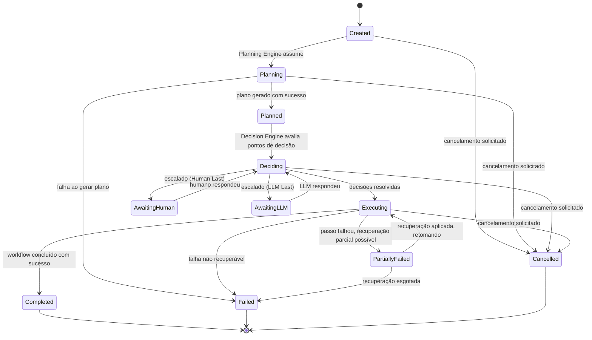
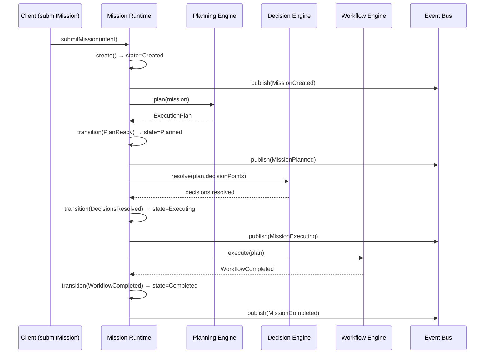

# Capítulo 6 — Mission Runtime

**Volume:** II — Kernel Architecture
**Status da especificação:** v0.1 (Draft)
**Depende de:** Capítulo 5 (Kernel — Visão Geral)

---

## 6.0 Objetivo do capítulo

Especificar o ciclo de vida completo de uma Missão: seus estados possíveis, transições válidas, estrutura de dados e o contrato que o Mission Runtime expõe para Planning Engine, Decision Engine, Workflow Engine e Scheduler.

## 6.1 Motivação

A Missão é a unidade atômica de todo o sistema (Princípio 4, Mission Driven). Se o ciclo de vida de uma Missão não for rigorosamente especificado, cada componente do Kernel assumiria semânticas diferentes de "quando uma missão começa" ou "o que significa falha parcial" — quebrando Determinism First e Full Governance.

## 6.2 Estrutura de dados: Mission

```typescript
interface Mission {
  id: MissionId;                    // UUID v7 — ordenável por tempo de criação
  type: MissionType;                // ex.: "investigate-incident", "prepare-deploy"
  intent: MissionIntent;            // payload original que originou a missão
  state: MissionState;              // ver máquina de estados, seção 6.3
  plan?: ExecutionPlan;             // preenchido pelo Planning Engine (Cap. 7)
  decisions: Decision[];            // trilha de decisões tomadas (Cap. 8)
  workflowRun?: WorkflowRunRef;      // referência à execução no Workflow Engine (Cap. 9)
  createdAt: Timestamp;
  updatedAt: Timestamp;
  parentMissionId?: MissionId;       // para missões derivadas/sub-missões
  knowledgeAssetsProduced: KnowledgeAssetRef[]; // ver Cap. 4, Princípio 7
  cognitiveDebtFlag: "autonomous" | "human" | "llm" | null; // ver Cap. 4, seção 4.9.1
}
```

**Nota de design:** `cognitiveDebtFlag` é preenchido apenas quando a missão é concluída, e é o dado bruto a partir do qual o KPI de Cognitive Debt (Volume VII) é calculado. Nenhum outro componente deve inferir esse valor por conta própria — ele é atribuído exclusivamente pelo Mission Runtime, no encerramento da missão.

## 6.3 Máquina de estados



### 6.3.1 Invariantes da máquina de estados

1. **Nenhuma transição pula estados.** Uma missão não vai de `Created` diretamente para `Executing` — mesmo planos triviais passam por `Planning` e `Deciding` (podendo ser resolvidos instantaneamente, mas nunca omitidos, para preservar Full Governance).
2. **`AwaitingHuman` e `AwaitingLLM` são sempre transitórios e retornam a `Deciding`.** Nunca executam ação diretamente — a decisão resultante é reincorporada ao fluxo normal de decisão, garantindo que a trilha de auditoria seja uniforme independente da fonte da decisão.
3. **`Cancelled` é acessível de qualquer estado não-terminal.** Cancelamento é sempre um evento governado (ver Cap. 5, contrato `cancelMission`), nunca um kill silencioso.
4. **`cognitiveDebtFlag` só pode ser setado na transição para `Completed` ou `Failed`.**

## 6.4 Interface do Mission Runtime

```typescript
interface MissionRuntime {
  create(intent: MissionIntent, parentMissionId?: MissionId): Mission;

  transition(missionId: MissionId, event: MissionEvent): Mission;
  // MissionEvent é um dos: PlanReady, PlanFailed, DecisionsResolved,
  // EscalatedToHuman, EscalatedToLLM, EscalationResolved,
  // WorkflowCompleted, WorkflowPartiallyFailed, WorkflowFailed,
  // RecoveryApplied, RecoveryExhausted, CancellationRequested

  getState(missionId: MissionId): MissionState;
  getMission(missionId: MissionId): Mission;

  // Toda transição publica automaticamente um evento no Event Bus (Cap. 10)
}
```

## 6.5 Fluxo de sequência: ciclo de vida completo (caso feliz)



## 6.6 Casos de falha e estratégias de recuperação

| Cenário de falha | Estado resultante | Estratégia |
|---|---|---|
| Planning Engine não consegue gerar plano (intent inválida ou capability ausente) | `Failed` | Evento `PlanningFailed` publicado com evidência; missão pode ser reenviada após correção externa (nova Capability registrada) |
| Decisão pendente aguardando humano expira (timeout configurável por tipo de missão) | Permanece em `AwaitingHuman`, dispara alerta de escalonamento (integração com Governance Engine, Volume VII) | Nunca falha automaticamente por timeout — decisão humana é aguardada explicitamente, com escalonamento de severidade |
| Passo do Workflow falha mas possui estratégia de recuperação registrada no Playbook | `PartiallyFailed` → `Executing` | Workflow Engine aplica a estratégia de recuperação (Cap. 9) e retoma do ponto de falha, nunca do início |
| Passo do Workflow falha sem estratégia de recuperação | `Failed` | Todo o estado é preservado para auditoria; missão pode gerar um Knowledge Asset do tipo "gap de recuperação" (alimenta Learning Engine) |
| Cancelamento solicitado durante `Executing` | `Cancelled` | Workflow Engine deve suportar cancelamento cooperativo em pontos de checkpoint — nunca interrupção abrupta de um passo em andamento |

## 6.7 Testes de aceitação (nível de especificação)

1. **AT-6.1:** Toda Missão criada deve, ao final de sua execução (`Completed`, `Failed` ou `Cancelled`), ter `cognitiveDebtFlag` definido corretamente conforme a trilha de decisões (`decisions[]`).
2. **AT-6.2:** Nenhuma transição de estado deve ocorrer sem um evento correspondente publicado no Event Bus (verificável por reconciliação entre estado final da missão e o log de eventos).
3. **AT-6.3:** Duas missões criadas com o mesmo `intent` e o mesmo estado de conhecimento devem produzir planos idênticos (Determinism First) — teste de replay determinístico.
4. **AT-6.4:** Cancelamento solicitado em qualquer estado não-terminal deve resultar em `Cancelled` em tempo finito e configurável (SLA de cancelamento).

## 6.8 KPIs deste componente

- **Taxa de missões `Completed` sem passar por `AwaitingHuman`/`AwaitingLLM`** — insumo direto do Cognitive Debt (Cap. 4).
- **Tempo médio em cada estado** — insumo para o Observability Engine (Volume VII).
- **Taxa de `PartiallyFailed` recuperado com sucesso vs. escalado para `Failed`** — mede maturidade dos Playbooks (Volume V).

## 6.9 Status da Implementação

| Já existe | Precisa refatorar | Ainda não existe |
|---|---|---|
| — | — | Máquina de estados completa; estrutura de dados `Mission`; persistência de estado; integração com Event Bus (Cap. 10) |

---

**Capítulo anterior:** [Capítulo 5 — Kernel: Visão Geral](./01-kernel-overview.md)
**Próximo capítulo:** [Capítulo 7 — Planning Engine](./03-planning-engine.md)
