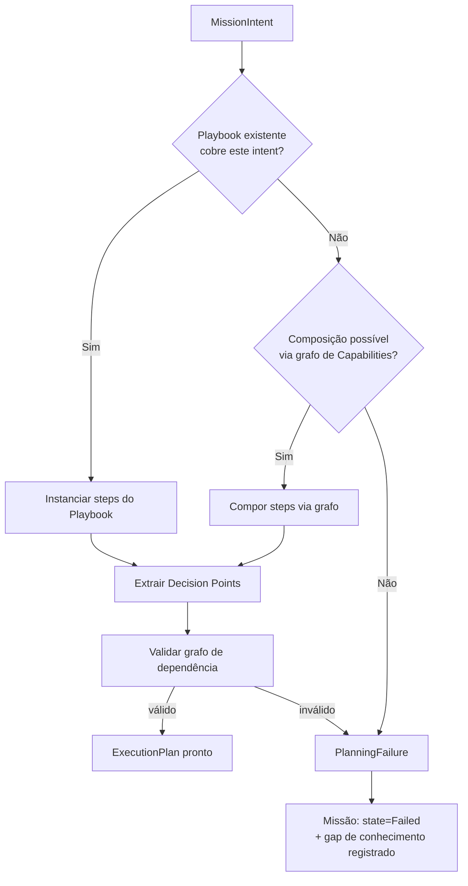

# Capítulo 7 — Planning Engine

**Volume:** II — Kernel Architecture
**Status da especificação:** v0.1 (Draft)
**Depende de:** Capítulo 6 (Mission Runtime)

---

## 7.0 Objetivo do capítulo

Especificar como uma `MissionIntent` é transformada em um `ExecutionPlan` — uma sequência ordenada de passos, com pontos de decisão explícitos, de forma determinística e reproduzível.

## 7.1 Motivação

Planejar não é decidir. O Planning Engine responde "quais passos, em que ordem, com quais dependências" — não "qual alternativa escolher em cada ponto de ambiguidade" (isso é o Decision Engine, Cap. 8). Separar essas responsabilidades é o que permite que o mesmo plano seja reutilizado com decisões diferentes, e que decisões sejam auditadas independentemente da estrutura do plano.

## 7.2 Princípios aplicados

| Princípio | Aplicação |
|---|---|
| Determinism First | Dado o mesmo `intent` e o mesmo estado do Capability Registry, o plano gerado deve ser idêntico |
| Knowledge First | O Planning Engine consulta Playbooks existentes antes de tentar compor um plano do zero |
| Evolution Never Stops | Novos tipos de missão devem poder ser planejados sem alterar o núcleo do Planning Engine — apenas registrando novos Playbooks |

## 7.3 Estrutura de dados: ExecutionPlan

```typescript
interface ExecutionPlan {
  id: PlanId;
  missionId: MissionId;
  steps: PlanStep[];
  decisionPoints: DecisionPoint[];   // referenciados pelos steps, resolvidos pelo Decision Engine
  sourcePlaybook?: PlaybookId;       // se derivado de um Playbook existente
  generatedAt: Timestamp;
  planHash: string;                  // hash determinístico de (intent + capability registry version)
}

interface PlanStep {
  id: StepId;
  capability: CapabilityRef;         // qual Capability executa este passo
  dependsOn: StepId[];                // grafo de dependência explícito
  decisionPointId?: DecisionPointId;  // se este passo depende de uma decisão prévia
  recoveryStrategy?: RecoveryStrategyRef; // ver Cap. 9
}

interface DecisionPoint {
  id: DecisionPointId;
  question: string;                   // descrição estruturada da decisão necessária
  options: DecisionOption[];
  escalationPolicy: EscalationPolicy; // ver Cap. 8
}
```

## 7.4 Algoritmo de planejamento (visão geral)

```
function plan(intent: MissionIntent, registry: CapabilityRegistry): ExecutionPlan {
  1. playbook = PlaybookRepository.findMatching(intent)
  2. if playbook exists:
        steps = instantiateFromPlaybook(playbook, intent)
     else:
        steps = composeFromCapabilityGraph(intent, registry)
        // fallback determinístico: busca em grafo de capacidades por composição
        // NUNCA invoca um LLM neste ponto (Determinism First)
  3. decisionPoints = extractDecisionPoints(steps)
  4. validate(steps)  // detecta ciclos, capabilities inexistentes, steps órfãos
  5. if validation fails:
        raise PlanningFailure(evidence)
  6. planHash = hash(intent, registry.version)
  7. return ExecutionPlan { steps, decisionPoints, planHash, ... }
}
```

### 7.4.1 O que acontece quando não existe Playbook nem composição possível

Este é um caso central de design: se `composeFromCapabilityGraph` não encontra uma composição válida de Capabilities existentes para atender ao `intent`, o Planning Engine **não tenta improvisar com um LLM**. Ele falha explicitamente (`PlanningFailure`), e a missão é escalada como um gap de conhecimento — que pode, fora do caminho crítico do Kernel, ser resolvido por um humano ou por consulta a um LLM (Volume VI, Learning Engine), gerando um novo Playbook ou Capability. Da próxima vez, o mesmo `intent` terá plano determinístico disponível.

Isso é a operacionalização direta do Capítulo 1, seção 1.4 (a hipótese Batman) no nível do Planning Engine.

## 7.5 Diagrama de fluxo



## 7.6 Casos de falha e recuperação

| Cenário | Tratamento |
|---|---|
| Playbook encontrado, mas Capability referenciada foi desativada | `PlanningFailure` com evidência específica (qual Capability, por quê); não tenta substituição automática silenciosa |
| Ciclo detectado no grafo de dependências (`dependsOn`) | `PlanningFailure` — ciclo é sempre um erro de configuração do Playbook, nunca um caso a "resolver em runtime" |
| Múltiplos Playbooks compatíveis com o mesmo `intent` | Resolução determinística por prioridade explícita registrada no Playbook (nunca escolha aleatória ou heurística implícita) |
| Intent parcialmente reconhecido (nenhum Playbook exato, mas Capabilities individuais existem) | Composição via grafo (seção 7.4), com plano marcado como `sourcePlaybook: undefined` para rastreabilidade de que não veio de um padrão testado |

## 7.7 Testes de aceitação

1. **AT-7.1:** Para o mesmo `intent` e a mesma versão do Capability Registry, `plan()` deve retornar planos com `planHash` idêntico (replay determinístico).
2. **AT-7.2:** Um plano com ciclo de dependências nunca deve ser retornado como válido — deve sempre resultar em `PlanningFailure`.
3. **AT-7.3:** Missões cujo planejamento falha por ausência de Capability devem gerar um registro de gap de conhecimento rastreável (verificável na Operational Memory).

## 7.8 KPIs deste componente

- **Taxa de planos originados de Playbook vs. composição ad-hoc via grafo** — mede maturidade do catálogo de Playbooks.
- **Taxa de `PlanningFailure`** — insumo direto para priorização de novas Capabilities/Playbooks no roadmap (Volume X).

## 7.9 Status da Implementação

| Já existe | Precisa refatorar | Ainda não existe |
|---|---|---|
| `ExecutionPlan`/`PlanStep`/`DecisionPoint`; composição via grafo de Capabilities (heurística sequencial mínima); validação de ciclo/dependência órfã; `planHash` determinístico — `src/batman_os/kernel/planning_engine.py`, testes AT-7.1/7.2/7.3 | Composição via grafo mais sofisticada (paralelismo/agrupamento) quando o Capability Engine real estiver mais maduro | Repositório de Playbooks real (formalizado em detalhe no Volume V) — hoje aceito via Protocol, sempre vazio nesta construção |

---

**Capítulo anterior:** [Capítulo 6 — Mission Runtime](./02-mission-runtime.md)
**Próximo capítulo:** [Capítulo 8 — Decision Engine](./04-decision-engine.md)
