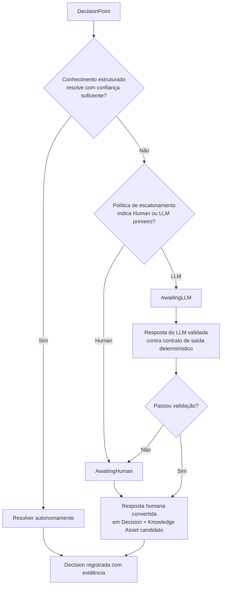
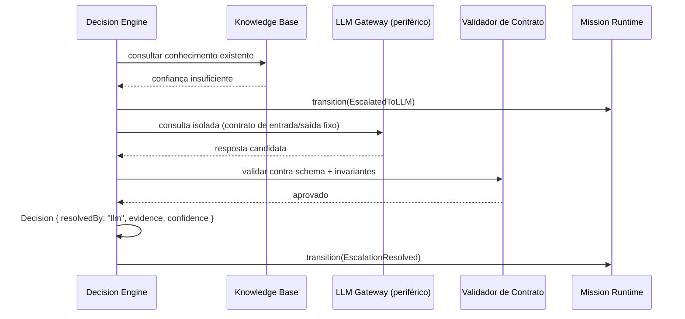

# Capítulo 8 — Decision Engine

**Volume:** II — Kernel Architecture
**Status da especificação:** v0.1 (Draft)
**Depende de:** Capítulo 7 (Planning Engine)

---

## 8.0 Objetivo do capítulo

Especificar como o Batman resolve `DecisionPoint`s gerados pelo Planning Engine — o componente que formaliza, em código, a hierarquia Knowledge First → Human Last → LLM Last (Cap. 2, seção 2.5).

## 8.1 Motivação

Este é, provavelmente, o componente mais crítico do Kernel do ponto de vista filosófico: é aqui que a promessa "Batman não depende continuamente de LLM" se torna verificável ou não. Um Decision Engine mal desenhado poderia, na prática, escalar toda decisão não trivial para um LLM — recriando exatamente o problema descrito no Capítulo 1.

## 8.2 A hierarquia de resolução (formalizada)



**Ponto crítico de design (seção 8.2, nota):** uma resposta de LLM **nunca** é aplicada diretamente como decisão. Ela passa por um contrato de validação determinístico (schema, regras de sanidade, verificação contra invariantes de domínio) antes de virar uma `Decision`. Se falhar validação, escala para humano — nunca "tenta de novo com o LLM" indefinidamente sem supervisão (ver seção 8.6, limites de re-tentativa).

## 8.3 Estrutura de dados: Decision

```typescript
interface Decision {
  id: DecisionId;
  decisionPointId: DecisionPointId;
  missionId: MissionId;
  resolvedBy: "knowledge" | "human" | "llm";
  chosenOption: DecisionOption;
  confidence: number;              // 0.0–1.0, obrigatório mesmo para resolução por conhecimento
  evidence: Evidence[];            // Evidence First (Princípio 3) — nunca vazio
  resolvedAt: Timestamp;
  knowledgeAssetCandidate?: KnowledgeAssetDraft; // se resolvedBy != "knowledge"
}

interface EscalationPolicy {
  // Configurável por tipo de missão / tipo de decisão — nunca hardcoded no Kernel
  confidenceThreshold: number;      // abaixo disso, não resolve autonomamente
  preferredEscalation: "human" | "llm";
  maxLlmRetries: number;            // ver seção 8.6
  reversibility: "reversible" | "irreversible"; // decisões irreversíveis nunca vão direto a LLM
}
```

## 8.4 Regra de ordenação Human vs. LLM

A ADR-0001 (Volume I) já fixou que LLM é sempre periférico. Mas entre escalar para humano ou para LLM primeiro, a política é explícita e configurável — nunca implícita:

| Fator | Tende a preferir |
|---|---|
| Decisão irreversível ou de alto impacto (ex.: rollback em produção) | Human |
| Decisão de baixo impacto, reversível, com boa cobertura de exemplos passados | LLM (como *sugestão* a ser validada, nunca aplicada cegamente) |
| Ausência completa de precedente na Operational Memory | Human — LLM sem contexto estruturado tem alto risco de alucinação sem lastro em evidência |
| Alta frequência do mesmo tipo de decisão (candidato a virar regra permanente) | Human, seguido de captura obrigatória como Knowledge Asset (Learn Forever) |

## 8.5 Diagrama de sequência: escalonamento para LLM com validação



## 8.6 Limites de re-tentativa e circuit breaker

Para evitar que o Decision Engine se torne, na prática, dependente contínuo do LLM (violando a ADR-0001), aplicam-se limites rígidos:

- `maxLlmRetries` por `DecisionPoint`: se excedido, escala automaticamente para humano — nunca insiste indefinidamente.
- **Circuit breaker por taxa:** se a proporção de decisões resolvidas via LLM em uma janela de tempo exceder um limiar configurado (sinal de Cognitive Debt crescente, não decrescente), o Governance Engine (Volume VII) é notificado para revisão — este é um mecanismo de alarme, não de bloqueio automático de operação.

## 8.7 Casos de falha e recuperação

| Cenário | Tratamento |
|---|---|
| Resposta do LLM falha validação de contrato repetidamente | Escala para humano após `maxLlmRetries`; registra gap de conhecimento |
| Humano não responde dentro do SLA da missão | Mission Runtime mantém `AwaitingHuman`; Governance Engine escala severidade do alerta (nunca falha a missão automaticamente por timeout de humano) |
| Decisão de conhecimento estruturado aponta confiança abaixo do threshold mesmo com regra aplicável | Trata como "conhecimento insuficiente", segue para escalonamento — confiança baixa nunca é ignorada em nome de velocidade |
| LLM Gateway indisponível (falha de infraestrutura) | Decision Engine escala diretamente para humano, independente da `preferredEscalation` configurada — disponibilidade do humano nunca depende da disponibilidade do LLM |

## 8.8 Testes de aceitação

1. **AT-8.1:** Nenhuma `Decision` pode existir com `evidence: []` — verificação de invariante em toda gravação.
2. **AT-8.2:** Toda `Decision` com `resolvedBy: "llm"` deve ter passado por validação de contrato registrada (rastreável).
3. **AT-8.3:** Decisões marcadas `reversibility: "irreversible"` nunca podem ter `resolvedBy: "llm"` sem uma escalação humana intermediária de aprovação — verificação estrutural obrigatória.
4. **AT-8.4:** A taxa de escalonamento para LLM por tipo de missão deve ser monitorável e alarmável (integração com Volume VII).

## 8.9 KPIs deste componente

- **Distribuição de `resolvedBy`** (knowledge / human / llm) — o dado bruto do Cognitive Debt.
- **Taxa de rejeição de respostas do LLM na validação de contrato** — mede o quanto o LLM Gateway está "fora do domínio" para o tipo de decisão em questão.
- **Tempo médio de resposta humana em `AwaitingHuman`** — insumo de SLA operacional.

## 8.10 Status da Implementação

| Já existe | Precisa refatorar | Ainda não existe |
|---|---|---|
| — | — | Decision Engine completo; Validador de Contrato para saídas de LLM; circuit breaker de taxa de escalonamento (integra com Volume VII) |

---

**Capítulo anterior:** [Capítulo 7 — Planning Engine](./03-planning-engine.md)
**Próximo capítulo:** [Capítulo 9 — Workflow Engine](./05-workflow-engine.md)
