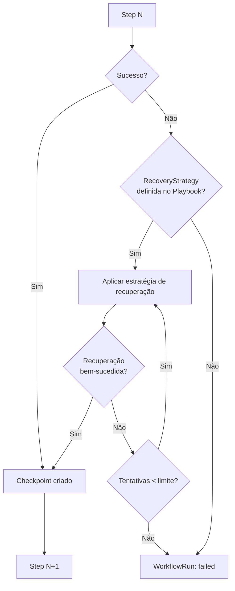
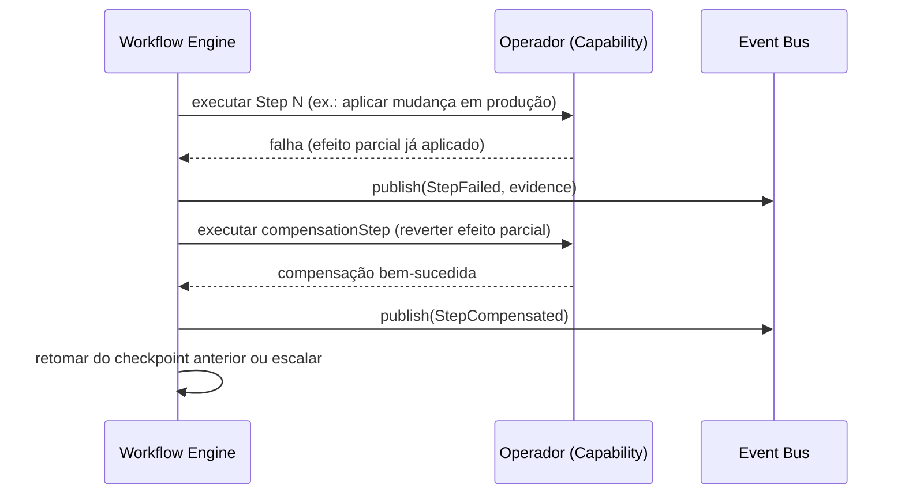

# Capítulo 9 — Workflow Engine

**Volume:** II — Kernel Architecture
**Status da especificação:** v0.1 (Draft)
**Depende de:** Capítulo 8 (Decision Engine)

---

## 9.0 Objetivo do capítulo

Especificar como um `ExecutionPlan`, já com todas as decisões resolvidas, é efetivamente executado: ordem de passos, checkpoints, estratégias de recuperação e cancelamento cooperativo.

## 9.1 Motivação

Planejar e decidir não produzem nenhum efeito no mundo real — apenas o Workflow Engine invoca Capabilities de fato. Ele é, portanto, o componente com maior superfície de risco operacional do Kernel, e o que mais precisa de garantias de recuperação e idempotência.

## 9.2 Estrutura de dados: WorkflowRun

```typescript
interface WorkflowRun {
  id: WorkflowRunId;
  missionId: MissionId;
  planId: PlanId;
  currentStepId: StepId | null;
  completedSteps: StepResult[];
  checkpoints: Checkpoint[];        // pontos seguros de retomada
  state: "running" | "paused" | "completed" | "failed" | "cancelled";
}

interface StepResult {
  stepId: StepId;
  status: "success" | "failed" | "recovered";
  output?: unknown;
  error?: ErrorEvidence;
  attempt: number;
  startedAt: Timestamp;
  finishedAt: Timestamp;
}

interface Checkpoint {
  afterStepId: StepId;
  stateSnapshot: unknown;           // suficiente para retomar sem reexecutar passos anteriores
  createdAt: Timestamp;
}
```

## 9.3 Regras de execução

1. **Execução respeita estritamente o grafo de dependências (`dependsOn`)** definido pelo Planning Engine — nenhum passo executa antes de suas dependências concluírem com sucesso.
2. **Passos independentes entre si podem executar em paralelo** (formalizado no Scheduler, Cap. 10) — o Workflow Engine expõe o grafo, mas não decide concorrência sozinho.
3. **Checkpoints são criados após cada passo bem-sucedido.** Isso garante que recuperação nunca precise reexecutar trabalho já confirmado (idempotência de retomada).
4. **Cancelamento é sempre cooperativo:** um passo em execução recebe um sinal de cancelamento e deve encerrar em um ponto seguro — o Workflow Engine nunca mata um processo abruptamente no meio de uma operação com efeitos colaterais não confirmados.

## 9.4 Diagrama de execução com recuperação



## 9.5 Estratégias de recuperação (RecoveryStrategy)

```typescript
type RecoveryStrategy =
  | { kind: "retry"; maxAttempts: number; backoff: "fixed" | "exponential" }
  | { kind: "compensate"; compensationStep: StepId } // desfaz efeito colateral parcial
  | { kind: "skip-if-optional"; }                     // apenas para steps marcados non-critical
  | { kind: "escalate"; escalationPolicy: EscalationPolicy }; // reabre um DecisionPoint
```

**Nota de design:** `escalate` permite que uma falha de execução reabra o Decision Engine (Cap. 8) — por exemplo, um passo falha porque a decisão original assumia uma pré-condição que não se confirmou; nesse caso, o Workflow Engine não tenta "adivinhar" um novo curso de ação, delega de volta à camada de decisão.

## 9.6 Sequência: falha com compensação



## 9.7 Casos de falha e recuperação (nível de Workflow Engine)

| Cenário | Tratamento |
|---|---|
| Passo crítico falha sem `RecoveryStrategy` | `WorkflowRun.state = failed`; Mission Runtime recebe `WorkflowFailed` |
| Passo opcional (`non-critical`) falha | `skip-if-optional` aplicado, execução continua, falha registrada como evidência não bloqueante |
| Compensação falha também | Escala para `Failed` com prioridade máxima — estado parcialmente aplicado em produção é sempre tratado como incidente de alta severidade (integra com Volume VII) |
| Cancelamento solicitado durante um passo com efeito colateral em andamento | Aguarda o passo atingir um ponto de checkpoint seguro antes de encerrar — nunca interrompe no meio de uma operação não idempotente |

## 9.8 Testes de aceitação

1. **AT-9.1:** Retomar um `WorkflowRun` a partir do último checkpoint nunca deve reexecutar um `StepResult` já marcado `success`.
2. **AT-9.2:** Toda falha de passo crítico sem estratégia de recuperação deve resultar em `WorkflowRun.state = failed` de forma determinística (nunca em estado indefinido).
3. **AT-9.3:** Estratégias `compensate` devem ser verificadas em teste de integração como verdadeiramente idempotentes (aplicar a compensação duas vezes não deve gerar efeito duplicado).

## 9.9 KPIs deste componente

- **Taxa de recuperação bem-sucedida por tipo de `RecoveryStrategy`** — insumo para maturidade de Playbooks (Volume V).
- **Tempo médio entre falha e recuperação (MTTR interno ao workflow)**.
- **Taxa de escalonamentos originados de falha de execução** (`escalate`) — sinaliza planos com pré-condições mal validadas no Planning Engine.

## 9.10 Status da Implementação

| Já existe | Precisa refatorar | Ainda não existe |
|---|---|---|
| — | — | Workflow Engine completo; sistema de checkpoints; estratégias de recuperação; mecanismo de cancelamento cooperativo |

---

**Capítulo anterior:** [Capítulo 8 — Decision Engine](./04-decision-engine.md)
**Próximo capítulo:** [Capítulo 10 — Event Bus & Scheduler](./06-event-bus-scheduler.md)
