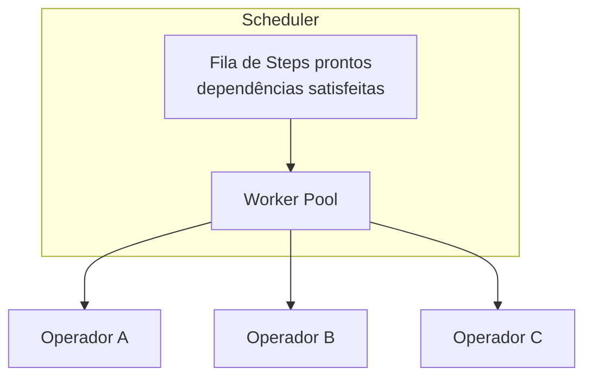
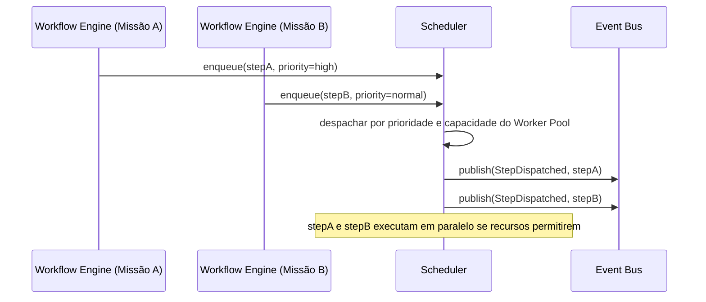

# Capítulo 10 — Event Bus & Scheduler

**Volume:** II — Kernel Architecture
**Status da especificação:** v0.1 (Draft)
**Depende de:** Capítulo 9 (Workflow Engine)

---

## 10.0 Objetivo do capítulo

Fechar o Volume II especificando os dois componentes transversais do Kernel: o **Event Bus**, que garante Full Governance (Princípio 9) tornando toda transição de estado auditável e imutável; e o **Scheduler**, que orquestra a execução concorrente de múltiplas missões e passos de workflow.

## 10.1 Motivação

Todos os componentes dos Capítulos 6–9 mencionam "publicar um evento" e "invocar o Scheduler" — este capítulo formaliza esses dois contratos que os demais assumem como dados.

## 10.2 Event Bus

### 10.2.1 Propriedades obrigatórias

- **Imutabilidade:** um evento publicado nunca é alterado ou removido — apenas novos eventos são adicionados (append-only log).
- **Ordenação causal:** eventos relacionados à mesma Missão preservam ordem de publicação.
- **Auditabilidade total:** qualquer estado de qualquer componente do Kernel deve ser reconstruível a partir da sequência de eventos (event sourcing como padrão arquitetural, não apenas mecanismo de notificação).

### 10.2.2 Estrutura de dados: Event

```typescript
interface KernelEvent {
  id: EventId;               // ULID — ordenável e único
  missionId: MissionId;
  type: EventType;           // MissionCreated, MissionPlanned, StepFailed, DecisionResolved, etc.
  payload: unknown;
  emittedBy: "MissionRuntime" | "PlanningEngine" | "DecisionEngine" | "WorkflowEngine" | "Scheduler";
  occurredAt: Timestamp;
  causedBy?: EventId;         // encadeamento causal explícito, quando aplicável
}
```

### 10.2.3 Contrato de publicação e assinatura

```typescript
interface EventBus {
  publish(event: KernelEvent): void;
  subscribe(filter: EventFilter, handler: (event: KernelEvent) => void): Subscription;
  replay(missionId: MissionId): KernelEvent[]; // reconstrução completa da história de uma missão
}
```

**Consumidores típicos do Event Bus** (fora do Kernel, especificados em volumes futuros): Observability Engine (Volume VII), Learning Engine (Volume VI — todo `PlanningFailure` e `StepFailed` é um candidato natural a gap de conhecimento), e Governance Engine (Volume VII — cálculo de Cognitive Debt em tempo real a partir do stream de eventos).

## 10.3 Scheduler

### 10.3.1 Responsabilidade

O Scheduler decide **quando** e **em qual grau de paralelismo** passos de workflow (de uma ou mais missões concorrentes) são efetivamente despachados para Operadores — sem jamais decidir **o quê** executar (isso é do Workflow Engine) ou **por quê** (Decision Engine).

### 10.3.2 Modelo de concorrência



- Um passo entra na fila `Q` somente quando **todas** as suas dependências (`dependsOn`) estão marcadas `success` (garantido pelo Workflow Engine, Cap. 9).
- O Worker Pool tem tamanho configurável por classe de missão (isolamento de recursos entre missões de diferentes criticidades).
- **Isolamento entre missões:** o Scheduler nunca permite que uma missão monopolize o Worker Pool a ponto de impedir progresso de missões de prioridade igual ou superior (fairness configurável, com prioridade explícita herdada do `MissionType`).

### 10.3.3 Interface

```typescript
interface Scheduler {
  enqueue(step: PlanStep, workflowRunId: WorkflowRunId, priority: Priority): void;
  cancel(workflowRunId: WorkflowRunId): void; // cancelamento cooperativo, ver Cap. 9, seção 9.3
  getQueueDepth(): number; // observabilidade de saturação
}
```

## 10.4 Sequência: dois passos concorrentes de missões diferentes



## 10.5 Casos de falha e recuperação

| Cenário | Tratamento |
|---|---|
| Worker Pool saturado (fila crescendo continuamente) | Scheduler expõe `getQueueDepth()` para alarme externo (Observability Engine); não descarta trabalho silenciosamente |
| Evento publicado mas nenhum assinante disponível no momento (assinante caiu) | Event Bus é append-only — assinante pode fazer `replay()` ao voltar, sem perda de evento |
| Falha do próprio Event Bus (indisponibilidade de infraestrutura) | Mission Runtime não deve avançar nenhuma transição de estado sem confirmação de publicação bem-sucedida — consistência de auditoria tem prioridade sobre disponibilidade de progresso da missão |
| Passo de alta prioridade preterido indefinidamente por starvation | Scheduler aplica aging (aumento gradual de prioridade efetiva com o tempo de espera) — configurado, nunca resolvido manualmente caso a caso |

## 10.6 Testes de aceitação

1. **AT-10.1:** `replay(missionId)` deve permitir reconstrução do estado final da missão idêntica ao estado persistido pelo Mission Runtime — teste de consistência event-sourcing.
2. **AT-10.2:** Nenhum passo pode ser despachado pelo Scheduler antes que todas as suas dependências estejam marcadas `success` no Workflow Engine.
3. **AT-10.3:** Sob carga sustentada, nenhuma missão de prioridade igual ou superior pode sofrer starvation além de um limite configurável (verificável via teste de carga com aging habilitado).

## 10.7 KPIs deste componente

- **Profundidade média e máxima da fila do Scheduler** — sinaliza necessidade de escalar Worker Pool.
- **Latência entre `enqueue` e despacho efetivo** — SLA interno de responsividade do Kernel.
- **Taxa de eventos consumidos vs. publicados por assinante** — detecta assinantes atrasados ou degradados.

## 10.8 Status da Implementação

| Já existe | Precisa refatorar | Ainda não existe |
|---|---|---|
| — | — | Event Bus (append-only, replay); Scheduler com Worker Pool, prioridade e aging |

---

## Encerramento do Volume II

Com este capítulo, o Kernel do Batman OS está especificado de ponta a ponta: uma Missão nasce (Cap. 6), é planejada de forma determinística (Cap. 7), tem seus pontos de ambiguidade resolvidos respeitando a hierarquia Knowledge → Human → LLM (Cap. 8), é executada com checkpoints e recuperação (Cap. 9), e cada transição é publicada de forma imutável e orquestrada com isolamento entre missões concorrentes (Cap. 10).

O **Volume III — Runtime** aprofunda o que fica "abaixo" do Workflow Engine e do Scheduler: como o Capability Engine resolve e versiona Capabilities, como o Execution Engine efetivamente invoca Operadores, como a Operational Memory persiste estado entre missões, e o modelo de concorrência e isolamento em maior detalhe (multi-tenancy de missões, limites de recursos por Operador).

---

**Capítulo anterior:** [Capítulo 9 — Workflow Engine](./05-workflow-engine.md)
**Próximo volume:** Volume III — Runtime (a iniciar)
