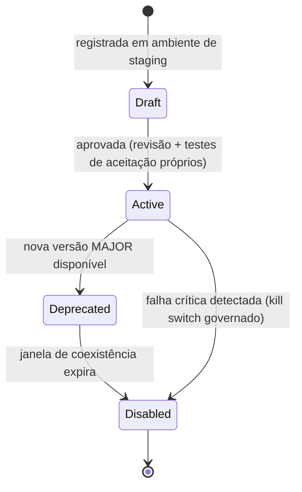

# Capítulo 11 — Capability Engine

**Volume:** III — Runtime
**Status da especificação:** v0.1 (Draft)
**Depende de:** Volume II (Kernel Architecture), em particular Capítulos 7 e 9

---

## 11.0 Objetivo do capítulo

Especificar como Capabilities são registradas, versionadas, resolvidas e descobertas — o catálogo vivo que o Planning Engine (Cap. 7) consulta para compor planos e que o Execution Engine (Cap. 12) invoca de fato.

## 11.1 Motivação

O Volume II tratou Capability como uma referência opaca (`CapabilityRef`). Este capítulo abre essa caixa-preta: de onde vêm as Capabilities, como evoluem sem quebrar planos já existentes, e como o sistema garante que "a mesma Capability" significa a mesma coisa entre uma execução e outra — pré-condição direta de Determinism First.

## 11.2 Princípios aplicados

| Princípio | Aplicação |
|---|---|
| Determinism First | Uma Capability, uma vez versionada, nunca muda de comportamento sob o mesmo número de versão |
| Evolution Never Stops | Novas Capabilities são adicionadas ao catálogo sem exigir mudança no Kernel |
| Full Governance | Toda mudança de Capability é uma mudança auditável, com ADR quando afeta contrato público |

## 11.3 Estrutura de dados: Capability

```typescript
interface CapabilityDefinition {
  id: CapabilityId;            // estável ao longo de todas as versões
  name: string;                 // ex.: "detect-sql-injection"
  version: SemVer;               // ex.: "2.1.0"
  inputSchema: JSONSchema;
  outputSchema: JSONSchema;
  requiredSkills: SkillRef[];    // ver Volume IV, Cap. 17
  deterministic: boolean;        // false apenas para Capabilities que envolvem LLM Gateway isolado
  sideEffects: "none" | "reversible" | "irreversible";
  deprecatedBy?: CapabilityId;   // aponta para sucessora, se aplicável
  status: "active" | "deprecated" | "disabled";
}
```

### 11.3.1 Regra de versionamento semântico obrigatória

- **PATCH** (`x.y.Z`): correção de bug que não altera `inputSchema`/`outputSchema` nem o comportamento observável para entradas válidas.
- **MINOR** (`x.Y.z`): adição de capacidade retrocompatível (ex.: novo campo opcional de saída).
- **MAJOR** (`X.y.z`): qualquer mudança que quebre um plano existente que referencie a versão anterior — exige ADR e, no mínimo, um período de coexistência com `deprecatedBy` apontando a versão nova.

**Regra de ouro do capítulo:** um `ExecutionPlan` já gerado (Cap. 7) referencia uma versão específica de Capability, nunca "a versão mais recente" implicitamente — isso é o que garante `planHash` estável (AT-7.1) mesmo que o catálogo evolua entre o momento do planejamento e o momento da execução.

## 11.4 Capability Registry — interface

```typescript
interface CapabilityRegistry {
  register(def: CapabilityDefinition): void;
  resolve(ref: CapabilityRef): CapabilityDefinition;   // resolução exata por id+versão
  findCandidates(intent: MissionIntent): CapabilityDefinition[]; // para composição no Planning Engine
  deprecate(id: CapabilityId, version: SemVer, replacedBy: CapabilityId): void;
  disable(id: CapabilityId, version: SemVer, reason: string): void; // nunca remove, apenas desativa
  version(): RegistryVersion; // hash/contador usado no planHash (Cap. 7)
}
```

**Nota crítica:** `disable` nunca é uma remoção física. Capabilities desativadas continuam resolvíveis para fins de auditoria de missões antigas (`replay`, Cap. 10), apenas deixam de ser candidatas para novos planos.

## 11.5 Diagrama: ciclo de vida de uma Capability



## 11.6 Resolução de candidatos para composição (uso pelo Planning Engine)

```
function findCandidates(intent: MissionIntent): CapabilityDefinition[] {
  1. candidates = registry.filter(c => c.status == "active" && matchesIntentSignature(c, intent))
  2. candidates = candidates.filter(c => schemaCompatible(c.inputSchema, intent.payloadSchema))
  3. sort candidates by (a) especificidade da assinatura, (b) versão mais recente ativa
  4. return candidates
}
```

A resolução é **determinística e sem heurística de linguagem natural** — casamento de assinatura estrutural (schema), nunca "melhor palpite semântico" via LLM. Isso preserva o Determinism First mesmo no processo de descoberta.

## 11.7 Casos de falha e recuperação

| Cenário | Tratamento |
|---|---|
| Plano referencia Capability desativada (`disabled`) desde o planejamento | `PlanningFailure` no momento da resolução (Cap. 7); nunca substituição silenciosa por outra versão |
| Duas Capabilities ativas empatam em especificidade para o mesmo intent | Erro de configuração do catálogo — deve ser resolvido explicitamente no registro (prioridade declarada), nunca por escolha aleatória em runtime |
| Nova versão MAJOR introduzida sem `deprecatedBy` apontando predecessora | Rejeitado no registro — toda mudança MAJOR exige rastro explícito de migração |
| Capability marcada `deterministic: false` sem isolamento comprovado do LLM Gateway | Rejeitado no registro — viola ADR-0001 (Volume I) |

## 11.8 Testes de aceitação

1. **AT-11.1:** Resolver a mesma `CapabilityRef` (id+versão) deve sempre retornar a mesma `CapabilityDefinition`, mesmo após o catálogo evoluir com novas versões.
2. **AT-11.2:** Uma mudança MAJOR não pode ser registrada sem `deprecatedBy` explícito.
3. **AT-11.3:** `findCandidates` deve ser determinístico: mesma entrada e mesmo `RegistryVersion` produzem sempre o mesmo conjunto ordenado de candidatos.

## 11.9 KPIs deste componente

- **Proporção de Capabilities ativas vs. deprecated vs. disabled** — saúde do catálogo.
- **Tempo médio de janela de coexistência** entre deprecação e desativação — mede disciplina de migração.
- **Taxa de `PlanningFailure` por Capability desativada referenciada** — sinaliza planos ou Playbooks desatualizados.

## 11.10 Status da Implementação

| Já existe | Precisa refatorar | Ainda não existe |
|---|---|---|
| — | — | Capability Registry completo; regras de versionamento semântico; ciclo de vida com kill switch governado |

---

**Capítulo anterior:** [Capítulo 10 — Event Bus & Scheduler](../02-kernel/06-event-bus-scheduler.md)
**Próximo capítulo:** [Capítulo 12 — Execution Engine](./02-execution-engine.md)
