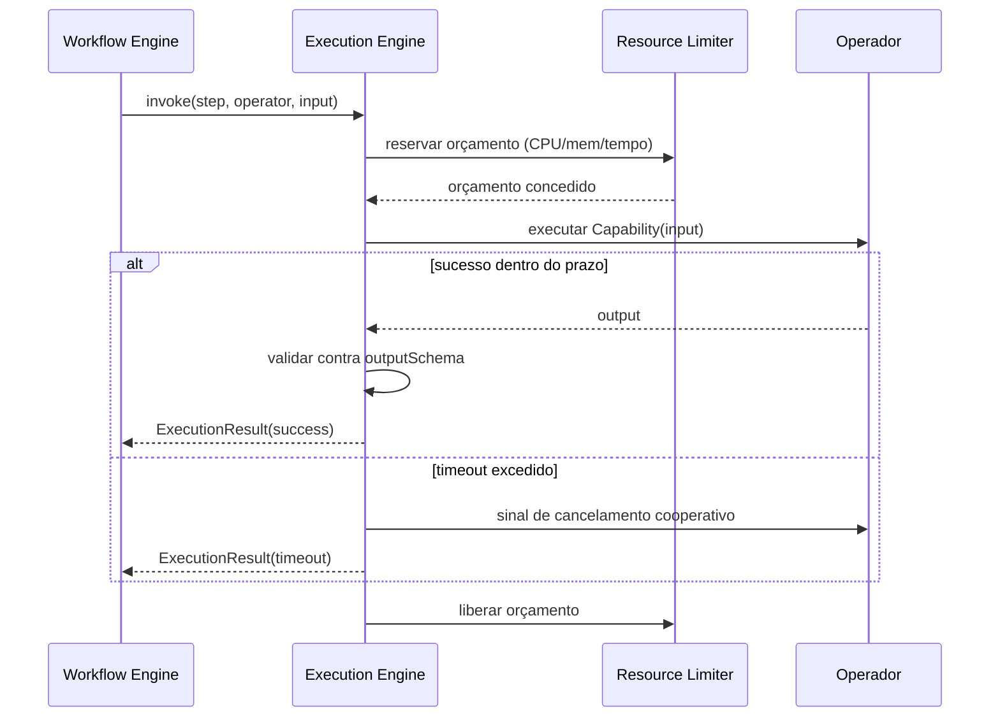
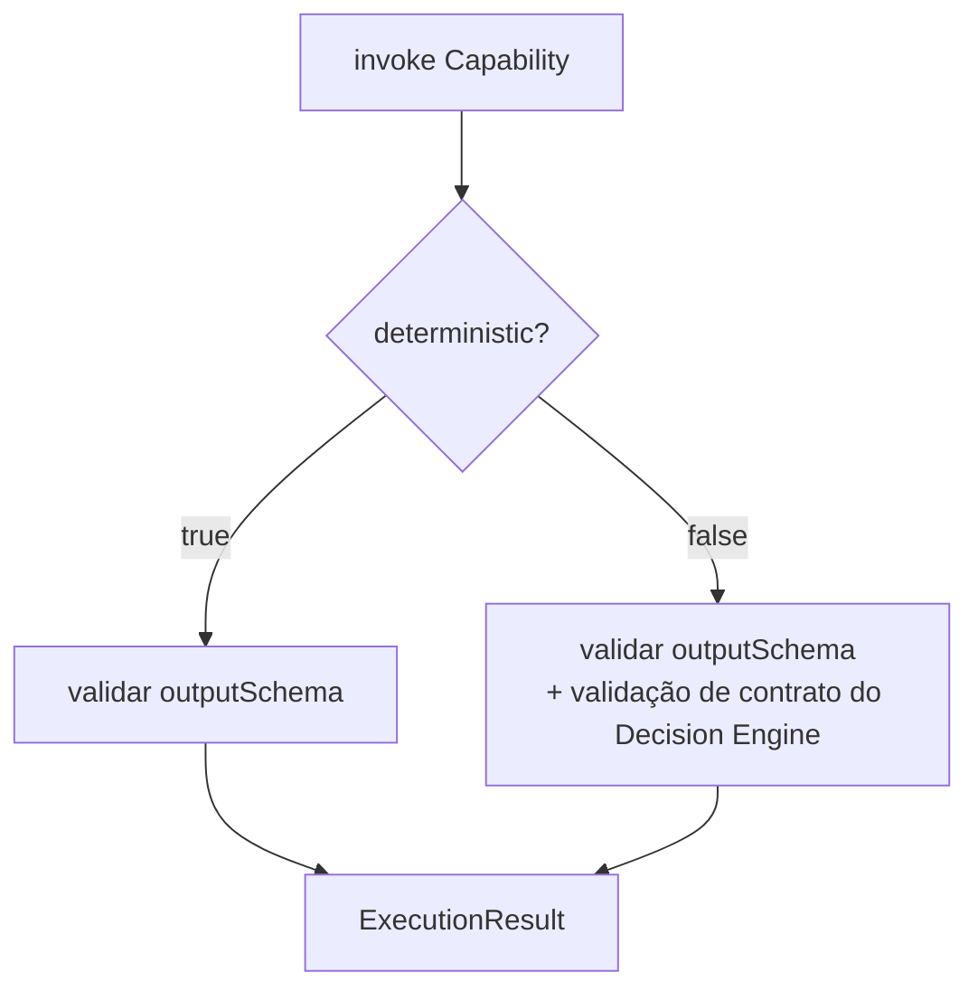

# Capítulo 12 — Execution Engine

**Volume:** III — Runtime
**Status da especificação:** v0.1 (Draft)
**Depende de:** Capítulo 11 (Capability Engine)

---

## 12.0 Objetivo do capítulo

Especificar a camada que efetivamente invoca uma Capability resolvida contra um Operador concreto — o ponto exato em que o Batman OS toca o mundo real (sistemas de arquivos, APIs externas, infraestrutura, o LLM Gateway).

## 12.1 Motivação

O Workflow Engine (Volume II, Cap. 9) sabe *que* um passo deve ser executado e *quando* suas dependências estão satisfeitas. Ele não sabe *como* invocar fisicamente um Operador, tratar timeouts de rede, serializar/desserializar payloads, ou aplicar limites de recurso. Essa é a responsabilidade do Execution Engine — a fronteira entre o Kernel determinístico e o mundo externo, necessariamente não determinístico em latência e disponibilidade (ainda que determinístico em contrato de dados).

## 12.2 Contrato de invocação

```typescript
interface ExecutionEngine {
  invoke(step: PlanStep, operator: OperatorRef, input: unknown): Promise<ExecutionResult>;
}

interface ExecutionResult {
  status: "success" | "failure" | "timeout";
  output?: unknown;              // validado contra outputSchema da Capability (Cap. 11)
  error?: ErrorEvidence;
  durationMs: number;
  resourceUsage: ResourceUsage;  // CPU, memória, chamadas de rede — insumo de billing/observabilidade
}
```

### 12.2.1 Validação obrigatória de contrato

Toda saída de uma Capability passa por validação contra `outputSchema` (Cap. 11) **antes** de ser aceita como `ExecutionResult.output`. Uma saída que viola o schema é tratada como `failure`, nunca como sucesso "com formato estranho" — isso é o que impede que erros silenciosos de contrato se propaguem para decisões subsequentes (Evidence First).

## 12.3 Diagrama: invocação com timeout e limite de recurso



## 12.4 Isolamento de falhas do Operador (bulkhead)

Cada invocação ocorre dentro de um limite de recurso isolado por Operador (padrão *bulkhead*): um Operador lento ou instável nunca deve poder esgotar recursos compartilhados a ponto de degradar invocações de outros Operadores não relacionados. Isso é aplicado pelo `Resource Limiter`, configurado por classe de Operador (ver Cap. 14, Concorrência e Isolamento, para o modelo completo de isolamento entre missões).

## 12.5 Tratamento do LLM Gateway como Operador especial

O LLM Gateway (mencionado desde a ADR-0001) é modelado, do ponto de vista do Execution Engine, como **um Operador como outro qualquer** — com uma diferença estrutural: sua Capability associada é sempre marcada `deterministic: false` (Cap. 11) e sua saída passa **obrigatoriamente** por um validador de contrato adicional antes mesmo da validação padrão de `outputSchema` (ver Volume II, Cap. 8, seção 8.2). Isso garante que o Execution Engine não trate a saída de um LLM com o mesmo nível de confiança automática que a saída de uma Capability determinística.



## 12.6 Casos de falha e recuperação

| Cenário | Tratamento |
|---|---|
| Operador não responde dentro do timeout configurado | `ExecutionResult.status = "timeout"`; Workflow Engine decide estratégia de recuperação (Cap. 9) |
| Saída do Operador viola `outputSchema` | Tratado como `failure` com evidência do erro de schema — nunca aceito parcialmente |
| Operador excede orçamento de recurso concedido pelo Resource Limiter | Execução é interrompida cooperativamente; registrado como `failure` com `resourceUsage` parcial para diagnóstico |
| Falha de rede transitória ao invocar Operador externo | Tratado como `failure`; retry é responsabilidade do `RecoveryStrategy` do passo (Cap. 9), não do Execution Engine — este nunca reintenta silenciosamente por conta própria |

## 12.7 Testes de aceitação

1. **AT-12.1:** Nenhum `ExecutionResult.status = "success"` pode existir com `output` que viole `outputSchema` da Capability invocada.
2. **AT-12.2:** Invocações que excedem o timeout configurado devem sempre retornar `status: "timeout"` em tempo finito, nunca bloquear indefinidamente o Worker Pool do Scheduler (Volume II, Cap. 10).
3. **AT-12.3:** Um Operador instável (alta taxa de timeout/failure) não deve degradar a taxa de sucesso de invocações de outros Operadores não relacionados (teste de isolamento bulkhead).

## 12.8 KPIs deste componente

- **Taxa de sucesso/falha/timeout por Operador** — insumo direto de saúde operacional.
- **Distribuição de `durationMs`** por Capability — detecta degradação de performance ao longo do tempo.
- **Taxa de rejeição por violação de `outputSchema`** — sinaliza Capabilities mal especificadas ou Operadores desatualizados frente ao contrato.

## 12.9 Status da Implementação

| Já existe | Precisa refatorar | Ainda não existe |
|---|---|---|
| — | — | Execution Engine completo; Resource Limiter (bulkhead); validação em duas camadas para Operadores não determinísticos |

---

**Capítulo anterior:** [Capítulo 11 — Capability Engine](./01-capability-engine.md)
**Próximo capítulo:** [Capítulo 13 — Operational Memory](./03-operational-memory.md)
