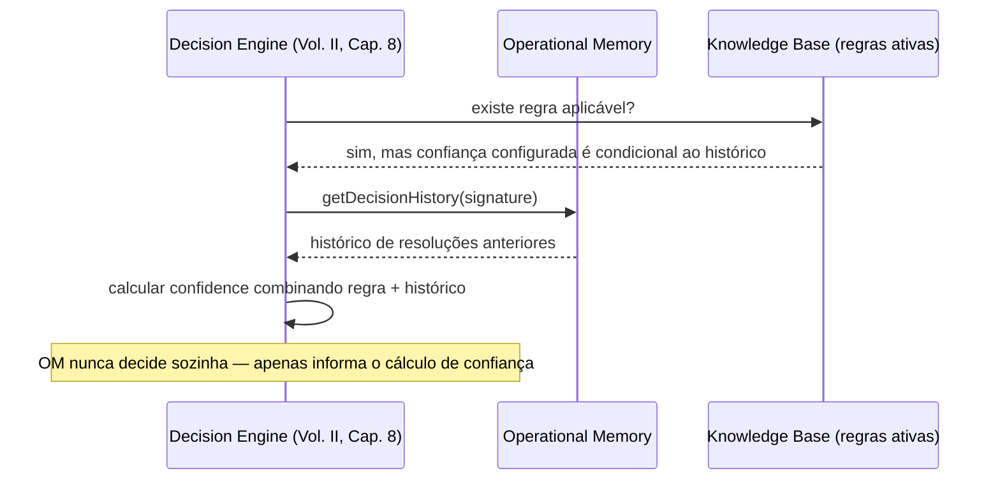

# Capítulo 13 — Operational Memory

**Volume:** III — Runtime
**Status da especificação:** v0.1 (Draft)
**Depende de:** Capítulo 12 (Execution Engine)

---

## 13.0 Objetivo do capítulo

Especificar onde e como o Batman persiste estado entre missões — a diferença entre "lembrar" (Operational Memory, este capítulo) e "aprender" (Learning Engine, Volume VI). Esta distinção é central e é formalizada na ADR-0004 (seção 13.7).

## 13.1 Motivação

Sem uma camada de memória explícita, cada Missão seria uma ilha isolada — o Decision Engine (Volume II, Cap. 8) não teria precedentes para consultar, e o Planning Engine não saberia que um `intent` semelhante já foi resolvido antes. A Operational Memory é o substrato de consulta que várias camadas do Kernel e Runtime compartilham.

## 13.2 Distinção formal: Operational Memory vs. Knowledge Asset

| | Operational Memory | Knowledge Asset (Cap. 4, Volume I) |
|---|---|---|
| Natureza | Histórico factual e consultável de execuções passadas | Conhecimento estruturado e ativo (regra, Capability, Workflow, Playbook) |
| Muda comportamento futuro? | Não diretamente — é consultada como evidência | Sim — é o que efetivamente altera como o sistema decide/planeja |
| Exemplo | "A missão M-4821, do tipo investigate-incident, teve DecisionPoint X resolvido com confiança 0.92 usando a regra R-17" | A própria regra R-17 |
| Curadoria | Append-only, nunca editada | Passa por processo de promoção/validação (Volume VI) |

**Regra central:** a Operational Memory é matéria-prima para o Learning Engine, mas nunca é, por si só, uma fonte de comportamento determinístico do Kernel. Um `DecisionPoint` nunca é resolvido "porque a Operational Memory mostra que aconteceu assim da última vez" diretamente — ela alimenta o cálculo de confiança do Decision Engine, mas a promoção de um padrão observado a uma regra permanente é um processo governado (Volume VI, Rule Evolution).

## 13.3 Estrutura de dados

```typescript
interface OperationalRecord {
  id: RecordId;
  missionId: MissionId;
  missionType: MissionType;
  decisionPointsResolved: DecisionSummary[];
  stepResults: StepResultSummary[];
  finalState: "Completed" | "Failed" | "Cancelled";
  cognitiveDebtFlag: "autonomous" | "human" | "llm";
  recordedAt: Timestamp;
}

interface DecisionSummary {
  decisionPointId: DecisionPointId;
  resolvedBy: "knowledge" | "human" | "llm";
  chosenOptionId: string;
  confidence: number;
}
```

Note que `OperationalRecord` é uma **projeção derivada** dos eventos do Event Bus (Volume II, Cap. 10) — não uma fonte de verdade paralela. Isso preserva a garantia de event sourcing estabelecida pela ADR-0003.

## 13.4 Interface de consulta

```typescript
interface OperationalMemory {
  findSimilarMissions(intent: MissionIntent, limit: number): OperationalRecord[];
  getDecisionHistory(decisionPointSignature: string): DecisionSummary[];
  getFrequency(pattern: PatternQuery): number; // usado para detectar candidatos a Cognitive Debt recorrente
}
```

## 13.5 Diagrama: fluxo de consulta durante o Decision Engine



## 13.6 Detecção de candidatos a Cognitive Debt recorrente

A Operational Memory é a fonte de dados para um processo periódico (não em tempo real, não bloqueante do Kernel) que identifica padrões de decisão repetidos com alta frequência e `resolvedBy` humano ou LLM — candidatos naturais a virar regra permanente via Learning Engine (Volume VI):

```
function findPromotionCandidates(memory: OperationalMemory, threshold: number): PromotionCandidate[] {
  1. patterns = groupBy(memory.allRecords(), r => decisionSignature(r))
  2. candidates = patterns.filter(p =>
       p.records.length >= threshold &&
       p.records.every(r => r.resolvedBy in ["human", "llm"]) &&
       consistentOutcome(p.records)  // mesma classe de decisão, resultado convergente
     )
  3. return candidates  // consumido pelo Learning Engine (Volume VI), nunca aplicado automaticamente aqui
}
```

**Nota crítica de governança:** este processo apenas **identifica candidatos**. A promoção de um padrão a regra permanente é sempre um evento de Human Review (Volume VII) — a Operational Memory nunca promove conhecimento a si mesma de forma autônoma, o que violaria Full Governance.

## 13.7 ADR relacionada

Esta distinção é formalizada em [ADR-0004 — Operational Memory não é fonte de verdade comportamental](./ADR/ADR-0004-operational-memory-vs-knowledge.md).

## 13.8 Casos de falha e recuperação

| Cenário | Tratamento |
|---|---|
| Operational Memory indisponível durante consulta do Decision Engine | Decision Engine prossegue com confiança calculada apenas a partir da Knowledge Base ativa (degradação graciosa, nunca falha em cascata) |
| Volume de registros cresce sem limite | Estratégia de retenção/arquivamento configurável (detalhada no Volume VIII — Infrastructure); registros arquivados continuam consultáveis via `replay` do Event Bus se necessário |
| Padrão de promoção detectado com resultados inconsistentes entre execuções (`consistentOutcome` falha) | Não é elegível a candidato — sinaliza que o padrão ainda não é estável o suficiente para virar regra |

## 13.9 Testes de aceitação

1. **AT-13.1:** `OperationalRecord` nunca deve ser editável após criado — apenas leitura (append-only, consistente com ADR-0003).
2. **AT-13.2:** `findPromotionCandidates` nunca deve, por si só, alterar o comportamento do Decision Engine — apenas produzir uma lista para revisão humana subsequente.
3. **AT-13.3:** Indisponibilidade da Operational Memory não pode causar falha do Decision Engine — apenas degradação do cálculo de confiança, verificável em teste de caos.

## 13.10 KPIs deste componente

- **Taxa de consultas à Operational Memory por Decision Point** — mede o quanto o Decision Engine depende de histórico vs. regras diretas.
- **Número de candidatos a promoção identificados por período** — insumo de throughput para o Learning Engine.
- **Latência de consulta `findSimilarMissions`** — relevante para não degradar o SLA do Decision Engine.

## 13.11 Status da Implementação

| Já existe | Precisa refatorar | Ainda não existe |
|---|---|---|
| Operational Memory completa (append-only, `OperationalRecord` imutável); `find_promotion_candidates()`; `calcular_confidence_combinada()` com degradação graciosa — `src/batman_os/runtime/operational_memory.py`, testes AT-13.1 a AT-13.3 | Reconciliação automática a partir do Event Bus (hoje alimentada via `registrar()` explícito — Decision/Workflow Engine ainda não publicam eventos ricos o bastante) | Job periódico agendado de detecção de candidatos; estratégia de retenção/arquivamento (Volume VIII, Infrastructure) |

---

**Capítulo anterior:** [Capítulo 12 — Execution Engine](./02-execution-engine.md)
**Próximo capítulo:** [Capítulo 14 — Concorrência e Isolamento de Missões](./04-concurrency-isolation.md)
