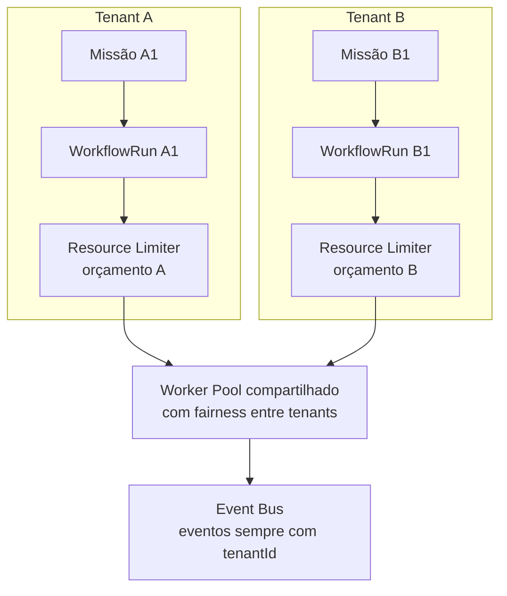

# Capítulo 14 — Concorrência e Isolamento de Missões

**Volume:** III — Runtime
**Status da especificação:** v0.1 (Draft)
**Depende de:** Capítulo 13 (Operational Memory); Volume II, Capítulo 10 (Scheduler)

---

## 14.0 Objetivo do capítulo

Fechar o Volume III especificando, em detalhe, como múltiplas Missões — potencialmente de diferentes times, diferentes níveis de criticidade, e diferentes tenants — coexistem no mesmo Batman OS sem interferência indevida entre si.

## 14.1 Motivação

O Scheduler (Volume II, Cap. 10) introduziu o conceito de Worker Pool e prioridade. Este capítulo aprofunda o modelo de isolamento: recursos, dados e falhas de uma Missão não podem vazar ou degradar outra, especialmente em um sistema multi-tenant onde diferentes áreas de negócio (ou diferentes clientes, no caso de uso do tipo MOK-VIBE) compartilham a mesma instância do Batman.

## 14.2 Dimensões de isolamento

| Dimensão | O que isola | Mecanismo |
|---|---|---|
| **Recurso computacional** | CPU, memória, chamadas de rede por invocação | Resource Limiter por Operador (Cap. 12), com orçamento por classe de missão |
| **Dados** | Operational Memory e Knowledge Base de um tenant não vazam para outro | Particionamento lógico por `tenantId` em toda consulta (Cap. 13) |
| **Falha** | Falha em uma Missão não propaga para outra em execução concorrente | Bulkhead por Operador (Cap. 12) + Workflow Engine isolado por `WorkflowRun` (Volume II, Cap. 9) |
| **Prioridade** | Missões críticas não ficam bloqueadas atrás de missões de baixa prioridade | Fila com prioridade + aging no Scheduler (Volume II, Cap. 10) |

## 14.3 Modelo de multi-tenancy

```typescript
interface MissionIntent {
  // campos já definidos no Volume II, Cap. 6, mais o campo obrigatório:
  tenantId: TenantId;
}
```

**Regra estrutural:** `tenantId` é propagado obrigatoriamente por toda a cadeia — `Mission`, `ExecutionPlan`, `WorkflowRun`, `OperationalRecord`, `KernelEvent`. Nenhum componente do Kernel ou Runtime pode processar uma entidade sem `tenantId` associado. Isso não é apenas isolamento de segurança — é pré-condição para que Cognitive Debt (Cap. 4, Volume I) e KPIs de governança possam ser calculados por tenant, não apenas de forma agregada e opaca.

## 14.4 Diagrama: isolamento em execução concorrente



## 14.5 Fairness entre tenants (extensão do Scheduler)

O modelo de prioridade do Scheduler (Volume II, Cap. 10) é estendido com uma camada de fairness por tenant, para impedir que um tenant com alto volume de missões monopolize o Worker Pool compartilhado às custas de tenants menores:

```
function selectNextStep(queues: Map<TenantId, PriorityQueue<PlanStep>>): PlanStep {
  1. eligibleTenants = queues.filter(q => q.nonEmpty())
  2. tenant = weightedRoundRobin(eligibleTenants, weights = tenantQuotas)
  3. return tenant.queue.dequeueHighestPriority()
}
```

`tenantQuotas` é configuração explícita (não emergente), revisável via Governance Engine (Volume VII) — nunca uma heurística implícita de "quem chegou primeiro".

## 14.6 Isolamento de falha: por que um `WorkflowRun` nunca compartilha estado mutável

Cada `WorkflowRun` (Volume II, Cap. 9) opera sobre seu próprio conjunto de checkpoints e `StepResult`s. Nenhum passo de uma missão lê ou escreve diretamente o estado de outra `WorkflowRun` — toda comunicação entre missões relacionadas (ex.: sub-missões, `parentMissionId`) ocorre exclusivamente através de eventos publicados no Event Bus (Volume II, Cap. 10) e leitura de `OperationalRecord`s (Cap. 13), nunca por acesso direto a estado mutável de outra execução.

## 14.7 Casos de falha e recuperação

| Cenário | Tratamento |
|---|---|
| Tenant com pico de volume de missões | Fairness por `weightedRoundRobin` impede monopólio do Worker Pool; alerta de saturação se quota do tenant for cronicamente insuficiente (Observability Engine, Volume VII) |
| Vazamento de dado entre tenants detectado (ex.: consulta sem `tenantId` corretamente propagado) | Tratado como incidente de segurança de prioridade máxima — nunca "bug comum"; aciona Governance Engine imediatamente |
| Falha de um Operador compartilhado afeta múltiplos tenants simultaneamente | Bulkhead (Cap. 12) limita o raio de impacto por invocação individual, não por tenant inteiro — ainda assim, se o próprio Operador cair, todos os tenants que o utilizam são afetados; mitigação de redundância de Operador é responsabilidade do Volume VIII — Infrastructure |

## 14.8 Testes de aceitação

1. **AT-14.1:** Nenhuma consulta à Operational Memory ou Knowledge Base pode retornar dados de um `tenantId` diferente do solicitado — verificação de isolamento de dados em teste de segurança automatizado.
2. **AT-14.2:** Sob carga sustentada de um tenant de alto volume, tenants de baixo volume devem manter uma taxa mínima garantida de despacho de steps (teste de fairness).
3. **AT-14.3:** Falha completa de um `WorkflowRun` não deve afetar o progresso de `WorkflowRun`s concorrentes de outras missões (teste de isolamento de falha).

## 14.9 KPIs deste componente

- **Latência de despacho por tenant** — detecta violações de fairness antes que virem incidente.
- **Taxa de utilização do Worker Pool por tenant vs. quota configurada**.
- **Número de incidentes de isolamento de dados detectados** — meta estrutural é zero, com alarme em qualquer ocorrência.

## 14.10 Status da Implementação

| Já existe | Precisa refatorar | Ainda não existe |
|---|---|---|
| Propagação obrigatória de `tenant_id` (Mission/ExecutionPlan/WorkflowRun/OperationalRecord/KernelEvent, sem default); `SchedulerComFairnessPorTenant` (smooth weighted round-robin); isolamento de dados na Operational Memory; isolamento de falha entre `WorkflowRun`s — `src/batman_os/runtime/concurrency.py`, testes AT-14.1 a AT-14.3 | — | Isolamento físico de instância por tenant (exceção configurável mencionada na ADR-0005) — não aplicável nesta fase |

---

## Encerramento do Volume III

Com este capítulo, o Runtime do Batman OS está especificado: o Capability Engine mantém um catálogo versionado e determinístico (Cap. 11); o Execution Engine é a fronteira controlada com o mundo externo, incluindo o tratamento do LLM Gateway como Operador especial (Cap. 12); a Operational Memory distingue claramente "lembrar" de "aprender" (Cap. 13); e o modelo de concorrência garante isolamento entre missões e tenants (Cap. 14).

O **Volume IV — Capabilities** aprofunda o que hoje é tratado aqui como caixa-preta operacional: o que é de fato um Operador, o contrato formal de uma Capability do ponto de vista de quem a implementa, Skills como unidades de conhecimento composável, Ferramentas (Tools), e os padrões de cooperação entre múltiplos Operadores dentro da mesma Missão.

---

**Capítulo anterior:** [Capítulo 13 — Operational Memory](./03-operational-memory.md)
**Próximo volume:** Volume IV — Capabilities (a iniciar)
