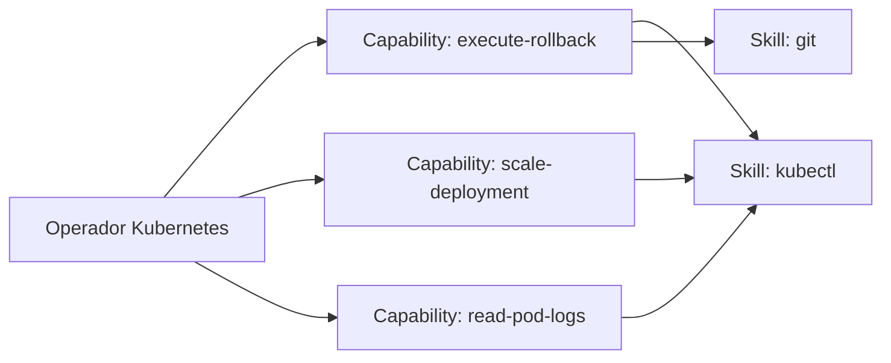
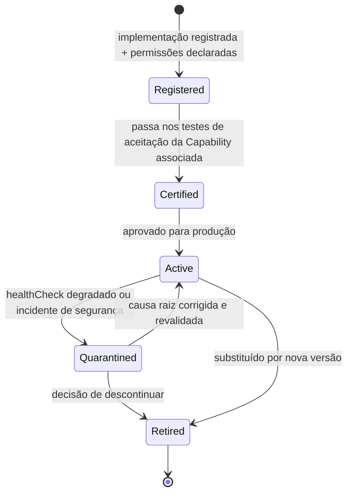

# Capítulo 15 — O que é um Operador

**Volume:** IV — Capabilities
**Status da especificação:** v0.1 (Draft)
**Depende de:** Volume III (Runtime), em particular Capítulos 11 e 12

---

## 15.0 Objetivo do capítulo

Onde o Volume III tratou o Operador como uma referência opaca invocada pelo Execution Engine (`OperatorRef`), este capítulo abre essa caixa-preta do ponto de vista de **quem implementa** um Operador — o contrato que um engenheiro (humano ou agente) precisa cumprir para adicionar uma nova capacidade permanente ao Batman.

## 15.1 Motivação

O Volume III especificou como o Kernel *consome* Operadores. Faltava especificar como um Operador *nasce*. Sem esse contrato, cada novo Operador seria implementado de forma ad-hoc, quebrando as garantias de isolamento (Volume III, Cap. 14), determinismo (ADR-0001) e auditabilidade (Full Governance) que o Runtime pressupõe.

## 15.2 Definição formal (retomando o Glossário, Volume I, Cap. 4)

> Um **Operador** é o executor especializado do Batman: a entidade concreta que possui Capacidades, Ferramentas, Memória Operacional, Estado e Permissões, e que o Execution Engine invoca para realizar o trabalho definido por um `PlanStep`.

## 15.3 Contrato formal de um Operador

```typescript
interface Operator {
  id: OperatorId;
  capabilities: CapabilityId[];        // quais Capabilities este Operador implementa (Vol. III, Cap. 11)
  permissions: PermissionSet;          // ver seção 15.5
  sandbox: SandboxPolicy;               // ver seção 15.6
  execute(capability: CapabilityId, input: unknown, context: ExecutionContext): Promise<unknown>;
  healthCheck(): HealthStatus;          // usado pelo Resource Limiter (Vol. III, Cap. 12)
}

interface ExecutionContext {
  missionId: MissionId;
  tenantId: TenantId;                   // obrigatório, ver Vol. III, Cap. 14
  stepId: StepId;
  deadline: Timestamp;                  // usado para timeout cooperativo (Vol. III, Cap. 12)
}
```

**Regra estrutural:** um Operador nunca recebe acesso direto ao `Mission` completo — apenas ao `ExecutionContext` mínimo necessário. Isso limita o raio de dano de um Operador malicioso ou defeituoso e reforça o isolamento por tenant (Volume III, ADR-0005).

## 15.4 Um Operador pode implementar múltiplas Capabilities

Não há relação um-para-um obrigatória entre Operador e Capability. Um mesmo Operador (ex.: "Operador Kubernetes") pode implementar várias Capabilities relacionadas (`execute-rollback`, `scale-deployment`, `read-pod-logs`), desde que cada uma tenha seu próprio contrato de schema (Volume III, Cap. 11) e suas próprias permissões declaradas.



## 15.5 Permissões (PermissionSet)

```typescript
interface PermissionSet {
  allowedActions: string[];             // whitelist explícita, nunca blacklist
  sideEffectScope: "read-only" | "reversible-write" | "irreversible-write";
  requiresApprovalAbove?: RiskThreshold; // decisões acima deste risco exigem Human Last (Vol. II, Cap. 8)
}
```

**Princípio de menor privilégio:** todo Operador é criado com `allowedActions` vazio por padrão; cada ação precisa ser explicitamente concedida. Isso é auditável e revisável pelo Governance Engine (Volume VII).

## 15.6 Sandbox e isolamento de execução

Retomando o modelo bulkhead do Volume III (Cap. 12), todo Operador executa dentro de uma `SandboxPolicy`:

```typescript
interface SandboxPolicy {
  resourceLimits: ResourceLimits;       // CPU, memória, tempo — Vol. III, Cap. 12
  networkPolicy: "none" | "allowlist" | "unrestricted";
  filesystemAccess: "none" | "scoped-temp" | "scoped-persistent";
}
```

`networkPolicy: "unrestricted"` é permitido apenas para Operadores explicitamente aprovados via ADR — é a exceção, não o padrão (ver ADR-0006, seção 15.9).

## 15.7 Ciclo de vida de um Operador



**Nota:** `Quarantined` isola o Operador do Scheduler (Volume II, Cap. 10) sem removê-lo do catálogo — suas missões em andamento seguem a estratégia de recuperação definida no Workflow Engine (Volume II, Cap. 9), nunca são abandonadas silenciosamente.

## 15.8 Casos de falha e recuperação

| Cenário | Tratamento |
|---|---|
| Operador tenta executar ação fora de `allowedActions` | Rejeitado no Execution Engine antes da invocação física — tratado como `failure` com evidência de violação de permissão |
| `healthCheck()` reporta degradação sustentada | Transição automática para `Quarantined`; Scheduler para de despachar novos passos para este Operador |
| Operador com `sideEffectScope: "irreversible-write"` tenta operar sem `requiresApprovalAbove` configurado | Rejeitado no registro (Cap. 15.5) — toda ação irreversível exige threshold de risco explícito, sem exceção |
| Novo Operador registrado sem sandbox declarada | Rejeitado no registro — `SandboxPolicy` é campo obrigatório, nunca implícito |

## 15.9 ADR relacionada

[ADR-0006 — Menor Privilégio e Sandboxing Obrigatório para Operadores](./ADR/ADR-0006-operator-least-privilege.md)

## 15.10 Testes de aceitação

1. **AT-15.1:** Nenhum Operador pode executar uma ação fora de seu `allowedActions` declarado — verificado com teste de tentativa de violação deliberada.
2. **AT-15.2:** Um Operador em `Quarantined` nunca deve receber novos `PlanStep`s do Scheduler até retornar a `Active`.
3. **AT-15.3:** Toda Capability com `sideEffectScope: "irreversible-write"` deve ter `requiresApprovalAbove` definido — verificação estrutural no momento do registro.

## 15.11 KPIs deste componente

- **Taxa de Operadores em `Quarantined` por período** — sinaliza saúde geral do catálogo de execução.
- **Número de tentativas de ação fora de permissão bloqueadas** — sinaliza tanto tentativas maliciosas quanto bugs de implementação de Operador.
- **Tempo médio entre `Quarantined` e retorno a `Active`** — mede maturidade operacional.

## 15.12 Status da Implementação

| Já existe | Precisa refatorar | Ainda não existe |
|---|---|---|
| — | — | Contrato `Operator`; ciclo de vida com quarentena; enforcement de `PermissionSet` e `SandboxPolicy` |

---

**Capítulo anterior:** [Capítulo 14 — Concorrência e Isolamento de Missões](../03-runtime/04-concurrency-isolation.md)
**Próximo capítulo:** [Capítulo 16 — Capabilities: Contrato e Ciclo de Vida](./02-capability-contract.md)
