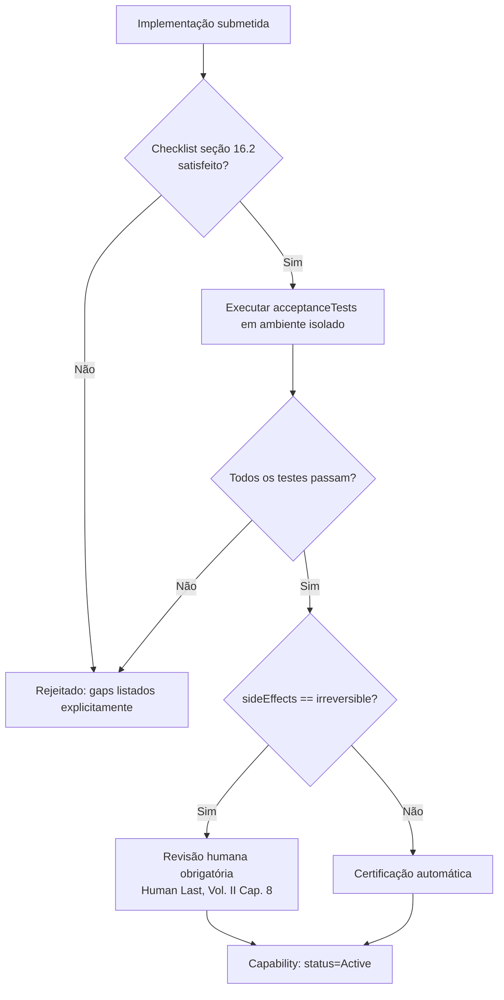

# Capítulo 16 — Capabilities: Contrato e Ciclo de Vida

**Volume:** IV — Capabilities
**Status da especificação:** v0.1 (Draft)
**Depende de:** Capítulo 15 (O que é um Operador); Volume III, Capítulo 11 (Capability Engine)

---

## 16.0 Objetivo do capítulo

O Volume III, Capítulo 11, especificou o Capability Engine do ponto de vista do **catálogo** (como Capabilities são registradas, versionadas e resolvidas). Este capítulo complementa isso do ponto de vista de **quem implementa** uma Capability nova: o checklist de engenharia, os testes obrigatórios e os critérios de aceitação antes que ela possa ser marcada `Active`.

## 16.1 Motivação

Sem um contrato de implementação explícito, a qualidade de uma Capability nova dependeria inteiramente do rigor pessoal de quem a escreveu. Isso é incompatível com Full Governance (Princípio 9, Volume I) e com a promessa de que o mesmo `intent` sempre produz o mesmo comportamento (Determinism First).

## 16.2 Checklist obrigatório de implementação

Toda nova Capability, antes de poder transicionar de `Draft` para `Active` (Volume III, Cap. 11, seção 11.5), deve satisfazer:

1. **`inputSchema` e `outputSchema` completos e versionados** (JSON Schema, sem campos ambíguos ou `any` implícito).
2. **Declaração explícita de `deterministic`** — `true` a menos que a Capability envolva o LLM Gateway isolado (ADR-0001, Volume I).
3. **Declaração explícita de `sideEffects`** (`none` / `reversible` / `irreversible`) — usada pelo Decision Engine (Volume II, Cap. 8, seção 8.4) para decidir política de escalonamento.
4. **Suíte de testes de aceitação própria**, cobrindo ao menos: caminho feliz, entrada inválida (deve falhar validação de schema, nunca "tentar adivinhar"), e timeout/falha de dependência externa.
5. **Estratégia de recuperação documentada** (se aplicável) para uso por `RecoveryStrategy` no Workflow Engine (Volume II, Cap. 9).
6. **Registro de Skills utilizadas** (Cap. 17) — nenhuma Capability pode invocar uma Skill não declarada.

## 16.3 Estrutura de dados: Implementação de referência

```typescript
interface CapabilityImplementation {
  definition: CapabilityDefinition;     // Volume III, Cap. 11
  handler: (input: unknown, ctx: ExecutionContext) => Promise<unknown>;
  acceptanceTests: AcceptanceTest[];
  recoveryStrategyDefaults?: RecoveryStrategy; // Volume II, Cap. 9
  skillsUsed: SkillRef[];               // Cap. 17
}

interface AcceptanceTest {
  name: string;
  input: unknown;
  expectedOutcome: "success" | "schema-rejection" | "timeout";
  expectedOutputMatcher?: (output: unknown) => boolean;
}
```

## 16.4 Fluxo de certificação de uma Capability



**Nota crítica:** Capabilities com `sideEffects: "irreversible"` **nunca** são certificadas automaticamente, independentemente de todos os testes passarem — exigem revisão humana explícita antes de `Active`, reforçando o Princípio 5 (Human Last) já no momento de entrada no catálogo, não apenas em tempo de execução.

## 16.5 Idempotência como requisito de design

Toda Capability com `sideEffects != "none"` deve, sempre que tecnicamente viável, ser desenhada como **idempotente**: invocá-la duas vezes com o mesmo `input` e mesmo `ExecutionContext.stepId` deve produzir o mesmo efeito líquido de invocá-la uma vez. Isso é o que torna a retomada de checkpoint (Volume II, Cap. 9, seção 9.3) segura sem duplicar efeitos colaterais.

```typescript
// Padrão recomendado para garantir idempotência: chave de idempotência derivada do stepId
async function handler(input: RollbackInput, ctx: ExecutionContext) {
  const idempotencyKey = `${ctx.missionId}:${ctx.stepId}`;
  if (await alreadyApplied(idempotencyKey)) {
    return previousResult(idempotencyKey);
  }
  const result = await applyRollback(input);
  await recordApplied(idempotencyKey, result);
  return result;
}
```

Quando idempotência verdadeira não é tecnicamente possível (ex.: envio de notificação externa não idempotente por natureza), isso deve ser declarado explicitamente no `CapabilityDefinition` (campo `idempotent: false`), e o Workflow Engine trata tais passos com estratégias de recuperação mais conservadoras (preferindo `compensate` a `retry` — Volume II, Cap. 9, seção 9.5).

## 16.6 Casos de falha e recuperação

| Cenário | Tratamento |
|---|---|
| Capability submetida sem `outputSchema` completo | Rejeitada no checklist (16.2), nunca aceita "para ajustar depois" |
| Testes de aceitação passam em ambiente de staging mas falham em produção | Indica gap entre ambientes — tratado como incidente de qualidade do processo de certificação, não apenas da Capability específica |
| Capability declarada `idempotent: true` mas efeito duplicado detectado em produção | Certificação suspensa imediatamente (`Active → Quarantined` equivalente para Capability); gera Knowledge Asset de gap de teste (Volume I, Cap. 4) |

## 16.7 Testes de aceitação (do próprio processo de certificação)

1. **AT-16.1:** Nenhuma Capability pode atingir `status: Active` sem `inputSchema`, `outputSchema`, `deterministic` e `sideEffects` todos declarados.
2. **AT-16.2:** Capabilities com `sideEffects: "irreversible"` nunca atingem `Active` sem um registro de revisão humana associado.
3. **AT-16.3:** Capabilities declaradas `idempotent: true` devem passar em teste automatizado de dupla invocação com mesmo `stepId` antes da certificação.

## 16.8 KPIs deste componente

- **Tempo médio de certificação** (submissão → `Active`) — mede fricção do processo.
- **Taxa de rejeição no checklist inicial** — sinaliza necessidade de melhor documentação ou tooling de apoio a implementadores.
- **Número de Capabilities suspensas por falha de idempotência em produção** — meta estrutural é zero.

## 16.9 Status da Implementação

| Já existe | Precisa refatorar | Ainda não existe |
|---|---|---|
| Pipeline de certificação completo (`certificar()`: checklist→testes de aceitação→idempotência→revisão humana); verificação automatizada de idempotência via dupla invocação; `sideEffects: irreversible` nunca certificado sem `revisao_humana_obtida` explícito — `src/batman_os/capabilities/capability_contract.py`, testes AT-16.1 a AT-16.3 | — | Ambiente de execução verdadeiramente isolado para rodar `acceptance_tests` (Volume VIII, Infrastructure) |

---

**Capítulo anterior:** [Capítulo 15 — O que é um Operador](./01-operator.md)
**Próximo capítulo:** [Capítulo 17 — Skills](./03-skills.md)
