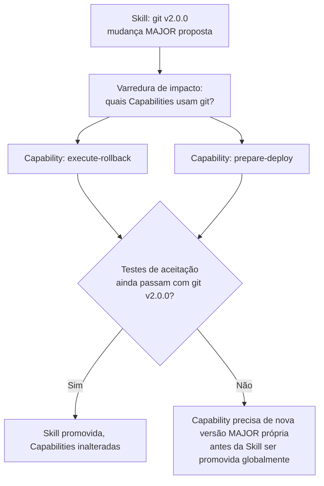

# Capítulo 17 — Skills

**Volume:** IV — Capabilities
**Status da especificação:** v0.1 (Draft)
**Depende de:** Capítulo 16 (Capabilities: Contrato e Ciclo de Vida)

---

## 17.0 Objetivo do capítulo

Especificar Skills — a unidade de conhecimento especializado composável que Capabilities utilizam internamente — formalizando como são catalogadas, versionadas e reaproveitadas entre múltiplas Capabilities, evitando duplicação de conhecimento técnico dentro do sistema.

## 17.1 Motivação

Sem um catálogo explícito de Skills, o mesmo conhecimento técnico (ex.: como interagir com o Git, como parsear uma AST) seria reimplementado de forma inconsistente dentro de cada Capability — multiplicando superfícies de bug e dificultando a evolução coordenada (ex.: uma correção de segurança em como o sistema lida com autenticação Git precisaria ser replicada manualmente em todo Operador que a usa).

## 17.2 Definição formal (retomando o Glossário, Volume I, Cap. 4)

> Uma **Skill** é conhecimento especializado, tipicamente técnico ou de domínio, utilizado internamente por uma Capability para executar sua função. Exemplos: Regex, AST, Semgrep, Docker, Git, Kubernetes, Filesystem, REST, SQL.

**Distinção crítica reforçada:** uma Missão nunca invoca uma Skill diretamente. Uma Skill é sempre um insumo interno de uma Capability (Cap. 16) — isso preserva a fronteira de contrato público estabelecida no Capability Engine (Volume III, Cap. 11): o mundo externo ao Kernel só enxerga Capabilities, nunca Skills.

## 17.3 Estrutura de dados: Skill

```typescript
interface SkillDefinition {
  id: SkillId;
  name: string;                  // ex.: "git", "kubectl", "ast-parser-typescript"
  version: SemVer;
  interface: SkillInterface;      // contrato de métodos expostos, análogo a uma biblioteca interna
  dependencies: SkillId[];        // Skills podem compor outras Skills (ex.: "kubectl" depende de "yaml-parser")
  status: "active" | "deprecated" | "disabled";
}
```

## 17.4 Skills como biblioteca interna versionada

Skills seguem o mesmo rigor de versionamento semântico do Capability Engine (Volume III, Cap. 11, seção 11.3), mas com uma diferença de escopo: uma mudança MAJOR em uma Skill não quebra `ExecutionPlan`s existentes diretamente (porque Missões nunca referenciam Skills), mas pode quebrar **Capabilities** que a utilizam — portanto, toda mudança MAJOR de Skill deve ser acompanhada de uma varredura de impacto sobre todas as Capabilities que a declaram como dependência (`skillsUsed`, Cap. 16, seção 16.3).



## 17.5 Composição de Skills

Skills podem depender de outras Skills (ex.: uma Skill de alto nível "kubectl" pode internamente compor uma Skill de baixo nível "yaml-parser" e outra "http-client"). Essa composição segue as mesmas regras de grafo acíclico aplicadas ao Planning Engine (Volume II, Cap. 7, seção 7.6) — um ciclo de dependência entre Skills é sempre um erro de registro, nunca resolvido em runtime.

## 17.6 Casos de falha e recuperação

| Cenário | Tratamento |
|---|---|
| Capability declara uso de Skill inexistente ou desativada | Rejeitada no checklist de certificação (Cap. 16, seção 16.2) |
| Mudança MAJOR em Skill quebra testes de aceitação de uma Capability dependente | Skill não é promovida globalmente até a Capability afetada ser atualizada para a nova versão MAJOR ou explicitamente fixada na versão anterior |
| Ciclo de dependência detectado entre Skills | Rejeitado no registro — nunca aceito com resolução "melhor esforço" |

## 17.7 Testes de aceitação

1. **AT-17.1:** Nenhuma Capability pode ser certificada (Cap. 16) referenciando uma Skill com `status: disabled`.
2. **AT-17.2:** Uma mudança MAJOR em uma Skill deve, obrigatoriamente, disparar reexecução dos testes de aceitação de todas as Capabilities que a declaram como dependência antes de ser promovida a `active` globalmente.
3. **AT-17.3:** O grafo de dependências entre Skills nunca pode conter ciclos — verificação automática no registro.

## 17.8 KPIs deste componente

- **Número médio de Capabilities por Skill** — mede reaproveitamento de conhecimento técnico (alinhado ao conceito de Patrimônio Cognitivo, Volume I, Cap. 4).
- **Taxa de quebra de Capability por mudança de Skill** — mede qualidade da varredura de impacto e cobertura de testes de aceitação.

## 17.9 Status da Implementação

| Já existe | Precisa refatorar | Ainda não existe |
|---|---|---|
| `SkillRegistry` completo; verificação de ciclos no grafo de dependência (DFS 3-cores); `propor_mudanca_major_de_skill()` — varredura de impacto que só promove globalmente se todas as Capabilities dependentes continuam passando — `src/batman_os/capabilities/skills.py` + `capability_contract.py`, testes AT-17.1 a AT-17.3 | — | — |

---

**Capítulo anterior:** [Capítulo 16 — Capabilities: Contrato e Ciclo de Vida](./02-capability-contract.md)
**Próximo capítulo:** [Capítulo 18 — Ferramentas (Tools)](./04-tools.md)
