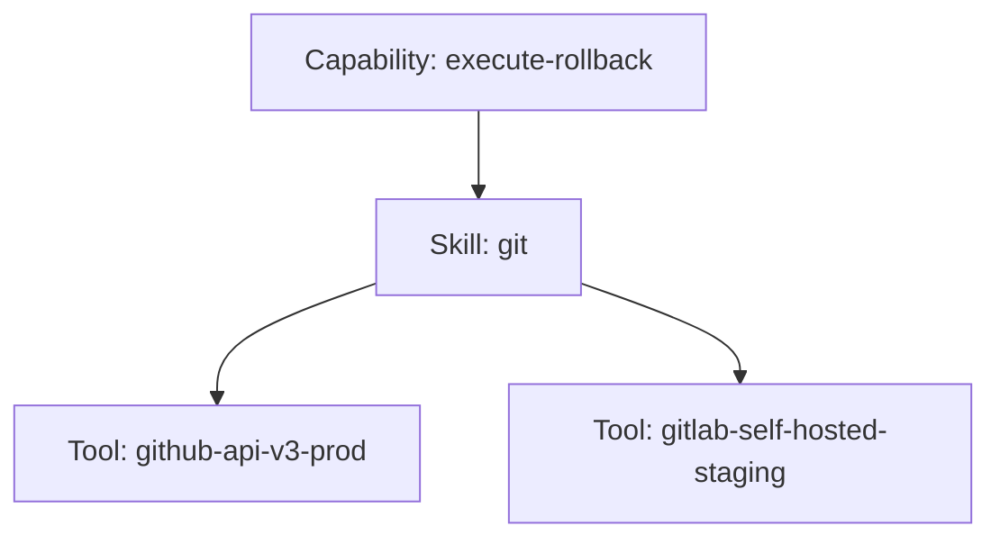
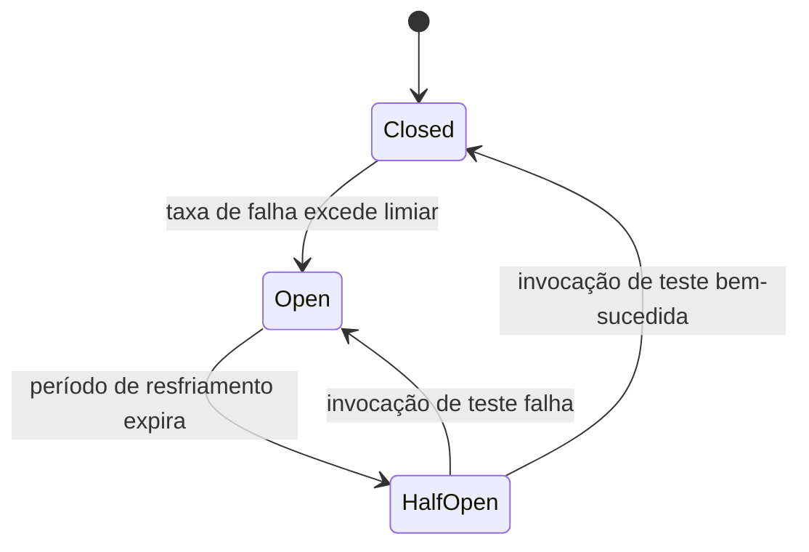

# Capítulo 18 — Ferramentas (Tools)

**Volume:** IV — Capabilities
**Status da especificação:** v0.1 (Draft)
**Depende de:** Capítulo 17 (Skills)

---

## 18.0 Objetivo do capítulo

Especificar Ferramentas (Tools) — a camada de adaptação concreta que conecta uma Skill ao mundo externo real (uma API específica, um binário de linha de comando, um SDK) — e formalizar a distinção entre Skill (técnica/conhecimento) e Tool (binding concreto e sujeito a credenciais).

## 18.1 Motivação

O Capítulo 17 definiu Skill como conhecimento técnico reutilizável (ex.: "como interagir com Git"). Mas "interagir com Git" precisa, em algum momento, se conectar a um binário `git` real, ou a uma API do GitHub, ou a um servidor Git self-hosted — cada um com autenticação, limites de taxa e comportamento de falha próprios. Essa camada de conexão concreta é a Tool.

## 18.2 Distinção formal: Skill vs. Tool

| | Skill (Cap. 17) | Tool (este capítulo) |
|---|---|---|
| Natureza | Conhecimento/técnica — "como fazer" | Binding concreto — "com o quê, exatamente" |
| Exemplo | Skill "git" (conhece comandos, fluxos, convenções) | Tool "github-api-v3-prod", Tool "gitlab-self-hosted-staging" |
| Credenciais | Nunca possui credenciais diretamente | Sempre escopada a um conjunto específico de credenciais/permissões |
| Reuso | Uma Skill pode ser implementada usando Tools diferentes | Uma Tool é específica de ambiente/provedor |
| Versionamento | SemVer da técnica | SemVer do binding + versão da API/SDK externo que envolve |



Uma mesma Skill "git" pode ser satisfeita por Tools diferentes dependendo do ambiente/tenant (Volume III, Cap. 14) em que a Missão está executando — isso é o que permite que o mesmo Playbook funcione em produção e em staging sem reescrita de Capability ou Skill.

## 18.3 Estrutura de dados: Tool

```typescript
interface ToolDefinition {
  id: ToolId;
  implementsSkill: SkillId;             // Cap. 17
  environment: "production" | "staging" | "sandbox";
  tenantScope: TenantId[] | "all";       // isolamento multi-tenant, Vol. III, Cap. 14
  credentialsRef: CredentialRef;         // nunca a credencial em si, apenas referência a um cofre externo
  rateLimits: RateLimitPolicy;
  failureBehavior: "fail-fast" | "circuit-break";
}
```

**Regra crítica de segurança:** `credentialsRef` é sempre uma referência opaca a um cofre de segredos externo (ex.: Vault, AWS Secrets Manager) — nenhuma credencial jamais é armazenada em texto plano em `ToolDefinition` ou em qualquer Knowledge Asset (Volume I, Cap. 4). Isso é inegociável e será reforçado no Volume VIII — Infrastructure.

## 18.4 Resolução de Tool em tempo de execução

```
function resolveTool(skillId: SkillId, ctx: ExecutionContext): ToolDefinition {
  1. candidates = toolRegistry.filter(t => t.implementsSkill == skillId)
  2. candidates = candidates.filter(t =>
       t.tenantScope == "all" || t.tenantScope.includes(ctx.tenantId)
     )
  3. candidates = candidates.filter(t => t.environment == currentEnvironment())
  4. if candidates.length != 1: raise ToolResolutionAmbiguity(evidence)
  5. return candidates[0]
}
```

**Nota de design:** a resolução exige exatamente um candidato — ambiguidade (zero ou múltiplos candidatos) é sempre um erro de configuração explícito, nunca resolvido por heurística de runtime (consistente com Determinism First).

## 18.5 Circuit breaker por Tool

Toda `Tool` com `failureBehavior: "circuit-break"` implementa um circuit breaker próprio, independente do circuit breaker de escalonamento a LLM (Volume II, Cap. 8, seção 8.6): se a taxa de falha de uma Tool específica exceder um limiar configurado em uma janela de tempo, novas invocações são bloqueadas preventivamente por um período de resfriamento, evitando que uma dependência externa degradada amplifique falhas em cascata por todo o Runtime.



## 18.6 Casos de falha e recuperação

| Cenário | Tratamento |
|---|---|
| Nenhuma Tool disponível para a Skill+tenant+ambiente solicitados | `ToolResolutionAmbiguity` (zero candidatos) — tratado como `PlanningFailure` equivalente no momento da execução, nunca fallback silencioso para outra Tool não escopada corretamente |
| Múltiplas Tools candidatas por configuração incorreta | `ToolResolutionAmbiguity` (múltiplos candidatos) — rejeitado, exige correção explícita de escopo no registro |
| Tool com circuit breaker aberto (`Open`) | Invocações falham rapidamente (`fail-fast`) sem tentar a chamada externa, poupando recursos e evitando degradação em cascata |
| Credencial referenciada por `credentialsRef` expirada ou revogada | Tratado como `failure` de execução (Volume III, Cap. 12) com evidência específica; nunca deve resultar em erro genérico que oculte a causa raiz |

## 18.7 Testes de aceitação

1. **AT-18.1:** `resolveTool` nunca deve retornar mais de um candidato sem lançar `ToolResolutionAmbiguity` — verificação de unicidade obrigatória.
2. **AT-18.2:** Nenhuma `ToolDefinition` pode conter uma credencial literal — apenas `credentialsRef` — verificável por scanner estático no processo de registro.
3. **AT-18.3:** Um circuit breaker em estado `Open` deve rejeitar invocações em tempo constante (sem tentar a chamada externa), verificável por teste de carga.

## 18.8 KPIs deste componente

- **Taxa de abertura de circuit breaker por Tool** — sinaliza degradação de dependências externas antes de virar incidente maior.
- **Número de `ToolResolutionAmbiguity` por período** — sinaliza dívida de configuração de escopo.
- **Distribuição de latência por Tool** — insumo para SLAs internos do Execution Engine (Volume III, Cap. 12).

## 18.9 Status da Implementação

| Já existe | Precisa refatorar | Ainda não existe |
|---|---|---|
| — | — | Tool Registry; circuit breaker por Tool; integração com cofre de segredos externo |

---

**Capítulo anterior:** [Capítulo 17 — Skills](./03-skills.md)
**Próximo capítulo:** [Capítulo 19 — Cooperação entre Operadores](./05-cooperation.md)
