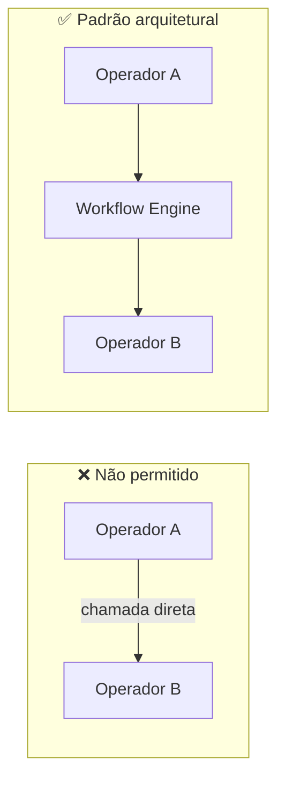
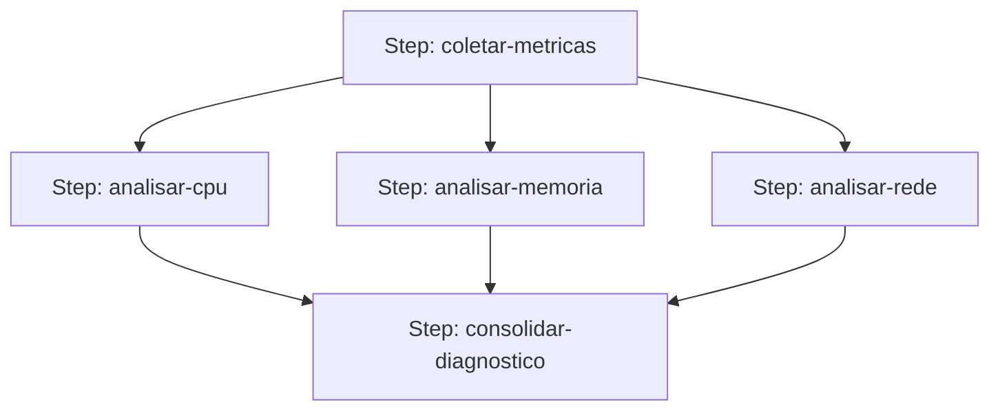
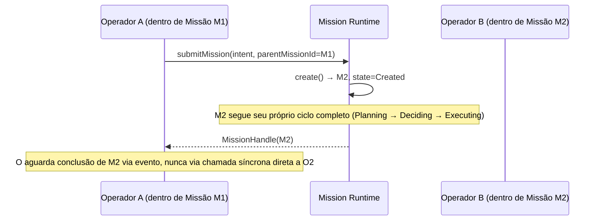

# Capítulo 19 — Cooperação entre Operadores

**Volume:** IV — Capabilities
**Status da especificação:** v0.1 (Draft)
**Depende de:** Capítulo 18 (Ferramentas); Volume II, Capítulo 9 (Workflow Engine)

---

## 19.0 Objetivo do capítulo

Fechar o Volume IV especificando como múltiplos Operadores cooperam dentro de uma mesma Missão — o padrão de comunicação permitido entre eles, e por que o Batman rejeita comunicação direta Operador-a-Operador como padrão arquitetural.

## 19.1 Motivação

Uma Missão real frequentemente exige mais de um Operador (ex.: um Operador de análise de código estático seguido de um Operador de execução de testes, seguido de um Operador de notificação). Sem um padrão de cooperação explícito, Operadores tenderiam a se comunicar diretamente entre si, criando acoplamento implícito e quebrando a garantia de que todo estado transita de forma auditável pelo Kernel (Volume II, Cap. 10, Event Bus).

## 19.2 Princípio central: cooperação mediada, nunca direta

> **Regra estrutural:** nenhum Operador chama outro Operador diretamente. Toda cooperação entre Operadores ocorre através do Workflow Engine (Volume II, Cap. 9), que orquestra a passagem de dados de um `PlanStep` para outro via contrato de schema explícito.



**Justificativa:** isso preserva Full Governance (toda passagem de dado entre passos é um evento auditável, Volume II Cap. 10) e Determinism First (o Workflow Engine, não os Operadores, decide ordem e roteamento, de forma consistente com o `ExecutionPlan` gerado pelo Planning Engine, Volume II Cap. 7).

## 19.3 Padrões de cooperação suportados

### 19.3.1 Pipeline sequencial (saída de um alimenta entrada do próximo)

```typescript
// PlanStep B declara dependsOn: [StepA.id]
// O output validado de A é passado como parte do input de B pelo Workflow Engine
```

Já coberto estruturalmente pelo grafo de dependências do `ExecutionPlan` (Volume II, Cap. 7).

### 19.3.2 Fan-out / Fan-in (paralelismo com agregação)



O Scheduler (Volume II, Cap. 10) já suporta execução paralela de passos independentes; este padrão apenas formaliza que múltiplos Operadores podem consumir a mesma saída (`fan-out`) e que um passo subsequente pode depender de múltiplos predecessores simultaneamente (`fan-in`), com o Workflow Engine agregando os resultados antes de invocar o passo consolidador.

### 19.3.3 Cooperação por sub-missão (delegação governada)

Para casos onde um Operador precisa iniciar um novo fluxo de trabalho independente (não apenas um passo), o padrão correto é a criação de uma **sub-missão** (`parentMissionId`, Volume II, Cap. 6), nunca a invocação direta de outro Operador:



Isso garante que a sub-missão tenha sua própria auditoria completa, seu próprio `tenantId` herdado (Volume III, Cap. 14), e sua própria contabilização de Cognitive Debt (Volume I, Cap. 4) — nunca "trabalho invisível" escondido dentro da execução de um único passo.

## 19.4 Casos de falha e recuperação

| Cenário | Tratamento |
|---|---|
| Operador tenta invocar outro Operador diretamente (bypass do Workflow Engine) | Rejeitado estruturalmente — Operadores não recebem referências entre si, apenas `ExecutionContext` (Cap. 15, seção 15.3); tentativa de bypass é tratada como violação de sandbox (Cap. 15, seção 15.6) |
| Fan-in aguarda predecessor que falhou sem recuperação | Passo consolidador nunca executa com dados parciais silenciosamente — segue estratégia de recuperação do Workflow Engine (Volume II, Cap. 9, seção 9.5), tipicamente `escalate` |
| Sub-missão nunca conclui (trava em `AwaitingHuman` indefinidamente) | Missão pai permanece aguardando conforme SLA configurado; escalada de severidade segue o mesmo mecanismo de `AwaitingHuman` já especificado (Volume II, Cap. 6, seção 6.6) |

## 19.5 Testes de aceitação

1. **AT-19.1:** Nenhum Operador deve ter, em tempo de execução, uma referência direta a outro Operador — verificável por auditoria estática do `ExecutionContext` injetado.
2. **AT-19.2:** Um passo de fan-in nunca deve executar antes que todos os seus predecessores (`dependsOn`) estejam marcados `success` ou tenham uma resolução explícita de recuperação.
3. **AT-19.3:** Toda sub-missão criada deve herdar corretamente o `tenantId` da missão pai e ser auditável independentemente via `replay` (Volume II, Cap. 10).

## 19.6 KPIs deste componente

- **Profundidade média de encadeamento de sub-missões** — sinaliza complexidade crescente de composição que pode indicar necessidade de um novo Playbook consolidado (Volume V).
- **Taxa de fan-in bloqueado aguardando recuperação de predecessor** — mede fragilidade de Playbooks com paralelismo.

## 19.7 Status da Implementação

| Já existe | Precisa refatorar | Ainda não existe |
|---|---|---|
| Fan-out/fan-in já suportado estruturalmente pelo grafo de dependências do Workflow Engine (Cap.9), testado explicitamente aqui; `criar_submissao()` força herança de `tenant_id` da missão pai; `auditar_ausencia_de_referencia_direta()` — `src/batman_os/capabilities/cooperation.py`, testes AT-19.1 a AT-19.3 | — | — |

---

## Encerramento do Volume IV

Com este capítulo, a periferia extensível do Batman OS está especificada: o que é um Operador e seu contrato de menor privilégio e sandboxing (Cap. 15), o processo de certificação de uma Capability do ponto de vista de quem a implementa (Cap. 16), Skills como conhecimento técnico versionado e composável (Cap. 17), Tools como o binding concreto e seguro com o mundo externo (Cap. 18), e os padrões governados de cooperação entre Operadores (Cap. 19).

O **Volume V — Workflow Engine** aprofunda a modelagem formal de Missões como Playbooks reutilizáveis, e as estratégias de recuperação e fallback em maior detalhe — incluindo como um Playbook é versionado e como conflitos entre Playbooks concorrentes para o mesmo `intent` são resolvidos de forma determinística.

---

**Capítulo anterior:** [Capítulo 18 — Ferramentas (Tools)](./04-tools.md)
**Próximo volume:** Volume V — Workflow Engine (a iniciar)
