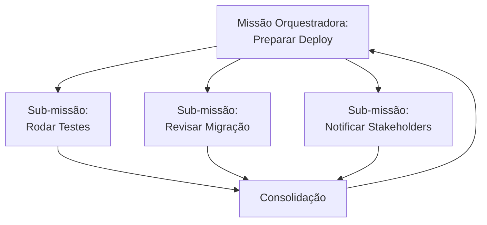

# Capítulo 20 — Missões: Modelagem Formal

**Volume:** V — Workflow Engine
**Status da especificação:** v0.1 (Draft)
**Depende de:** Volume II, Capítulo 6 (Mission Runtime); Volume IV, Capítulo 19 (Cooperação entre Operadores)

---

## 20.0 Objetivo do capítulo

O Volume II, Capítulo 6, especificou o ciclo de vida genérico de uma Missão (estados, transições, estrutura de dados básica). Este capítulo formaliza a **taxonomia** de tipos de missão, seus contratos de criticidade e SLA, e os padrões de composição entre missões — o vocabulário estrutural que os Playbooks (Cap. 21) instanciam.

## 20.1 Motivação

Sem uma taxonomia explícita de `MissionType`, cada nova classe de trabalho (investigar incidente, preparar deploy, cancelar benefício) receberia tratamento ad-hoc de criticidade, SLA e política de escalonamento — dispersando decisões que deveriam ser centralizadas e auditáveis (Full Governance).

## 20.2 Registro de tipos de missão

```typescript
interface MissionTypeDefinition {
  id: MissionTypeId;             // ex.: "investigate-incident"
  criticality: "low" | "medium" | "high" | "critical";
  defaultSLA: Duration;           // tempo-alvo até Completed
  escalationDefaults: EscalationPolicy; // valores-padrão herdados pelos DecisionPoints (Vol. II, Cap. 8)
  allowsSubMissions: boolean;
  cognitiveDebtTracked: boolean;  // quase sempre true; false apenas para missões puramente exploratórias/sandbox
}
```

**Regra estrutural:** todo `MissionIntent` (Volume II, Cap. 6) deve referenciar um `MissionTypeId` registrado — não existe missão de tipo "genérico" ou não classificado. Isso é o que permite segmentar KPIs (Cognitive Debt, SLA, taxa de sucesso) de forma significativa por classe de trabalho, e não apenas de forma agregada e pouco acionável.

## 20.3 Criticidade como eixo estrutural, não decorativo

A criticidade de um `MissionType` não é apenas metadado informativo — ela é consumida ativamente por três componentes já especificados:

| Consumidor | Como usa `criticality` |
|---|---|
| Scheduler (Vol. II, Cap. 10) | Prioridade base na fila, antes de aging |
| Decision Engine (Vol. II, Cap. 8) | Missões `critical` nunca escalam para LLM sem escalonamento humano intermediário, independente da `preferredEscalation` configurada no `DecisionPoint` individual |
| Workflow Engine (Vol. II, Cap. 9) | Missões `critical` exigem `RecoveryStrategy` obrigatória em todo passo com `sideEffects != none` — planos sem estratégia de recuperação declarada são rejeitados na validação (Vol. II, Cap. 7, seção 7.4) |

## 20.4 Padrões de composição de missões

Retomando o Capítulo 19 (Cooperação entre Operadores), formalizamos aqui os padrões de composição do ponto de vista da Missão, não do Operador:

### 20.4.1 Missão simples

Uma missão sem sub-missões, com um único `ExecutionPlan`. É o caso majoritário.

### 20.4.2 Missão orquestradora

Uma missão cujo plano consiste primariamente em criar e aguardar sub-missões (`parentMissionId`), consolidando os resultados. Útil para processos de negócio de alto nível (ex.: "Preparar Deploy" pode orquestrar sub-missões "Rodar Testes", "Revisar Migração de Banco", "Notificar Stakeholders").



### 20.4.3 Missão recorrente (agendada)

Uma missão cujo `MissionIntent` é gerado automaticamente em cadência configurada (ex.: "Auditoria de Compliance Diária"). Estruturalmente idêntica a qualquer outra missão — a única diferença é a origem do `intent` (um agendador, não um evento externo ou humano) — não introduz nenhum novo estado ou exceção na máquina de estados do Volume II, Cap. 6.

## 20.5 Contrato de SLA

```typescript
interface SLAContract {
  missionTypeId: MissionTypeId;
  targetSLA: Duration;
  warningThreshold: Duration;     // dispara alerta antes do estouro
  breachAction: "alert-only" | "auto-escalate-priority";
}
```

**Nota crítica:** `breachAction: "auto-escalate-priority"` **nunca** significa "pular etapas de decisão ou execução" — apenas aumenta a prioridade efetiva no Scheduler (Volume II, Cap. 10). Estouro de SLA nunca é resolvido comprometendo Full Governance ou Determinism First.

## 20.6 Casos de falha e recuperação

| Cenário | Tratamento |
|---|---|
| `MissionIntent` referencia `MissionTypeId` inexistente | Rejeitada antes mesmo do Planning Engine — `PlanningFailure` imediata com evidência clara |
| Missão orquestradora com sub-missão que nunca conclui | Missão pai permanece aguardando conforme SLA da sub-missão; escalada de severidade segue o mecanismo já especificado no Volume II, Cap. 6, seção 6.6 |
| Missão `critical` sem `RecoveryStrategy` declarada em passo com efeito colateral | Rejeitada na validação do plano (Volume II, Cap. 7) — nunca aceita "melhor esforço" |

## 20.7 Testes de aceitação

1. **AT-20.1:** Nenhuma Missão pode ser criada sem um `MissionTypeId` válido e registrado.
2. **AT-20.2:** Missões de criticidade `critical` nunca devem ter uma `Decision` com `resolvedBy: "llm"` sem escalonamento humano intermediário de aprovação — verificação estrutural cruzada com o Decision Engine (Vol. II, Cap. 8, AT-8.3).
3. **AT-20.3:** `breachAction: "auto-escalate-priority"` nunca deve alterar o conjunto de `DecisionPoint`s ou passos de um `ExecutionPlan` já gerado — apenas a prioridade de despacho.

## 20.8 KPIs deste componente

- **Distribuição de missões por criticidade e por SLA cumprido/estourado** — visão consolidada de saúde operacional.
- **Proporção de missões orquestradoras vs. simples** — mede complexidade de composição do catálogo de Playbooks (Cap. 21).

## 20.9 Status da Implementação

| Já existe | Precisa refatorar | Ainda não existe |
|---|---|---|
| `MissionTypeRegistry` (nenhuma Missão sem tipo registrado, AT-20.1); `criticidade` retrofitada no `DecisionEngine.resolve()` — `critical` nunca tenta LLM (AT-20.2); `escalar_prioridade_por_sla()` prova que `auto-escalate-priority` nunca altera o plano (AT-20.3); `prioridade_base_por_criticidade()`; `validar_recovery_obrigatoria_para_criticas()` (regra da seção 20.3, não formalizada como AT numerado) — `src/batman_os/workflow/missions.py` + retrofit em `kernel/mission_runtime.py`/`kernel/decision_engine.py` | — | Enforcement de criticidade no Scheduler como prioridade *efetiva* de despacho (hoje só o mapeamento `criticidade→prioridade base` existe; o Scheduler em si permanece agnóstico de `Mission`, por design do Cap.10) |

---

**Capítulo anterior:** [Capítulo 19 — Cooperação entre Operadores](../04-capabilities/05-cooperation.md)
**Próximo capítulo:** [Capítulo 21 — Playbooks](./02-playbooks.md)
