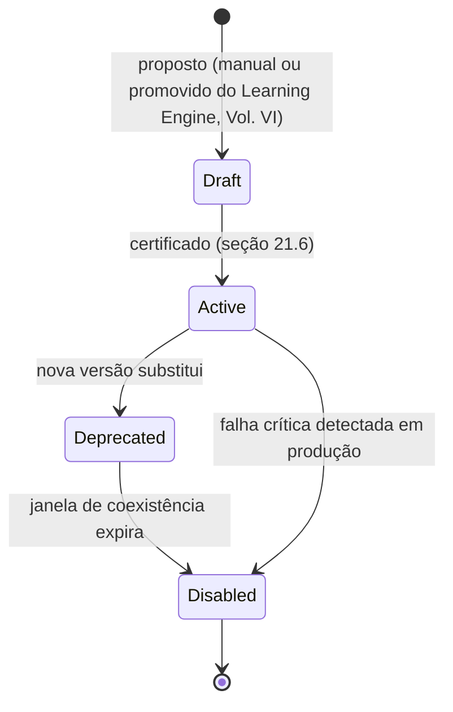

# Capítulo 21 — Playbooks

**Volume:** V — Workflow Engine
**Status da especificação:** v0.1 (Draft)
**Depende de:** Capítulo 20 (Missões: Modelagem Formal); Volume II, Capítulo 7 (Planning Engine)

---

## 21.0 Objetivo do capítulo

O Volume II, Capítulo 7, introduziu o Playbook como a fonte preferencial de instanciação de um `ExecutionPlan`. Este capítulo especifica, em detalhe, sua estrutura, versionamento, processo de certificação e — criticamente — como o sistema resolve de forma determinística quando múltiplos Playbooks são candidatos para o mesmo `intent`.

## 21.1 Motivação

Um Playbook é o principal Knowledge Asset produtor de determinismo em escala: é o que permite que a mesma classe de problema seja resolvida de forma idêntica todas as vezes, sem recompor um plano do zero (Volume II, Cap. 7, seção 7.4). Sem regras rígidas de resolução de conflito entre Playbooks, o sistema correria o risco de reintroduzir não-determinismo exatamente no ponto que deveria eliminá-lo.

## 21.2 Estrutura de dados: Playbook

```typescript
interface PlaybookDefinition {
  id: PlaybookId;
  version: SemVer;
  appliesTo: IntentMatcher;        // condição estrutural de casamento com um MissionIntent
  missionTypeId: MissionTypeId;     // Cap. 20 — todo Playbook pertence a um tipo de missão
  priority: number;                  // resolução determinística de conflito, seção 21.4
  stepsTemplate: PlanStepTemplate[];
  requiredCapabilities: CapabilityRef[];
  recoveryDefaults: Map<StepId, RecoveryStrategy>; // Vol. II, Cap. 9
  status: "draft" | "active" | "deprecated" | "disabled";
  provenance: PlaybookProvenance;    // ver seção 21.5
}

interface IntentMatcher {
  schema: JSONSchema;               // casamento estrutural, nunca semântico via LLM
  conditions?: FieldCondition[];     // refinamentos adicionais sobre campos do intent
}
```

## 21.3 Ciclo de vida de um Playbook



Este ciclo espelha deliberadamente o ciclo de vida de Capability (Volume III, Cap. 11, seção 11.5) — a mesma disciplina de nunca remover fisicamente, apenas desativar, se aplica aqui pelas mesmas razões de auditabilidade retroativa.

## 21.4 Resolução determinística de conflito entre Playbooks

Quando mais de um `PlaybookDefinition` ativo casa estruturalmente com o mesmo `MissionIntent` (seção 7.6 do Volume II já exigia isso ser resolvido "por prioridade explícita" — este capítulo formaliza o algoritmo):

```
function resolvePlaybook(intent: MissionIntent, candidates: PlaybookDefinition[]): PlaybookDefinition {
  1. matched = candidates.filter(p => matches(p.appliesTo, intent))
  2. if matched.length == 0: return null  // segue para composição via grafo, Vol. II Cap. 7
  3. if matched.length == 1: return matched[0]
  4. // Empate de matching — resolução por critérios em ordem estrita:
  5. sorted = matched.sort_by(
       (a, b) => b.priority - a.priority,             // 1º: prioridade explícita mais alta
       then => moreSpecificMatcher(a, b),              // 2º: matcher mais específico (mais condições)
       then => b.version.compareTo(a.version)           // 3º: versão SemVer mais recente
     )
  6. if sorted[0].priority == sorted[1].priority
     and equallySpecific(sorted[0], sorted[1]):
       raise PlaybookResolutionAmbiguity(evidence)       // nunca resolvido por escolha arbitrária
  7. return sorted[0]
}
```

**Regra de ouro:** um empate real (mesma prioridade, mesma especificidade) nunca é resolvido silenciosamente — é tratado como erro de configuração do catálogo (`PlaybookResolutionAmbiguity`), exigindo correção explícita de prioridade ou refinamento do `IntentMatcher`, nunca uma escolha "left-to-right" ou por ordem de registro.

## 21.5 Proveniência de um Playbook

```typescript
interface PlaybookProvenance {
  origin: "hand-authored" | "promoted-from-learning-engine";
  sourceKnowledgeAssets: KnowledgeAssetRef[]; // se promovido, quais decisões/registros o originaram
  approvedBy: HumanReviewRef;                  // obrigatório para qualquer Playbook ativo (Vol. VII)
}
```

Todo Playbook — mesmo um promovido automaticamente a partir de candidatos identificados pela Operational Memory (Volume III, Cap. 13, seção 13.6) — carrega proveniência completa e exige aprovação humana registrada antes de `Active`. Isso é consistente com a ADR-0004 (Volume III): nenhuma promoção de conhecimento acontece sem checkpoint humano.

## 21.6 Certificação de um Playbook

Análogo ao processo de certificação de Capability (Volume IV, Cap. 16), mas focado na estrutura do plano, não na implementação de uma função individual:

1. `IntentMatcher` deve ser inequívoco frente a todos os outros Playbooks ativos do mesmo `missionTypeId` (verificado automaticamente — falha se introduzir uma nova ambiguidade, seção 21.4).
2. Todas as `requiredCapabilities` devem estar `active` no Capability Registry (Volume III, Cap. 11).
3. `recoveryDefaults` deve cobrir todo `PlanStepTemplate` com efeito colateral não nulo (consistente com a exigência de criticidade do Cap. 20, seção 20.3, para missões `critical`).
4. Teste de simulação: o Playbook deve gerar um `ExecutionPlan` válido (sem ciclos, sem Capability ausente) para ao menos um `intent` de exemplo declarado no próprio Playbook.

## 21.7 Casos de falha e recuperação

| Cenário | Tratamento |
|---|---|
| Novo Playbook introduz ambiguidade com um já ativo (mesma prioridade e especificidade) | Rejeitado na certificação — nunca aceito com resolução "primeiro a chegar" |
| Playbook referencia Capability desde então desativada | Detectado na certificação de novas versões e em auditoria periódica de Playbooks ativos; Playbook afetado é sinalizado para revisão antes de causar `PlanningFailure` em produção |
| Playbook promovido do Learning Engine sem `approvedBy` | Rejeitado — nunca atinge `Active` sem aprovação humana registrada |

## 21.8 Testes de aceitação

1. **AT-21.1:** `resolvePlaybook` nunca deve retornar um resultado quando dois candidatos empatam em prioridade e especificidade — deve sempre lançar `PlaybookResolutionAmbiguity`.
2. **AT-21.2:** Nenhum Playbook pode atingir `status: Active` sem `approvedBy` preenchido, independentemente da origem (`hand-authored` ou `promoted-from-learning-engine`).
3. **AT-21.3:** Todo `PlanStepTemplate` com efeito colateral (via Capability referenciada) deve ter uma entrada correspondente em `recoveryDefaults` antes da certificação.

## 21.9 KPIs deste componente

- **Cobertura de Playbook** — proporção de missões resolvidas via Playbook vs. composição ad-hoc via grafo (já introduzida no Volume II, Cap. 7, KPI 7.9, aqui segmentada por `missionTypeId`).
- **Número de `PlaybookResolutionAmbiguity` detectados na certificação** — mede disciplina de configuração de prioridade do catálogo.
- **Proporção de Playbooks `promoted-from-learning-engine` vs. `hand-authored`** — mede maturidade do ciclo de aprendizado (Volume VI).

## 21.10 Status da Implementação

| Já existe | Precisa refatorar | Ainda não existe |
|---|---|---|
| `resolve_playbook()` — algoritmo completo de resolução determinística (prioridade→especificidade→SemVer para ordenação; ambiguidade real nunca resolvida por versão, AT-21.1); `certificar_playbook()` — `approved_by` obrigatório mesmo para `promoted-from-learning-engine` (AT-21.2), `recoveryDefaults` cobrindo todo step com efeito colateral (AT-21.3), `requiredCapabilities` ativas, IntentMatcher inequívoco frente a Playbooks já ativos do mesmo tipo — `src/batman_os/workflow/playbooks.py` | — | Teste de simulação de plano na certificação (item 4, secao 21.6) — exigiria integração completa com Capability Registry + Planning Engine juntos; não é AT numerado, deixado para quando essa integração amadurecer |

---

**Capítulo anterior:** [Capítulo 20 — Missões: Modelagem Formal](./01-missions-formal-model.md)
**Próximo capítulo:** [Capítulo 22 — Estratégias de Recuperação e Fallback](./03-recovery-fallback-strategies.md)
