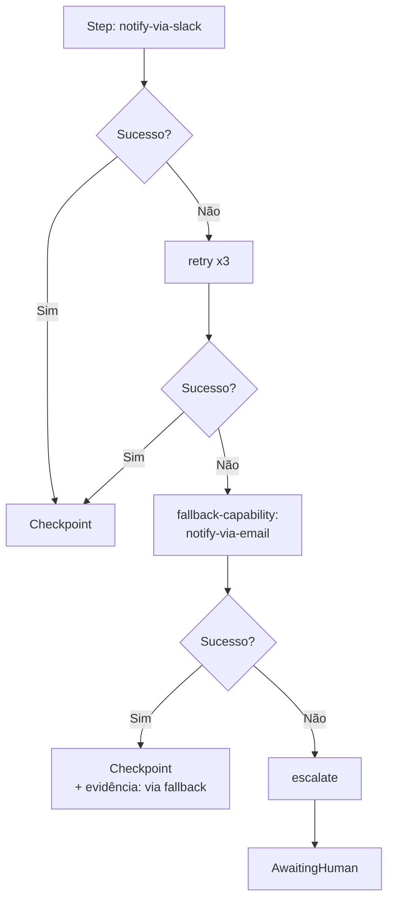
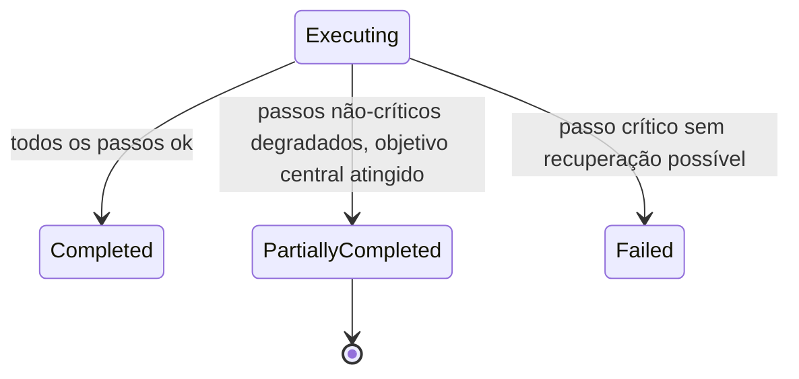

# Capítulo 22 — Estratégias de Recuperação e Fallback

**Volume:** V — Workflow Engine
**Status da especificação:** v0.1 (Draft)
**Depende de:** Capítulo 21 (Playbooks); Volume II, Capítulo 9 (Workflow Engine)

---

## 22.0 Objetivo do capítulo

O Volume II, Capítulo 9, especificou `RecoveryStrategy` como um mecanismo de passo único (`retry`, `compensate`, `skip-if-optional`, `escalate`). Este capítulo generaliza esse conceito para **cadeias de fallback** — sequências ordenadas de estratégias com degradação controlada — e formaliza a semântica de "sucesso parcial" de uma Missão.

## 22.1 Motivação

Nem toda falha se resolve com uma única estratégia. Um passo pode primeiro tentar `retry`, e se esgotado, tentar uma via alternativa (`fallback-capability`), e só então escalar. Sem uma cadeia formalizada, essa lógica de degradação progressiva ficaria implícita e inconsistente entre Playbooks.

## 22.2 Estrutura de dados: FallbackChain

```typescript
interface FallbackChain {
  stepId: StepId;
  chain: RecoveryStrategy[];        // ordem de tentativa, esgota da esquerda para a direita
  onChainExhausted: "fail" | "partial-success" | "escalate";
}
```

Isso estende (não substitui) o `RecoveryStrategy` do Volume II, Cap. 9 — cada elo da cadeia é um `RecoveryStrategy` já especificado ali (`retry`, `compensate`, `skip-if-optional`, `escalate`), mais um novo tipo introduzido neste capítulo:

```typescript
type RecoveryStrategy =
  | { kind: "retry"; maxAttempts: number; backoff: "fixed" | "exponential" }
  | { kind: "compensate"; compensationStep: StepId }
  | { kind: "skip-if-optional" }
  | { kind: "escalate"; escalationPolicy: EscalationPolicy }
  | { kind: "fallback-capability"; alternativeCapability: CapabilityRef }; // NOVO
```

### 22.2.1 `fallback-capability`

Permite que um passo, ao falhar, tente uma Capability alternativa que resolve o mesmo `DecisionPoint` ou objetivo funcional por outro caminho (ex.: se a Capability `notify-via-slack` falhar, tentar `notify-via-email`). A Capability alternativa deve ter `outputSchema` compatível com o que os passos subsequentes esperam — verificado na certificação do Playbook (Cap. 21, seção 21.6), nunca ajustado dinamicamente em runtime.

## 22.3 Diagrama: cadeia de fallback em ação



## 22.4 Semântica de sucesso parcial (`partial-success`)

Uma Missão pode concluir com sucesso parcial quando um ou mais passos não-críticos esgotam sua `FallbackChain` sob `onChainExhausted: "partial-success"`, mas o objetivo central da missão foi atingido por outros caminhos.

```typescript
interface Mission {
  // ... campos já definidos (Vol. II, Cap. 6)
  state: MissionState;              // adiciona "PartiallyCompleted" à máquina de estados
  degradations: DegradationRecord[]; // quais passos degradaram e como
}

interface DegradationRecord {
  stepId: StepId;
  exhaustedChain: RecoveryStrategy[];
  impact: "cosmetic" | "reduced-functionality" | "requires-follow-up";
}
```

### 22.4.1 Extensão da máquina de estados (Volume II, Cap. 6)



**Regra crítica:** `PartiallyCompleted` **nunca** é usado para passos críticos (`sideEffects != none` em Capabilities centrais ao objetivo da missão, Volume IV Cap. 16) — apenas para degradações explicitamente marcadas como toleráveis no Playbook. Isso é decidido em tempo de design do Playbook (Cap. 21), nunca inferido heroicamente em runtime pelo Workflow Engine.

## 22.5 Relação com Cognitive Debt

Toda `DegradationRecord` com `impact: "requires-follow-up"` gera automaticamente um candidato de gap de conhecimento na Operational Memory (Volume III, Cap. 13) — o mesmo padrão de degradação recorrente é, por definição, um sinal de que uma nova Capability, Tool ou Playbook precisa ser desenvolvido, alimentando o Learning Engine (Volume VI).

## 22.6 Casos de falha e recuperação

| Cenário | Tratamento |
|---|---|
| `FallbackChain` esgotada em passo crítico | `onChainExhausted` deve ser `"fail"` ou `"escalate"` — Playbook que declarar `"partial-success"` para um passo crítico é rejeitado na certificação (Cap. 21) |
| `fallback-capability` com schema de saída incompatível com passos subsequentes | Rejeitado na certificação do Playbook — nunca detectado apenas em runtime |
| Missão acumula múltiplas `DegradationRecord`s com `impact: "requires-follow-up"` do mesmo padrão, repetidamente | Sinaliza Cognitive Debt estrutural — acionado para revisão prioritária no Learning Engine (Volume VI) |

## 22.7 Testes de aceitação

1. **AT-22.1:** Nenhum Playbook pode declarar `onChainExhausted: "partial-success"` para um passo marcado como crítico ao objetivo central da missão — verificação na certificação.
2. **AT-22.2:** `fallback-capability` só é aceito na certificação se a Capability alternativa tiver `outputSchema` compatível com todos os passos que dependem da saída do passo original.
3. **AT-22.3:** Toda Missão em `PartiallyCompleted` deve ter ao menos uma `DegradationRecord` associada — nunca um estado de degradação sem evidência (Evidence First).

## 22.8 KPIs deste componente

- **Taxa de missões `PartiallyCompleted` vs. `Completed` integralmente** — mede robustez real dos Playbooks sob condições adversas.
- **Distribuição de `impact` das degradações** — prioriza onde investir em novas Capabilities/Tools.
- **Taxa de acionamento de `fallback-capability` por passo** — mede o quanto o sistema depende de caminhos alternativos vs. o caminho principal.

## 22.9 Status da Implementação

| Já existe | Precisa refatorar | Ainda não existe |
|---|---|---|
| — | Extensão da máquina de estados do Mission Runtime (Vol. II, Cap. 6) para incluir `PartiallyCompleted` | `FallbackChain`; `fallback-capability`; geração automática de candidatos de gap de conhecimento a partir de degradações recorrentes |

---

## Encerramento do Volume V

Com este capítulo, o Batman OS tem uma modelagem completa de como o trabalho é estruturado e reutilizado ao longo do tempo: Missões classificadas por tipo e criticidade com composição formal (Cap. 20), Playbooks como o mecanismo determinístico de reuso com resolução de conflito sem ambiguidade (Cap. 21), e degradação controlada com sucesso parcial em vez de "tudo ou nada" (Cap. 22).

O **Volume VI — Learning Engine** especifica como o sistema efetivamente aprende: o Knowledge Graph que conecta todos os Knowledge Assets, o processo de Rule Evolution e Workflow Evolution, e como candidatos identificados na Operational Memory (Volume III, Cap. 13) e nas degradações deste capítulo se tornam, de fato, novas regras, Capabilities e Playbooks — sempre passando por Human Review (Volume VII).

---

**Capítulo anterior:** [Capítulo 21 — Playbooks](./02-playbooks.md)
**Próximo volume:** Volume VI — Learning Engine (a iniciar)
