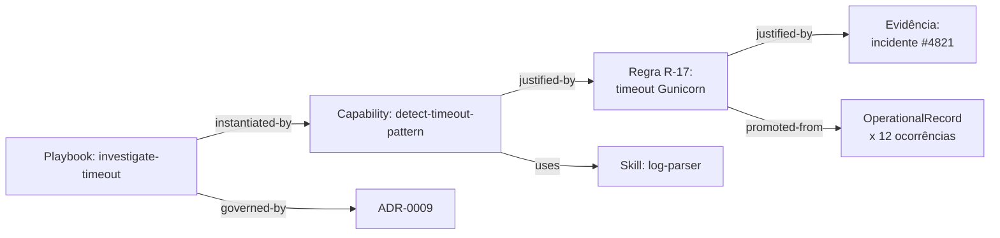

# Capítulo 23 — Knowledge Graph

**Volume:** VI — Learning Engine
**Status da especificação:** v0.1 (Draft)
**Depende de:** Volume I, Capítulo 4 (Definições Oficiais); Volume III, Capítulo 13 (Operational Memory)

---

## 23.0 Objetivo do capítulo

Especificar a estrutura que conecta todos os Knowledge Assets do Batman (regras, Capabilities, Skills, Workflows, Playbooks, ADRs, evidências) em um grafo consultável — o substrato sobre o qual Rule Evolution (Cap. 24), Workflow Evolution (Cap. 25) e Operational Learning (Cap. 26) operam.

## 23.1 Motivação

Até este ponto da obra, cada tipo de Knowledge Asset foi especificado em seu próprio capítulo, com seu próprio catálogo (Capability Registry, Volume III Cap. 11; Playbook Registry, Volume V Cap. 21). Sem um grafo unificado que relacione esses catálogos entre si, seria impossível responder perguntas estruturais como "quais Playbooks seriam afetados se esta Skill for descontinuada?" ou "qual evidência sustenta esta regra?" sem uma varredura manual e não sistemática.

## 23.2 Por que grafo, e não apenas tabelas relacionais

Knowledge Assets têm relações de dependência e proveniência que são naturalmente hierárquicas e cruzadas (uma Capability usa Skills, é usada por Playbooks, foi certificada com base em testes, uma regra foi promovida a partir de evidências específicas). Um modelo de grafo torna essas travessias — a mesma varredura de impacto já exigida estruturalmente em capítulos anteriores (ex.: Volume IV, Cap. 17, seção 17.4) — uma operação de primeira classe, não uma consulta ad-hoc reconstruída a cada vez.

## 23.3 Modelo de nós e arestas

```typescript
type KnowledgeNode =
  | { type: "rule"; ref: RuleId }
  | { type: "capability"; ref: CapabilityId }
  | { type: "skill"; ref: SkillId }
  | { type: "tool"; ref: ToolId }
  | { type: "playbook"; ref: PlaybookId }
  | { type: "adr"; ref: AdrId }
  | { type: "evidence"; ref: EvidenceId }
  | { type: "operational-record"; ref: RecordId }; // Vol. III, Cap. 13

type KnowledgeEdge =
  | { kind: "uses"; from: KnowledgeNode; to: KnowledgeNode }          // Capability -uses-> Skill
  | { kind: "instantiated-by"; from: KnowledgeNode; to: KnowledgeNode } // Playbook -instantiated-by-> Capability
  | { kind: "promoted-from"; from: KnowledgeNode; to: KnowledgeNode }  // Rule -promoted-from-> OperationalRecord
  | { kind: "justified-by"; from: KnowledgeNode; to: KnowledgeNode }   // Rule -justified-by-> Evidence
  | { kind: "supersedes"; from: KnowledgeNode; to: KnowledgeNode }     // nova versão -supersedes-> versão anterior
  | { kind: "governed-by"; from: KnowledgeNode; to: KnowledgeNode };   // Playbook -governed-by-> ADR
```

## 23.4 Diagrama: exemplo de grafo real



## 23.5 Interface de consulta

```typescript
interface KnowledgeGraph {
  getNode(ref: KnowledgeNode): KnowledgeNodeDetail;
  getNeighbors(ref: KnowledgeNode, edgeKind?: KnowledgeEdge["kind"]): KnowledgeNode[];
  impactAnalysis(ref: KnowledgeNode): ImpactReport; // travessia transitiva completa
  provenanceTrail(ref: KnowledgeNode): KnowledgeNode[]; // cadeia de "promoted-from"/"justified-by" até a origem
}

interface ImpactReport {
  directlyDependent: KnowledgeNode[];
  transitivelyDependent: KnowledgeNode[];
  affectedPlaybooks: PlaybookId[];    // relevante para recertificação, Vol. V Cap. 21
  affectedMissionTypes: MissionTypeId[]; // relevante para SLA e criticidade, Vol. V Cap. 20
}
```

**Consumidores diretos já especificados em volumes anteriores:** a varredura de impacto de mudança MAJOR em Skill (Volume IV, Cap. 17, seção 17.4) e a auditoria periódica de Playbooks afetados por Capability desativada (Volume V, Cap. 21, seção 21.7) passam a ser, formalmente, chamadas a `impactAnalysis()` — não implementações paralelas e potencialmente divergentes.

## 23.6 O Knowledge Graph não é uma fonte de verdade paralela

Consistente com a ADR-0003 (Volume II — event sourcing) e a ADR-0004 (Volume III — Operational Memory não decide sozinha): o Knowledge Graph é uma **projeção derivada** dos registros de cada catálogo (Capability Registry, Playbook Registry, Rule Registry — Cap. 24) e do Event Bus. Ele nunca é editado diretamente — é reconstruído/atualizado a partir das mudanças que já passam pelos processos de certificação e governança já especificados.

## 23.7 Casos de falha e recuperação

| Cenário | Tratamento |
|---|---|
| Knowledge Graph desatualizado em relação aos catálogos-fonte (drift) | Detectável por reconciliação periódica; nunca deve ser a fonte usada para decisões do Kernel em tempo real — apenas para análise e governança offline |
| `impactAnalysis` retorna grafo com ciclo (ex.: `supersedes` circular) | Tratado como erro de integridade de dados — investigado como incidente de qualidade dos catálogos-fonte, nunca "resolvido" ocultando o ciclo |
| Consulta de `provenanceTrail` não encontra origem (cadeia quebrada) | Sinaliza Knowledge Asset registrado sem proveniência completa — bloqueante para novas promoções (ver ADR-0010) |

## 23.8 Testes de aceitação

1. **AT-23.1:** Toda mudança em um catálogo-fonte (Capability, Playbook, Rule) deve refletir no Knowledge Graph dentro de um SLA de reconciliação definido — verificável por teste de consistência eventual.
2. **AT-23.2:** `impactAnalysis` de uma Skill deve retornar exatamente o mesmo conjunto de Capabilities que a varredura de impacto manual especificada no Volume IV, Cap. 17 (teste de equivalência).
3. **AT-23.3:** Nenhum nó do tipo `rule` pode existir sem ao menos uma aresta `justified-by` — verificação estrutural de integridade (Evidence First).

## 23.9 KPIs deste componente

- **Tamanho do Knowledge Graph ao longo do tempo** (nós e arestas) — proxy direto de Patrimônio Cognitivo (Volume I, Cap. 4).
- **Profundidade média de `provenanceTrail`** — mede o quanto o conhecimento atual descende de decisões humanas antigas vs. recentes.
- **Taxa de drift detectado entre catálogos-fonte e o grafo** — mede saúde do pipeline de reconciliação.

## 23.10 Status da Implementação

| Já existe | Precisa refatorar | Ainda não existe |
|---|---|---|
| `KnowledgeGraph` completo (`adicionar_no`/`adicionar_aresta`/`get_node`/`get_neighbors`); `impact_analysis()` — travessia reversa transitiva, equivalência provada com a varredura manual do Vol.IV Cap.17 (AT-23.2); `provenance_trail()` — cadeia `promoted-from`/`justified-by`, tolerante a ciclo; `verificar_integridade()` — todo nó `rule` exige `justified-by` (AT-23.3); `detectar_drift()` — reconciliação contra SLA (AT-23.1) — `src/batman_os/learning/knowledge_graph.py` | Consolidar as varreduras de impacto dos Volumes IV/V para *de fato* chamar `impact_analysis()` em vez de suas implementações próprias (a equivalência está provada por teste, mas a substituição real ainda não foi feita) | — |

---

**Capítulo anterior:** [Capítulo 22 — Estratégias de Recuperação e Fallback](../05-workflow/03-recovery-fallback-strategies.md)
**Próximo capítulo:** [Capítulo 24 — Rule Evolution](./02-rule-evolution.md)
