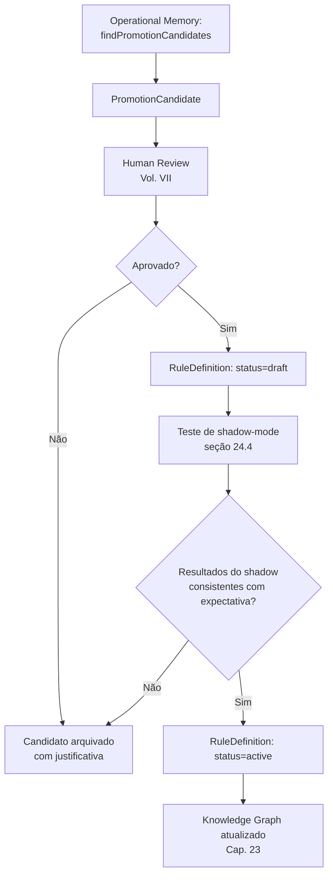
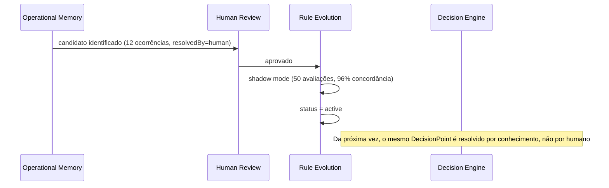

# Capítulo 24 — Rule Evolution

**Volume:** VI — Learning Engine
**Status da especificação:** v0.1 (Draft)
**Depende de:** Capítulo 23 (Knowledge Graph); Volume III, Capítulo 13 (Operational Memory, seção 13.6)

---

## 24.0 Objetivo do capítulo

Especificar o pipeline completo pelo qual um candidato a promoção — identificado pela Operational Memory (Volume III, Cap. 13, seção 13.6) — se torna, de fato, uma regra ativa consumida pelo Decision Engine (Volume II, Cap. 8). Este é o mecanismo central que opera o Princípio 7 (Learn Forever, Volume I) e reduz Cognitive Debt ao longo do tempo.

## 24.1 Motivação

A ADR-0004 (Volume III) estabeleceu que a Operational Memory nunca promove conhecimento sozinha. Este capítulo especifica o que preenche essa lacuna deliberada: o processo formal, com Human Review obrigatória, que transforma um padrão observado em uma regra permanente e versionada.

## 24.2 Estrutura de dados: Rule

```typescript
interface RuleDefinition {
  id: RuleId;
  version: SemVer;
  appliesTo: DecisionPointSignature;    // qual classe de DecisionPoint esta regra resolve (Vol. II, Cap. 8)
  condition: RuleCondition;              // expressão determinística sobre o input do DecisionPoint
  resolution: DecisionOption;
  confidenceBase: number;                 // ponto de partida para o cálculo de confidence do Decision Engine
  provenance: RulePromotion;
  status: "draft" | "active" | "deprecated" | "disabled";
}

interface RulePromotion {
  sourceCandidateId: PromotionCandidateId; // Vol. III, Cap. 13, seção 13.6
  supportingRecords: OperationalRecordRef[];
  reviewedBy: HumanReviewRef;              // obrigatório, Vol. VII
  promotedAt: Timestamp;
}
```

## 24.3 Pipeline de Rule Evolution



## 24.4 Shadow mode: validação antes de ativação plena

Antes de uma regra nova ou atualizada passar a `status: active` e efetivamente influenciar decisões do Kernel, ela passa por um período de **shadow mode**: a regra é avaliada em paralelo a cada `DecisionPoint` correspondente, mas sua resolução não é aplicada — apenas comparada com a decisão real tomada por outros meios (conhecimento existente, humano ou LLM).

```typescript
interface ShadowEvaluation {
  ruleId: RuleId;
  decisionPointId: DecisionPointId;
  shadowResolution: DecisionOption;
  actualResolution: DecisionOption;
  agreement: boolean;
  recordedAt: Timestamp;
}
```

**Critério de saída do shadow mode:** uma taxa mínima de concordância (`agreement`) configurável, sobre um número mínimo de avaliações, antes de `active`. Isso garante que a promoção de conhecimento seja validada contra a realidade operacional antes de assumir autoridade decisória — nunca apenas confiança na revisão humana isolada de dados empíricos subsequentes.

## 24.5 Versionamento e depreciação de regras

Regras seguem o mesmo rigor de SemVer já estabelecido para Capabilities (Volume III, Cap. 11) e Playbooks (Volume V, Cap. 21):

- **MAJOR:** mudança na `condition` ou `resolution` que alteraria o resultado para casos já historicamente resolvidos por essa regra.
- **MINOR:** refinamento da `condition` que cobre novos casos sem alterar o comportamento para os casos já cobertos.
- **PATCH:** correção de `confidenceBase` ou metadados, sem alterar `condition`/`resolution`.

Depreciação segue o padrão já estabelecido: `Active → Deprecated → Disabled`, nunca remoção física, preservando auditabilidade retroativa via Knowledge Graph (Cap. 23).

## 24.6 Relação com o Decision Engine

Uma vez `active`, uma `RuleDefinition` torna-se parte da Knowledge Base consultada pelo Decision Engine (Volume II, Cap. 8, seção 8.2) — o primeiro nível da hierarquia Knowledge → Human → LLM. Isso fecha o ciclo completo do sistema: uma decisão que antes exigia escalonamento humano ou de LLM passa, a partir da promoção, a ser resolvida autonomamente — reduzindo Cognitive Debt de forma mensurável e auditável (Volume I, Cap. 4, seção 4.9.1).



## 24.7 Casos de falha e recuperação

| Cenário | Tratamento |
|---|---|
| Regra em shadow mode apresenta baixa concordância | Não promovida a `active`; candidato retorna para análise humana com os dados de discordância como evidência adicional |
| Regra ativa começa a divergir do comportamento esperado (drift de domínio) | Detectável por monitoramento contínuo de confiança/resultados (Volume VII, Observability Engine); pode ser suspensa (`Disabled`) preventivamente |
| Duas regras ativas competem pelo mesmo `DecisionPointSignature` com condições sobrepostas | Tratado como erro de configuração — resolução determinística por especificidade da condição, análogo ao Cap. 21, seção 21.4; empate real é `RuleResolutionAmbiguity` |

## 24.8 Testes de aceitação

1. **AT-24.1:** Nenhuma `RuleDefinition` pode atingir `status: active` sem ter passado por shadow mode com taxa de concordância acima do limiar configurado.
2. **AT-24.2:** Nenhuma `RuleDefinition` pode existir sem `provenance.reviewedBy` preenchido.
3. **AT-24.3:** Duas regras ativas com condições sobrepostas para o mesmo `DecisionPointSignature` nunca devem ser resolvidas por escolha arbitrária — devem lançar `RuleResolutionAmbiguity` em caso de empate real de especificidade.

## 24.9 KPIs deste componente

- **Número de regras promovidas por período** — velocidade de aprendizado do sistema.
- **Taxa de concordância média em shadow mode** — mede qualidade dos candidatos chegando de Human Review.
- **Redução de Cognitive Debt atribuível a novas regras** — o KPI mais direto de sucesso deste capítulo, calculável comparando missões do mesmo `MissionType` antes/depois da ativação de uma regra.

## 24.10 Status da Implementação

| Já existe | Precisa refatorar | Ainda não existe |
|---|---|---|
`RuleDefinition`/`RulePromotion` (`reviewed_by` obrigatório estruturalmente — Pydantic recusa construir sem ele, AT-24.2); `promover_a_active()` — shadow mode com volume mínimo E taxa de concordância, nunca só Human Review isolada (AT-24.1, ADR-0011); `resolve_rule()` — especificidade da condição como critério de desempate, empate real vira `RuleResolutionAmbiguity` (AT-24.3) — `src/batman_os/learning/rule_evolution.py`; **`CatalogoDeRegrasComoBaseConhecimento`** (`learning/rule_evolution_adapter.py`, achado de revisão 2026-07-04) — conecta `resolve_rule()` de verdade ao `BaseConhecimento` do Decision Engine (Vol.II Cap.8): uma regra `active` agora é de fato consultada, não só testada isoladamente. Limitação documentada no próprio adaptador: só casa regras com `condition` vazio, já que `DecisionPoint` (Cap.7) não carrega payload genérico de dados ainda | — | Rule Registry persistente; detecção de drift de regras ativas em produção (Volume VII, Observability Engine); `DecisionPoint` com payload genérico (`dados: dict`) para o adaptador conseguir avaliar `RuleCondition`s reais, não só casamento por `pergunta` |

---

**Capítulo anterior:** [Capítulo 23 — Knowledge Graph](./01-knowledge-graph.md)
**Próximo capítulo:** [Capítulo 25 — Workflow Evolution](./03-workflow-evolution.md)
