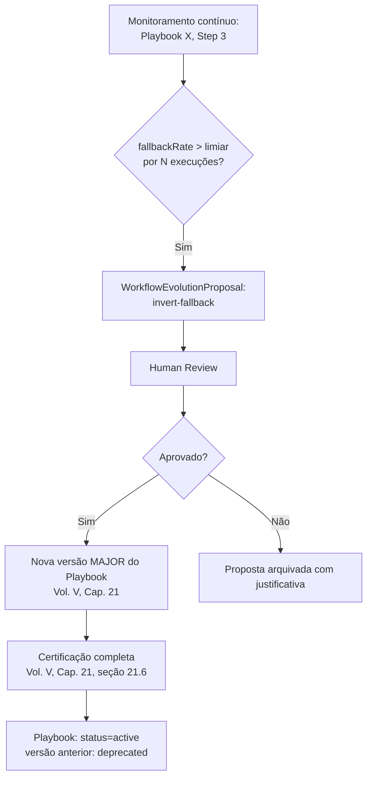

# Capítulo 25 — Workflow Evolution

**Volume:** VI — Learning Engine
**Status da especificação:** v0.1 (Draft)
**Depende de:** Capítulo 24 (Rule Evolution); Volume V, Capítulo 21 (Playbooks)

---

## 25.0 Objetivo do capítulo

Enquanto o Capítulo 24 especificou como decisões individuais (`DecisionPoint`s) evoluem para regras, este capítulo especifica como **estruturas inteiras de execução** — Playbooks — evoluem: quando um Playbook deve ser dividido, fundido com outro, ou aposentado, com base em evidência real de execução, não em intuição de design.

## 25.1 Motivação

Um Playbook certificado (Volume V, Cap. 21) não é estático. Ao longo de centenas ou milhares de execuções, padrões emergem: um passo quase sempre degrada e usa seu `fallback-capability` (Volume V, Cap. 22) — sinal de que talvez o passo principal devesse ser substituído pelo que hoje é apenas o fallback. Dois Playbooks quase idênticos, exceto por um passo, sugerem oportunidade de consolidação. Sem um processo formal de evolução, esses sinais permaneceriam inexplorados, e o catálogo de Playbooks se tornaria uma coleção de artefatos congelados no momento em que foram escritos — o oposto de Evolution Never Stops.

## 25.2 Sinais de evolução monitorados

| Sinal | Fonte | Ação sugerida |
|---|---|---|
| Passo principal falha e usa `fallback-capability` em alta proporção das execuções | `ExecutionResult` agregado (Volume III, Cap. 12) | Propor inversão: fallback vira passo principal, original vira fallback |
| Múltiplas `DegradationRecord`s com `impact: requires-follow-up` no mesmo passo | Volume V, Cap. 22, seção 22.5 | Propor nova Capability ou Skill para eliminar a degradação |
| Dois Playbooks ativos com `stepsTemplate` majoritariamente idênticos | Análise estrutural via Knowledge Graph (`impactAnalysis`, Cap. 23) | Propor fusão (merge) em um único Playbook parametrizado |
| Playbook nunca mais casado com nenhum `intent` em janela longa de tempo | Telemetria de resolução (Volume II, Cap. 7, seção 7.9) | Propor depreciação |

## 25.3 Estrutura de dados: WorkflowEvolutionProposal

```typescript
interface WorkflowEvolutionProposal {
  id: ProposalId;
  kind: "invert-fallback" | "merge-playbooks" | "split-playbook" | "deprecate-playbook";
  affectedPlaybooks: PlaybookId[];
  evidence: EvolutionEvidence;
  proposedChange: PlaybookDefinition | PlaybookDefinition[]; // versão proposta
  reviewedBy?: HumanReviewRef;
  status: "proposed" | "approved" | "rejected" | "applied";
}

interface EvolutionEvidence {
  executionSampleSize: number;
  observationWindow: DateRange;
  metricsSnapshot: Record<string, number>; // ex.: { fallbackRate: 0.87, degradationCount: 34 }
}
```

## 25.4 Fluxo de evolução: inversão de fallback (exemplo detalhado)



**Nota crítica:** mesmo uma inversão aparentemente "óbvia" (o fallback já provou funcionar melhor na prática) nunca pula a certificação completa do Playbook (Volume V, Cap. 21) — evidência operacional informa a proposta, mas não substitui o processo de governança que garante ausência de ciclos, Capabilities ativas, e cobertura de recuperação.

## 25.5 Fusão de Playbooks (merge)

Quando o Knowledge Graph (Cap. 23) identifica dois Playbooks ativos com `stepsTemplate` majoritariamente sobrepostos, a fusão proposta deve:

1. Generalizar o `IntentMatcher` (Volume V, Cap. 21) para cobrir ambos os casos originais sem introduzir ambiguidade com nenhum outro Playbook ativo (reaplicando o algoritmo de resolução de conflito, ADR-0008).
2. Preservar toda `recoveryDefaults` de ambos os Playbooks originais — a fusão nunca reduz cobertura de recuperação.
3. Ser certificada como um Playbook novo (nova versão MAJOR ou novo `PlaybookId`, a critério da Human Review), com os dois originais movidos para `Deprecated`.

## 25.6 Depreciação por desuso

Playbooks sem nenhum casamento de `intent` em uma janela de observação configurável (ex.: 180 dias) são sinalizados automaticamente como candidatos a depreciação — não removidos, apenas movidos para revisão, preservando a possibilidade de que o padrão de missão simplesmente se tornou raro, não obsoleto.

## 25.7 Casos de falha e recuperação

| Cenário | Tratamento |
|---|---|
| Proposta de inversão de fallback aprovada, mas nova versão do Playbook falha na certificação | Proposta retorna a `rejected` com o motivo de falha de certificação anexado como evidência adicional — nunca aplicada parcialmente |
| Fusão de Playbooks introduz ambiguidade de matching não detectada antes da certificação | Bloqueada na certificação (ADR-0008) — a fusão não é aplicada até a ambiguidade ser resolvida |
| Depreciação por desuso aplicada a um Playbook que na verdade cobre um caso sazonal raro | Reversível: Playbook depreciado permanece resolvível para fins de auditoria (Volume III, Cap. 11, padrão de não remoção física) e pode ser reativado explicitamente por Human Review se o padrão de uso retornar |

## 25.8 Testes de aceitação

1. **AT-25.1:** Nenhuma `WorkflowEvolutionProposal` pode ser aplicada (`status: applied`) sem passar pela certificação completa de Playbook (Volume V, Cap. 21, AT-21.1–21.3).
2. **AT-25.2:** Uma fusão de Playbooks nunca deve resultar em cobertura de `recoveryDefaults` menor que a união dos dois Playbooks originais — verificável por comparação estrutural automatizada.
3. **AT-25.3:** Depreciação por desuso nunca remove fisicamente um Playbook — deve permanecer resolvível via Knowledge Graph (`provenanceTrail`, Cap. 23).

## 25.9 KPIs deste componente

- **Número de propostas de evolução geradas, aprovadas e aplicadas por período** — mede o quanto o catálogo de Playbooks está de fato evoluindo com a operação real.
- **Redução de `fallbackRate` após inversões aplicadas** — validação a posteriori de que a evolução realmente melhorou o caminho principal.
- **Tamanho médio do catálogo de Playbooks ativos ao longo do tempo** — deve crescer com cobertura, mas não indefinidamente sem consolidação (sinal de saúde: taxa de fusão/depreciação não-trivial).

## 25.10 Status da Implementação

| Já existe | Precisa refatorar | Ainda não existe |
|---|---|---|
| `aplicar_proposta()` — nunca aplica sem Human Review nem sem certificação completa do Playbook (Cap.21), falha de certificação reverte para `rejected` com motivo anexado, nunca aplicação parcial (AT-25.1); `verificar_cobertura_de_merge()` — identidade por `CapabilityId` (estável entre Playbooks), nunca por índice de `steps_template` (AT-25.2); `depreciar_por_desuso()` — nunca remove fisicamente (AT-25.3); `deveria_propor_inversao_de_fallback()`/`deveria_propor_depreciacao_por_desuso()` (secao 25.2/25.6) — `src/batman_os/learning/workflow_evolution.py` | — | Monitoramento contínuo de verdade (rodar os sinais em produção); análise estrutural via Knowledge Graph para detectar candidatos a fusão (Cap.23 `impact_analysis` já existe, a heurística de "stepsTemplate majoritariamente idênticos" ainda não) |

---

**Capítulo anterior:** [Capítulo 24 — Rule Evolution](./02-rule-evolution.md)
**Próximo capítulo:** [Capítulo 26 — Operational Learning](./04-operational-learning.md)
