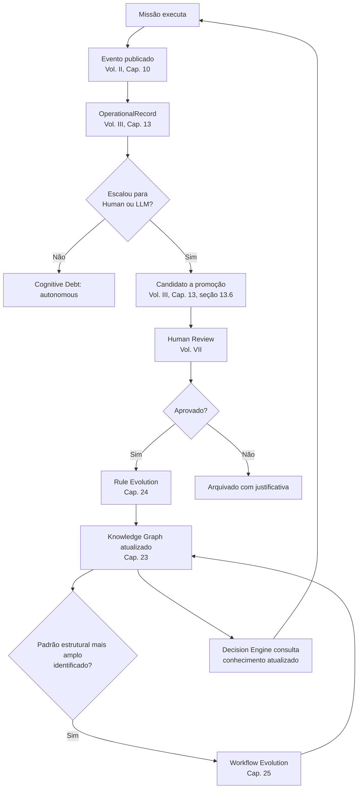
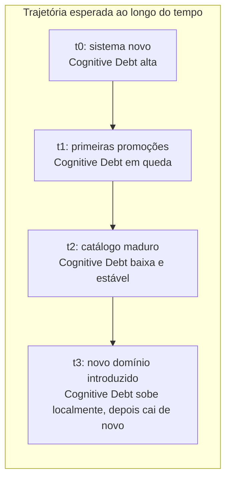

# Capítulo 26 — Operational Learning

**Volume:** VI — Learning Engine
**Status da especificação:** v0.1 (Draft)
**Depende de:** Capítulos 23–25 (Knowledge Graph, Rule Evolution, Workflow Evolution)

---

## 26.0 Objetivo do capítulo

Fechar o Volume VI amarrando os três mecanismos de aprendizado especificados (Knowledge Graph, Rule Evolution, Workflow Evolution) em um único ciclo operacional contínuo, e formalizar como esse ciclo é medido — retomando e completando a métrica de Cognitive Debt introduzida no Capítulo 4 (Volume I) como o indicador mestre de sucesso de todo o Learning Engine.

## 26.1 Motivação

Os Capítulos 24 e 25 especificaram, cada um, um tipo de evolução (regras individuais, estruturas de Playbook). Este capítulo responde a uma pergunta de nível superior: como esses dois mecanismos, junto com a Operational Memory (Volume III, Cap. 13) e a Governança (Volume VII, ainda a especificar), formam um sistema de aprendizado coerente — o que a obra chamou, desde o Capítulo 1, de "a hipótese Batman"?

## 26.2 O ciclo completo de aprendizado operacional

Este diagrama fecha o círculo aberto no Capítulo 1 (seção 1.4, "A hipótese Batman"): o mesmo problema, resolvido uma vez com apoio humano ou de LLM, alimenta um pipeline que — passando sempre por revisão humana explícita (nunca automático) — reduz a chance de que o **mesmo padrão** exija nova intervenção externa no futuro.

## 26.3 Operational Learning não é um componente novo de software

Este capítulo, deliberadamente, não introduz uma nova estrutura de dados ou interface própria — Operational Learning é o **nome do ciclo**, não um serviço adicional. O que existe fisicamente são: Operational Memory (Volume III, Cap. 13), Human Review (Volume VII), Rule Evolution (Cap. 24), Workflow Evolution (Cap. 25) e Knowledge Graph (Cap. 23). Nomear o ciclo explicitamente serve a um propósito de governança: torna possível medir e relatar sua saúde como uma coisa só, mesmo com múltiplos componentes técnicos.

## 26.4 Cognitive Debt como métrica mestre do Learning Engine

Retomando e completando a definição do Volume I, Capítulo 4, seção 4.9.1: Cognitive Debt não é apenas uma métrica de Governança — é o indicador direto de sucesso ou fracasso de todo este volume. Formalizamos aqui sua trajetória esperada:

**Nota crítica de interpretação:** um aumento pontual de Cognitive Debt não é necessariamente um sinal negativo — pode indicar a introdução legítima de um novo `MissionType` ou domínio de negócio (ex.: um novo pacote de serviço em um contexto como MOK-VIBE) para o qual o sistema ainda não acumulou Playbooks e regras. O KPI relevante não é o valor absoluto, mas a **tendência dentro de cada domínio maduro** — consistente com o Princípio 10 (Evolution Never Stops, Volume I): o sistema nunca "termina" de aprender, porque o espaço de problemas nunca para de crescer.

## 26.5 Limites estruturais do aprendizado (o que este ciclo não faz)

Para evitar ambiguidade com sistemas de aprendizado de máquina tradicionais, fixamos os limites deste capítulo:

- **Não há treinamento de modelo estatístico dentro do Batman.** Todo "aprendizado" aqui é a promoção governada de conhecimento explícito e legível (regras, Playbooks) — nunca pesos de rede neural ou parâmetros opacos.
- **Não há aprendizado sem checkpoint humano.** Reforçando a ADR-0004 (Volume III): em nenhum ponto deste ciclo o sistema se promove a si mesmo sem revisão humana explícita, mesmo quando a evidência é estatisticamente esmagadora.
- **Não há aprendizado retroativo silencioso.** Uma nova regra ou Playbook nunca reescreve o histórico de missões já concluídas — apenas influencia decisões futuras (consistente com event sourcing, ADR-0003).

## 26.6 Casos de falha e recuperação

| Cenário | Tratamento |
|---|---|
| Backlog de candidatos a promoção cresce mais rápido que a capacidade de Human Review | Sinaliza gargalo estrutural de governança — acionado como alerta prioritário para o Volume VII, nunca resolvido afrouxando o requisito de revisão humana |
| Cognitive Debt de um domínio maduro para de cair e estagna | Investigado como possível esgotamento dos mecanismos de Rule/Workflow Evolution para aquele domínio, ou indício de que os casos remanescentes genuinamente exigem julgamento humano caso a caso (não é uma falha, é um limite legítimo a documentar) |
| Ciclo de aprendizado gera regras conflitantes entre si (detectado via `RuleResolutionAmbiguity`, Cap. 24) | Tratado como qualidade insuficiente do processo de Human Review para aquele lote de candidatos — nunca resolvido automaticamente, sempre retorna para revisão |

## 26.7 Testes de aceitação

1. **AT-26.1:** A trajetória de Cognitive Debt por `MissionTypeId` deve ser consultável isoladamente (não apenas agregada globalmente), permitindo distinguir estagnação legítima de gargalo de governança.
2. **AT-26.2:** Nenhuma mudança de comportamento do Decision Engine (Volume II, Cap. 8) pode ser rastreada até uma origem que não seja uma `RuleDefinition` com `provenance.reviewedBy` preenchido (verificação de ponta a ponta do ciclo completo).
3. **AT-26.3:** O tempo entre a identificação de um candidato a promoção (Volume III, Cap. 13) e sua resolução (aprovado, aplicado, ou arquivado) deve ser mensurável e relatável como KPI de saúde do backlog de Human Review.

## 26.8 KPIs deste componente

- **Cognitive Debt por `MissionTypeId` ao longo do tempo** — o KPI mestre do volume, já introduzido no Volume I e agora totalmente instrumentado.
- **Tamanho e idade do backlog de candidatos a promoção pendentes de Human Review** — saúde do gargalo de governança.
- **Proporção de Patrimônio Cognitivo (Volume I, Cap. 4) originado de Rule Evolution vs. Workflow Evolution** — mede em que nível de granularidade o sistema está aprendendo mais.

## 26.9 Status da Implementação

| Já existe | Precisa refatorar | Ainda não existe |
|---|---|---|
| Todos os componentes individuais já especificados (Cap. 23–25 e Vol. III Cap. 13); `cognitive_debt_por_tipo()`/`trajetoria_cognitive_debt()` — isolado por `MissionTypeId`, nunca só agregado global (AT-26.1); `rastrear_origem_da_regra()` — garantia estrutural via `RulePromotion.reviewed_by` obrigatório (AT-26.2), provado por teste de ciclo completo (`OperationalRecord`→`PromotionCandidate`→`RuleDefinition`→`resolve_rule`); `ItemDeBacklog`/`idade_do_backlog_pendente()`/`tempo_de_resolucao_dos_concluidos()` (AT-26.3) — `src/batman_os/learning/operational_learning.py`; `CatalogoDeRegrasComoBaseConhecimento` (`rule_evolution_adapter.py`) fecha o ciclo Rule Evolution→Decision Engine de verdade (achado de revisão, corrigido) | — | **Gap conhecido de revisão (2026-07-04):** o diagrama da secao 26.2 mostra Rule/Workflow Evolution atualizando o Knowledge Graph (Cap.23) — isso não está implementado: `promover_a_active()` (Cap.24) e `aplicar_proposta()` (Cap.25) nunca chamam `KnowledgeGraph.adicionar_no()`/`adicionar_aresta()`. Dashboard consolidado *de fato* renderizado (Volume VII, Observability Engine); alertas de saturação de backlog acionados automaticamente |

---

## Encerramento do Volume VI

Com este capítulo, o ciclo de aprendizado do Batman OS está completo: o Knowledge Graph conecta todo conhecimento (Cap. 23), Rule Evolution transforma decisões repetidas em regras validadas por shadow mode (Cap. 24), Workflow Evolution refina estruturas inteiras de execução com base em evidência real (Cap. 25), e Operational Learning nomeia e mede o ciclo como um todo através da trajetória de Cognitive Debt (Cap. 26).

Chega o momento de especificar o que garante que esse aprendizado nunca escape do controle: o **Volume VII — Governance**, que formaliza o Governance Engine, o processo de Human Review mencionado repetidamente ao longo deste volume, a política de LLM Escalation, e o Observability Engine que sustenta todos os KPIs definidos até aqui.

---

**Capítulo anterior:** [Capítulo 25 — Workflow Evolution](./03-workflow-evolution.md)
**Próximo volume:** Volume VII — Governance (a iniciar)
