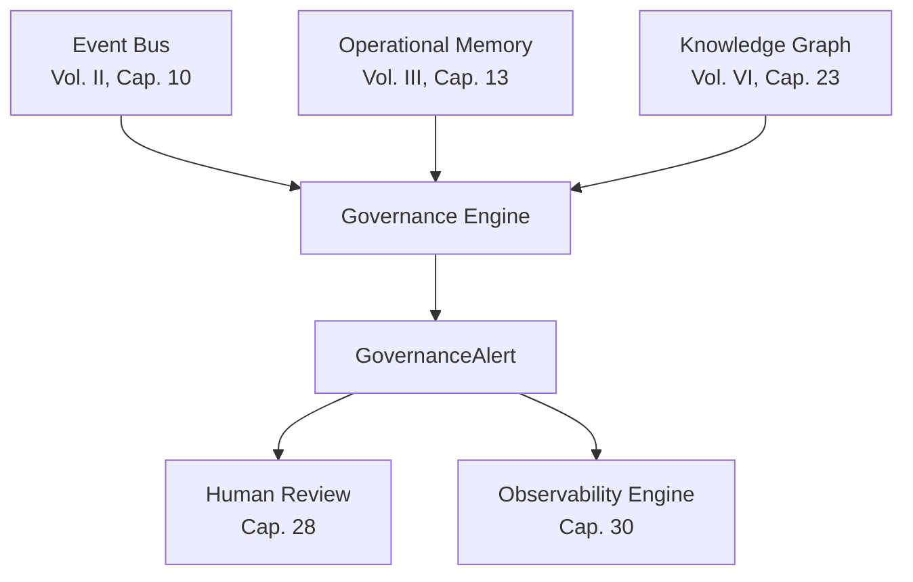
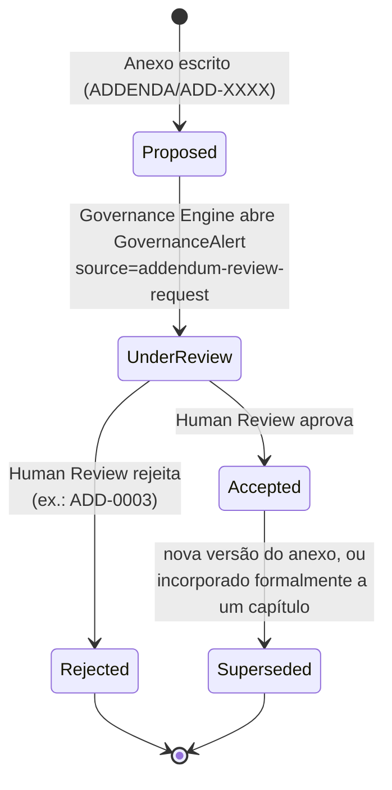

# Capítulo 27 — Governance Engine

**Volume:** VII — Governance
**Status da especificação:** v0.1 (Draft)
**Depende de:** Toda a obra até aqui — este capítulo formaliza um componente referenciado, mas não especificado, em praticamente todos os volumes anteriores

---

## 27.0 Objetivo do capítulo

Especificar o componente que a obra já invocou repetidamente sem defini-lo formalmente: o **Governance Engine**. Ele aparece implicitamente desde a ADR-0004 (Volume III), no processo de Human Review (Volume VI) e em toda menção a "aciona o Governance Engine" espalhada pelos capítulos de casos de falha. Este capítulo fecha essa lacuna.

## 27.1 Motivação

Full Governance (Princípio 9, Volume I) exige que toda decisão seja auditável — mas auditável **para quem**, e **através de que mecanismo concreto**? Sem um componente que centralize essa responsabilidade, cada volume implementaria sua própria noção fragmentada de "governança", tornando impossível responder perguntas transversais como "qual é a saúde de Cognitive Debt do sistema inteiro, hoje?" sem uma varredura manual entre catálogos.

## 27.2 O que o Governance Engine é, e o que não é

> O Governance Engine é o componente que **consolida, expõe e alarma** sobre a saúde de conformidade do Batman OS em relação aos seus próprios princípios (Volume I) — sem executar nenhuma ação do Kernel diretamente.

**Distinção crítica:** o Governance Engine **nunca** substitui o Decision Engine (Volume II, Cap. 8) na tomada de decisões operacionais, nem o Learning Engine (Volume VI) na promoção de conhecimento. Ele é estritamente um componente de **supervisão e escalonamento de severidade** — a mesma relação que a Operational Memory tem com o comportamento do Kernel (ADR-0004, Volume III): informa e aciona, nunca decide sozinho por substituição.

## 27.3 Responsabilidades consolidadas

| Responsabilidade | Onde já foi mencionada na obra |
|---|---|
| Escalar severidade de missões com SLA estourado | Volume V, Cap. 20, seção 20.5 |
| Receber alarme de circuit breaker de escalonamento a LLM | Volume II, Cap. 8, seção 8.6 |
| Investigar incidentes de isolamento de dados entre tenants | Volume III, Cap. 14, seção 14.7 |
| Gerenciar o backlog de Human Review (Cap. 28) | Volume VI, Cap. 26, seção 26.6 |
| Aprovar Anexos (`ADDENDA.md`) — ver seção 27.6 deste capítulo | Introduzido aqui pela primeira vez formalmente |
| Consumir KPIs do Observability Engine (Cap. 30) para relatórios de conformidade | Todos os capítulos com seção "KPIs deste componente" |

## 27.4 Estrutura de dados: GovernanceAlert

```typescript
interface GovernanceAlert {
  id: AlertId;
  source: "sla-breach" | "llm-circuit-breaker" | "tenant-isolation-incident"
        | "human-review-backlog" | "rule-drift" | "addendum-review-request";
  severity: "info" | "warning" | "critical";
  evidence: Evidence[];              // Evidence First, sempre
  relatedMissionId?: MissionId;
  relatedTenantId?: TenantId;
  status: "open" | "acknowledged" | "resolved";
  createdAt: Timestamp;
}

interface GovernanceEngine {
  raiseAlert(alert: GovernanceAlert): void;
  getOpenAlerts(filter?: AlertFilter): GovernanceAlert[];
  acknowledge(alertId: AlertId, by: HumanReviewRef): void;
  resolve(alertId: AlertId, resolution: string): void;
}
```

## 27.5 Diagrama: Governance Engine como consumidor transversal de eventos



O Governance Engine **não publica eventos que o Kernel consome** — a seta é sempre de entrada (Event Bus/Operational Memory/Knowledge Graph → Governance Engine), nunca o inverso. Isso preserva a garantia de que o Kernel opera de forma autocontida e determinística (ADR-0001, Volume I), com governança estritamente como camada de observação e escalonamento humano.

## 27.6 Ciclo de vida e aceite de Anexos (ADDENDA)

Este capítulo é o lugar formal onde o processo, hoje descrito apenas informalmente em `ADDENDA.md`, ganha um dono estrutural: **a aceitação de um Anexo é uma função do Governance Engine, exercida através de Human Review (Cap. 28)**.



**Regra formal:** nenhum Anexo passa de `Proposed` para `Accepted` sem um registro de Human Review associado (`HumanReviewRef`), da mesma forma que nenhuma `RuleDefinition` (Volume VI, Cap. 24) ou `PlaybookDefinition` (Volume V, Cap. 21) passa a `Active` sem o mesmo tipo de registro. Isso alinha o processo de evolução do próprio livro ao processo de evolução do sistema que ele descreve — intencionalmente, como já observado na introdução do `ADDENDA.md`.

**Consequência prática:** a partir deste capítulo, "aceitar um anexo" deixa de ser uma decisão informal do autor em conversa e passa a ser um evento rastreável (`GovernanceAlert` com `source: addendum-review-request`, resolvido via Cap. 28), com evidência anexada — inclusive quando o "revisor humano" é o próprio autor da obra atuando nesse papel.

## 27.7 Autoridade do Governance Engine: o que ele pode e não pode fazer sozinho

| Ação | Permitida diretamente? |
|---|---|
| Levantar um alerta (`raiseAlert`) | Sim — função primária |
| Pausar um Operador (`Quarantined`, Volume IV, Cap. 15) | **Não diretamente** — apenas recomenda; a transição de estado do Operador continua sendo acionada pelo mecanismo já especificado (`healthCheck` degradado) ou por decisão humana explícita |
| Suspender uma Capability ou Playbook | **Não diretamente** — apenas escalar como `GovernanceAlert` de severidade `critical`, com a suspensão efetiva exigindo o mesmo processo de certificação/depreciação já especificado (Volume III, Cap. 11; Volume V, Cap. 21) |
| Aprovar um Anexo | **Não sozinho** — apenas abre a revisão; a aprovação em si é ato de Human Review (Cap. 28) |

**Nota de design central:** o Governance Engine é deliberadamente desprovido de autoridade executiva direta sobre o Kernel. Isso é consistente com a distinção já estabelecida entre "camadas que decidem" (Decision Engine) e "camadas que observam e escalam" (Operational Memory, e agora Governance Engine) — dar poder de execução direta à camada de observação recriaria, em outro lugar do sistema, exatamente o risco que a ADR-0004 (Volume III) já rejeitou para a Operational Memory.

## 27.8 Casos de falha e recuperação

| Cenário | Tratamento |
|---|---|
| Governance Engine indisponível | Kernel continua operando normalmente (ele nunca depende de governança para decisões em tempo real, seção 27.5) — apenas alarmes e backlog de revisão ficam represados até a disponibilidade retornar |
| Volume de `GovernanceAlert` cresce além da capacidade de Human Review | Isso é, em si, motivo para um `GovernanceAlert` de severidade `critical` sobre o próprio backlog (`source: human-review-backlog`) — o sistema se autorreporta em vez de silenciosamente acumular risco |
| Um Anexo é aprovado sem `HumanReviewRef` registrado (falha de processo) | Tratado como violação de Full Governance — o Anexo não deveria ter sido considerado `Accepted`; requer correção retroativa do registro, nunca aceito como exceção |

## 27.9 Testes de aceitação

1. **AT-27.1:** Nenhum `GovernanceAlert` pode ser criado sem `evidence` associada.
2. **AT-27.2:** Nenhum Anexo pode transicionar para `Accepted` sem um `HumanReviewRef` registrado — verificação estrutural cruzada com `ADDENDA.md`.
3. **AT-27.3:** O Governance Engine nunca deve ter um caminho de código que chame diretamente uma função de mutação do Kernel (`transition`, `cancelMission`, etc.) — verificável por auditoria estática de dependências entre módulos.

## 27.10 KPIs deste componente

- **Número de `GovernanceAlert` abertos, por severidade, ao longo do tempo** — termômetro geral de saúde de conformidade.
- **Tempo médio entre abertura e resolução de alerta, por `source`**.
- **Proporção de Anexos em cada estado** (`Proposed`/`Accepted`/`Rejected`/`Superseded`) — saúde do próprio processo de evolução arquitetural da obra.

## 27.11 Status da Implementação

| Já existe | Precisa refatorar | Ainda não existe |
|---|---|---|
| Todos os pontos de origem de alerta já especificados individualmente em volumes anteriores | Consolidar essas origens dispersas para publicar formalmente através da interface `GovernanceEngine.raiseAlert` | O componente `GovernanceEngine` como serviço único; processo formal de aceite de Anexos |

---

**Capítulo anterior:** [Capítulo 26 — Operational Learning](../06-learning/04-operational-learning.md)
**Próximo capítulo:** [Capítulo 28 — Human Review](./02-human-review.md)
