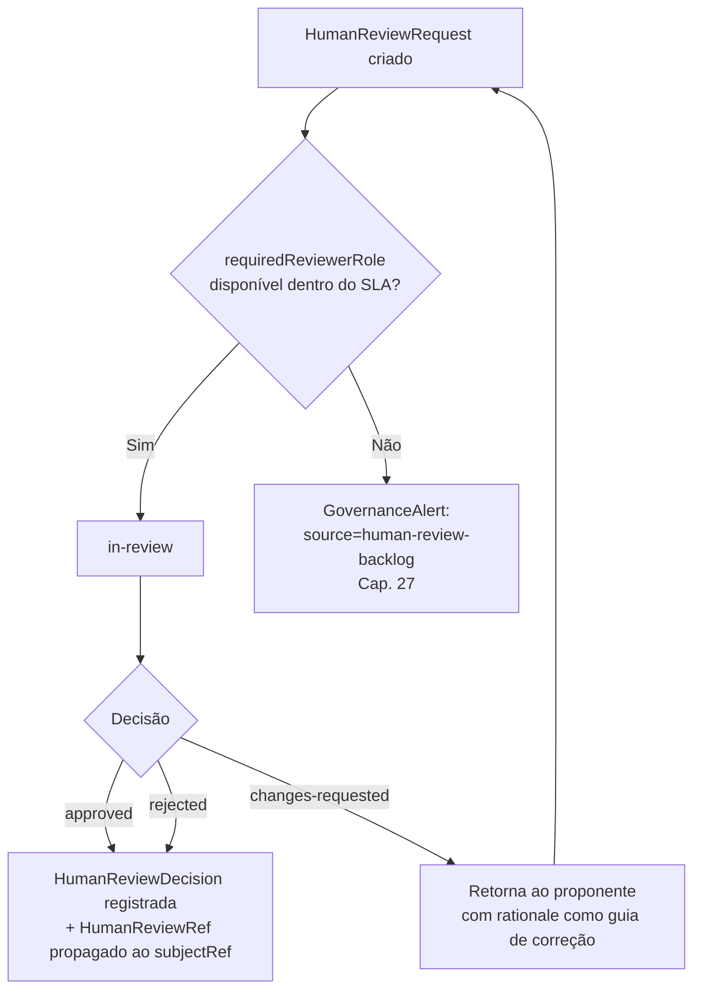

# Capítulo 28 — Human Review

**Volume:** VII — Governance
**Status da especificação:** v0.1 (Draft)
**Depende de:** Capítulo 27 (Governance Engine)

---

## 28.0 Objetivo do capítulo

Especificar formalmente o processo de **Human Review** — mencionado como pré-condição obrigatória em praticamente todo mecanismo de promoção de conhecimento da obra (ADR-0004, Volume III; Rule Evolution e Workflow Evolution, Volume VI; certificação de Capability com efeito irreversível, Volume IV, Cap. 16; e agora o aceite de Anexos, Cap. 27) sem, até este ponto, ter uma especificação própria.

## 28.1 Motivação

Um processo referenciado dezenas de vezes como "checkpoint obrigatório" mas nunca especificado é, paradoxalmente, o ponto mais frágil de toda a arquitetura: se Human Review for, na prática, um clique único e sem critério, toda a disciplina de governança construída nos volumes anteriores se torna teatro. Este capítulo garante que isso não aconteça.

## 28.2 Estrutura de dados: HumanReview

```typescript
interface HumanReviewRequest {
  id: ReviewRequestId;
  kind: "rule-promotion" | "playbook-certification" | "capability-irreversible-approval"
      | "addendum-acceptance" | "governance-alert-resolution";
  subjectRef: KnowledgeNode | GovernanceAlert["id"] | AddendumRef; // o que está sendo revisado
  evidence: Evidence[];             // sempre presente — Evidence First
  requiredReviewerRole: ReviewerRole;
  slaDeadline: Timestamp;
  status: "pending" | "in-review" | "approved" | "rejected" | "changes-requested";
}

interface HumanReviewDecision {
  requestId: ReviewRequestId;
  reviewerId: ReviewerId;
  reviewerRole: ReviewerRole;
  decision: "approved" | "rejected" | "changes-requested";
  rationale: string;                // obrigatório, mesmo em aprovação
  decidedAt: Timestamp;
}

type ReviewerRole = "domain-expert" | "security-reviewer" | "architecture-reviewer" | "governance-lead";
```

**Regra estrutural:** `rationale` é obrigatório mesmo quando a decisão é `approved`. Isso é deliberado: uma aprovação sem justificativa registrada é epistemicamente equivalente a nenhuma revisão ter ocorrido — apenas um clique. Evidence First (Princípio 3, Volume I) se aplica à revisão humana tanto quanto a qualquer decisão automatizada do Decision Engine.

## 28.3 Papéis de revisor e escopo de autoridade

| `ReviewerRole` | Autorizado a revisar |
|---|---|
| `domain-expert` | Promoção de regras (Vol. VI, Cap. 24) e certificação de Playbook (Vol. V, Cap. 21) dentro de seu domínio declarado |
| `security-reviewer` | Certificação de Capability com `sideEffects: irreversible` (Vol. IV, Cap. 16) e qualquer `GovernanceAlert` de `source: tenant-isolation-incident` |
| `architecture-reviewer` | Aceite de Anexos (Cap. 27, seção 27.6) e Workflow Evolution estrutural (Vol. VI, Cap. 25) |
| `governance-lead` | Resolução de `GovernanceAlert` de severidade `critical` de qualquer origem; único papel autorizado a sobrescrever a decisão de outro revisor |

**Regra estrutural:** um `HumanReviewRequest` só pode ser decidido por um reviewer cujo `ReviewerRole` corresponda ao `requiredReviewerRole` da solicitação — nunca por "qualquer humano disponível". Isso é o que impede, por exemplo, que a certificação de uma Capability com efeito irreversível seja aprovada por alguém sem contexto de segurança, mesmo que essa pessoa esteja disponível e disposta a aprovar rapidamente.

## 28.4 Fila de revisão e SLA



**Nota crítica:** `changes-requested` reabre o ciclo de submissão — não é uma rejeição definitiva nem uma aprovação condicional. O `subjectRef` (uma regra proposta, um Playbook, um Anexo) deve ser corrigido e resubmetido como uma nova `HumanReviewRequest`, preservando a cadeia de proveniência (`provenance`, já especificada em Rule Definition, Vol. VI Cap. 24, e PlaybookProvenance, Vol. V Cap. 21).

## 28.5 Propagação da decisão

Uma vez `approved`, a decisão é propagada ao artefato revisado como `HumanReviewRef` — o mesmo campo já usado em `RulePromotion` (Volume VI, Cap. 24), `PlaybookProvenance` (Volume V, Cap. 21) e agora também no ciclo de vida de Anexos (Cap. 27, seção 27.6). Este capítulo não introduz um novo formato de referência — formaliza o único formato que os demais capítulos já pressupunham.

```typescript
interface HumanReviewRef {
  requestId: ReviewRequestId;
  decidedBy: ReviewerId;
  decidedAt: Timestamp;
  rationale: string;
}
```

## 28.6 Casos de falha e recuperação

| Cenário | Tratamento |
|---|---|
| Nenhum revisor com `requiredReviewerRole` disponível dentro do SLA | `GovernanceAlert` de backlog (Cap. 27); a solicitação permanece `pending`, nunca é auto-aprovada por expiração de prazo |
| Dois revisores do mesmo papel divergem sobre a mesma solicitação (revisão em par ou re-revisão) | Escalado a `governance-lead`, único papel com autoridade de desempate explícita (seção 28.3) |
| `HumanReviewDecision` registrada sem `rationale` preenchido | Rejeitado na gravação — campo obrigatório, sem exceção, mesmo para `approved` |
| Revisor aprova uma solicitação fora de seu `ReviewerRole` autorizado (falha de controle de acesso) | Tratado como incidente de governança (`GovernanceAlert` severidade `critical`) — a decisão é invalidada e a solicitação retorna a `pending` |

## 28.7 Testes de aceitação

1. **AT-28.1:** Nenhuma `HumanReviewDecision` pode ser gravada sem `rationale` preenchido, independentemente do valor de `decision`.
2. **AT-28.2:** Nenhuma solicitação pode ser decidida por um `reviewerRole` diferente do `requiredReviewerRole` declarado.
3. **AT-28.3:** Toda promoção de regra (Vol. VI, AT-24.2), certificação de Playbook (Vol. V, AT-21.2) ou aceite de Anexo (Cap. 27, AT-27.2) deve ser rastreável a exatamente um `HumanReviewRef` válido, verificável via Knowledge Graph (Volume VI, Cap. 23, `provenanceTrail`).

## 28.8 KPIs deste componente

- **Tempo médio de resolução por `kind` de solicitação** — insumo direto do KPI de backlog já mencionado no Capítulo 27.
- **Taxa de `changes-requested` vs. `approved`/`rejected` direto** — mede maturidade dos proponentes (humanos ou processos automatizados de detecção de candidato).
- **Distribuição de decisões por `ReviewerRole`** — identifica gargalos de disponibilidade por especialidade.

## 28.9 Status da Implementação

| Já existe | Precisa refatorar | Ainda não existe |
|---|---|---|
| O conceito de `HumanReviewRef` já é consumido por múltiplos capítulos anteriores | Consolidar essas referências para apontar a esta especificação única | Fila de revisão; enforcement de `ReviewerRole`; registro estruturado de `rationale` obrigatório |

---

**Capítulo anterior:** [Capítulo 27 — Governance Engine](./01-governance-engine.md)
**Próximo capítulo:** [Capítulo 29 — LLM Escalation](./03-llm-escalation.md)
