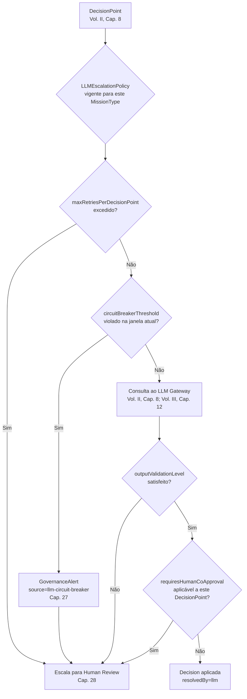

# Capítulo 29 — LLM Escalation

**Volume:** VII — Governance
**Status da especificação:** v0.1 (Draft)
**Depende de:** Capítulo 28 (Human Review); Volume II, Capítulo 8 (Decision Engine)

---

## 29.0 Objetivo do capítulo

Consolidar, sob a ótica de governança, toda a política de uso de LLM já introduzida de forma dispersa ao longo da obra (ADR-0001, Volume I; Decision Engine, Volume II Cap. 8; Execution Engine, Volume III Cap. 12; circuit breaker, Volume II Cap. 8 seção 8.6) em uma política única, auditável e versionada — a "constituição" que rege quando, como e com que limites o Batman pode consultar um modelo de linguagem.

## 29.1 Motivação

Cada menção anterior ao uso de LLM no Kernel e Runtime foi feita no contexto específico daquele componente (validação de saída no Execution Engine, hierarquia de escalonamento no Decision Engine). Do ponto de vista de Governança, falta um documento único que responda: qual é, hoje, a política agregada de uso de LLM em todo o sistema, e como ela é auditada como um todo — não componente a componente.

## 29.2 A política formal de LLM Escalation

```typescript
interface LLMEscalationPolicy {
  id: PolicyId;
  version: SemVer;
  scope: "global" | MissionTypeId[];   // política pode ser refinada por tipo de missão (Vol. V, Cap. 20)
  maxRetriesPerDecisionPoint: number;   // Vol. II, Cap. 8, seção 8.6
  circuitBreakerThreshold: RatePolicy; // Vol. II, Cap. 8, seção 8.6
  requiresHumanCoApproval: "always" | "irreversible-only" | "never";
  outputValidationLevel: "schema-only" | "schema-plus-domain-invariants";
  approvedBy: HumanReviewRef;            // Cap. 28 — toda política é, ela mesma, revisada
}
```

**Nota crítica de auto-referência:** a própria `LLMEscalationPolicy` é um artefato que passa por Human Review (Cap. 28, papel `governance-lead` ou `security-reviewer`) antes de `active` — a política que restringe o uso de LLM está sujeita ao mesmo rigor de governança que qualquer outro Knowledge Asset, consistente com Full Governance aplicado recursivamente sobre a própria infraestrutura de governança.

## 29.3 Consolidação: onde cada regra já vivia, e o que muda

| Regra | Já especificada em | O que este capítulo adiciona |
|---|---|---|
| LLM nunca é núcleo de decisão | ADR-0001, Volume I | Nada de novo — reafirma como âncora |
| Resposta de LLM sempre validada contra contrato antes de virar `Decision` | Volume II, Cap. 8, seção 8.2 | Formaliza `outputValidationLevel` como campo de política configurável, não implícito no código do Decision Engine |
| Circuit breaker por taxa de escalonamento | Volume II, Cap. 8, seção 8.6 | Formaliza como `circuitBreakerThreshold`, consultável e auditável centralmente, não apenas um limiar interno ao Decision Engine |
| Decisões irreversíveis nunca vão a LLM sem aprovação humana intermediária | Volume II, Cap. 8, AT-8.3 | Formaliza `requiresHumanCoApproval` como parâmetro de política versionado, permitindo auditoria de mudanças nesse requisito ao longo do tempo |

## 29.4 Diagrama: LLM Escalation como política auditada, não comportamento implícito



## 29.5 Auditoria agregada de uso de LLM

Este capítulo introduz um relatório formal, consumido pelo Observability Engine (Cap. 30), que consolida o uso de LLM através de todo o sistema — não apenas por `DecisionPoint` individual, mas como visão agregada de governança:

```typescript
interface LLMUsageAudit {
  period: DateRange;
  totalDecisionPoints: number;
  resolvedByLLM: number;
  resolvedByLLMPercentage: number;   // insumo direto de Cognitive Debt, Vol. I Cap. 4
  rejectedByValidation: number;       // taxa de "alucinação" ou saída fora de contrato
  circuitBreakerTrips: number;
  byMissionType: Map<MissionTypeId, LLMUsageSummary>;
}
```

Esse relatório é o mecanismo formal pelo qual a Governança verifica, periodicamente, que a ADR-0001 (Volume I) continua sendo respeitada na prática operacional — não apenas na intenção arquitetural.

## 29.6 Casos de falha e recuperação

| Cenário | Tratamento |
|---|---|
| `LLMUsageAudit` mostra `resolvedByLLMPercentage` crescente ao longo de múltiplos períodos consecutivos | `GovernanceAlert` de severidade `warning` a `critical` conforme magnitude — sinal direto de que Cognitive Debt está se deslocando na direção errada (Volume VI, Cap. 26, seção 26.4) |
| Nova versão de `LLMEscalationPolicy` relaxa `requiresHumanCoApproval` de `always` para `irreversible-only` sem justificativa registrada | Rejeitada na revisão (Cap. 28) — mudanças que relaxam controles exigem `rationale` com evidência operacional concreta, nunca apenas conveniência |
| `LLM Gateway` (Volume III, Cap. 12) reporta indisponibilidade prolongada | `LLMEscalationPolicy` não é alterada automaticamente — o Decision Engine já trata esse caso escalando para humano diretamente (Volume II, Cap. 8, seção 8.7); este capítulo apenas garante que o evento é auditado |

## 29.7 Testes de aceitação

1. **AT-29.1:** Nenhuma `LLMEscalationPolicy` pode atingir `active` sem `approvedBy` preenchido.
2. **AT-29.2:** Uma mudança de `requiresHumanCoApproval` para um valor menos restritivo deve, obrigatoriamente, incluir `rationale` com evidência quantitativa (extraída de `LLMUsageAudit`) — verificação de conteúdo mínimo no processo de revisão.
3. **AT-29.3:** `LLMUsageAudit.resolvedByLLMPercentage` deve ser calculável e verificável independentemente a partir do Event Bus (Volume II, Cap. 10) via `replay`, garantindo que a auditoria não é uma métrica isolada e não reconciliável.

## 29.8 KPIs deste componente

- **`resolvedByLLMPercentage` por `MissionTypeId` ao longo do tempo** — o KPI mais direto de conformidade com ADR-0001 na prática.
- **Taxa de `rejectedByValidation`** — mede a qualidade real da saída do LLM Gateway frente ao domínio de cada `MissionType`.
- **Número de mudanças de `LLMEscalationPolicy` por período, e proporção que relaxa vs. aperta controles** — sinaliza a direção geral da postura de governança ao longo do tempo.

## 29.9 Status da Implementação

| Já existe | Precisa refatorar | Ainda não existe |
|---|---|---|
| Toda a lógica individual de escalonamento (Vol. II, Cap. 8) | Extrair os parâmetros hoje implícitos no Decision Engine para uma `LLMEscalationPolicy` externa e versionada | `LLMUsageAudit` consolidado; processo de revisão de mudanças de política |

---

**Capítulo anterior:** [Capítulo 28 — Human Review](./02-human-review.md)
**Próximo capítulo:** [Capítulo 30 — Observability Engine](./04-observability-engine.md)
