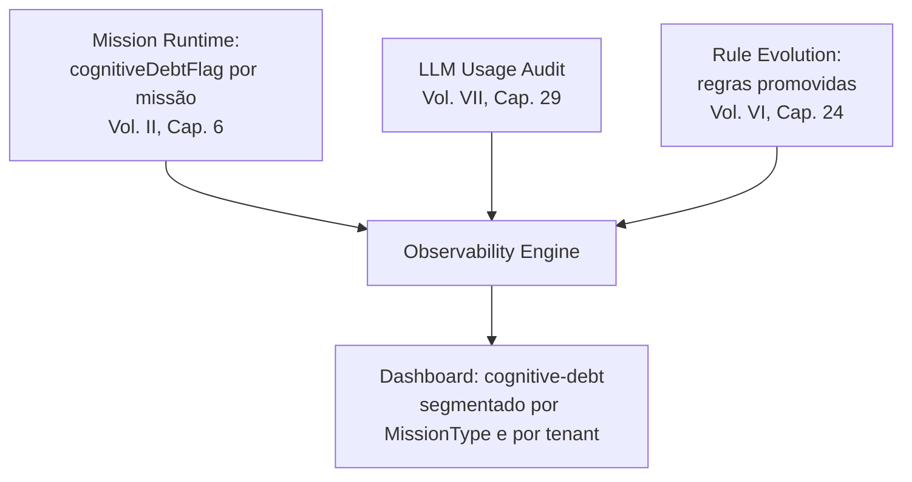

# Capítulo 30 — Observability Engine

**Volume:** VII — Governance
**Status da especificação:** v0.1 (Draft)
**Depende de:** Capítulos 27–29 (Governance Engine, Human Review, LLM Escalation)

---

## 30.0 Objetivo do capítulo

Fechar o Volume VII — e, com ele, o núcleo funcional completo do Batman OS — especificando o componente que consolida e expõe todos os KPIs individualmente definidos em cada capítulo anterior (mais de vinte seções "KPIs deste componente" ao longo da obra) como um sistema único e consultável, com Cognitive Debt como métrica mestre.

## 30.1 Motivação

Cada capítulo, desde o Volume II, terminou com uma seção própria de KPIs — profundidade de fila do Scheduler, taxa de recuperação do Workflow Engine, cobertura de Playbook, tempo de resolução de Human Review, e dezenas de outros. Sem um componente que os consolide, cada um permanece um número isolado, calculável apenas por quem conhece o capítulo específico que o define. O Observability Engine é o componente que os torna uma superfície coerente de leitura sobre a saúde do sistema como um todo.

## 30.2 O Observability Engine não calcula nada novo — apenas consolida

Consistente com o padrão já estabelecido no Knowledge Graph (ADR-0010, Volume VI) e na Operational Memory (ADR-0004, Volume III): o Observability Engine é uma **projeção derivada** do Event Bus (Volume II, Cap. 10) e dos catálogos-fonte. Ele não introduz uma nova fórmula de cálculo para nenhum KPI já definido — apenas os agrega, correlaciona e expõe em um único painel consultável.

```typescript
interface ObservabilityEngine {
  getMetric(metricId: MetricId, filter?: MetricFilter): TimeSeries;
  getDashboard(view: "cognitive-debt" | "sla-health" | "learning-throughput" | "governance-backlog"): Dashboard;
  registerAlertRule(rule: AlertRule): void; // conecta a métricas, dispara GovernanceAlert (Cap. 27)
}
```

## 30.3 Catálogo consolidado de métricas (mapa completo da obra)

Este capítulo não define métricas novas — mapeia, pela primeira vez em um único lugar, todas as já especificadas:

| Métrica | Origem | Consolidada em qual painel |
|---|---|---|
| Cognitive Debt (global e por `MissionTypeId`) | Volume I, Cap. 4; Volume VI, Cap. 26 | `cognitive-debt` |
| Taxa de SLA cumprido/estourado por `MissionType` | Volume V, Cap. 20 | `sla-health` |
| Profundidade e latência da fila do Scheduler | Volume II, Cap. 10 | `sla-health` |
| Cobertura de Playbook / taxa de composição ad-hoc | Volume II, Cap. 7; Volume V, Cap. 21 | `learning-throughput` |
| Regras promovidas por período; taxa de concordância em shadow mode | Volume VI, Cap. 24 | `learning-throughput` |
| Tamanho do Knowledge Graph (Patrimônio Cognitivo) | Volume VI, Cap. 23 | `learning-throughput` |
| Backlog de Human Review por `ReviewerRole` | Volume VII, Cap. 28 | `governance-backlog` |
| `resolvedByLLMPercentage` | Volume VII, Cap. 29 | `cognitive-debt` |
| Taxa de missões `PartiallyCompleted` | Volume V, Cap. 22 | `sla-health` |

## 30.4 Diagrama: composição do painel `cognitive-debt`



## 30.5 Alarmes derivados de métricas

`registerAlertRule` conecta uma condição sobre uma métrica consolidada a um `GovernanceAlert` (Volume VII, Cap. 27) — fechando o ciclo entre observação e escalonamento:

```typescript
interface AlertRule {
  id: AlertRuleId;
  metricId: MetricId;
  condition: "above" | "below" | "trend-worsening";
  threshold: number;
  window: Duration;
  raisesAlertWith: Omit<GovernanceAlert, "id" | "createdAt" | "status">;
}
```

**Exemplo de regra:** `resolvedByLLMPercentage` acima de um limiar por três janelas de observação consecutivas dispara automaticamente um `GovernanceAlert` de `source: "llm-circuit-breaker"` mesmo que o circuit breaker individual do Decision Engine (Volume II, Cap. 8) não tenha disparado — o Observability Engine enxerga tendência agregada ao longo do tempo, algo que o circuit breaker local, por desenho, não precisa fazer.

## 30.6 Retomando a nota de honestidade epistêmica da obra

Assim como o World Model (ADD-0002) carrega `confidence` e `lastObservedAt` explícitos, todo `TimeSeries` retornado pelo Observability Engine carrega metadado de janela de agregação e possível atraso de reconciliação (herdado do Knowledge Graph, ADR-0010, e da Operational Memory) — nenhum painel deste componente deve ser lido como "estado em tempo real absoluto", e sim como "melhor consolidação disponível na última janela de reconciliação".

## 30.7 Casos de falha e recuperação

| Cenário | Tratamento |
|---|---|
| Observability Engine indisponível | Nenhum componente do Kernel ou Runtime depende dele para operar (mesma garantia já aplicada ao Knowledge Graph, ADR-0010) — apenas painéis e alarmes derivados ficam temporariamente sem atualização |
| Métrica consolidada diverge do valor calculável diretamente na fonte (drift de agregação) | Tratado como incidente de qualidade de dados do próprio Observability Engine — nunca aceito como "aproximação aceitável" sem investigação, dado que decisões de governança (incluindo aceite de Anexos, Cap. 27) podem depender dessas métricas |
| `AlertRule` mal configurada gera alarme falso-positivo recorrente | Investigado como erro de configuração da regra, não do dado subjacente — ajuste de `threshold`/`window` segue o mesmo processo de revisão do Cap. 28 |

## 30.8 Testes de aceitação

1. **AT-30.1:** Todo valor exposto por `getMetric` deve ser reproduzível de forma independente a partir do Event Bus via `replay` (Volume II, Cap. 10) — nenhuma métrica pode existir apenas dentro do Observability Engine sem lastro reconstruível.
2. **AT-30.2:** `registerAlertRule` com `condition: "trend-worsening"` deve disparar corretamente quando a métrica monitorada piora de forma sustentada por `window`, mesmo sem violar um limiar absoluto em nenhum ponto isolado.
3. **AT-30.3:** Indisponibilidade do Observability Engine não pode causar falha ou bloqueio de nenhuma missão em andamento — verificável por teste de caos.

## 30.9 KPIs deste componente (meta-KPI)

- **Cobertura de métricas consolidadas vs. métricas ainda dispersas nos capítulos-fonte** — mede o quão completo está, na prática, o painel unificado.
- **Taxa de drift entre valor consolidado e valor recalculado diretamente da fonte** — saúde da própria camada de observabilidade.
- **Número de `GovernanceAlert` originados de `AlertRule` (Observability) vs. originados diretamente de componentes individuais** — mede o quanto a visão agregada está, de fato, adicionando detecção que os componentes isolados não capturariam sozinhos.

## 30.10 Status da Implementação

| Já existe | Precisa refatorar | Ainda não existe |
|---|---|---|
Todas as métricas individuais, já especificadas capítulo a capítulo; `ObservabilityEngine` completo — `TimeSeries` sempre com metadado de janela/reconciliação (secao 30.6, AT-30.1); `get_dashboard()` — os quatro paineis nomeados via `PAINEL_DAS_METRICAS`; `avaliar_regras()`/`AlertRule` — `trend-worsening` dispara por piora sustentada sem nunca consultar `threshold` absoluto (AT-30.2); auditoria estática confirma que o módulo nunca importa `batman_os.kernel` (AT-30.3) — `src/batman_os/governance/observability_engine.py` | — | Catálogo completo de >20 métricas mapeadas (hoje uma amostra representativa de 8); `replay` de verdade a partir do Event Bus alimentando `construir_serie()` (hoje recebe pontos já reconciliados de quem chama) |

---

## Encerramento do Volume VII

Com este capítulo, o Batman OS tem uma "constituição" completa de governança: o Governance Engine consolida e escalona sem executar (Cap. 27), Human Review formaliza o único checkpoint que autoriza qualquer promoção de conhecimento ou aceite de Anexo (Cap. 28), LLM Escalation vira uma política única, versionada e auditável em vez de regras dispersas (Cap. 29), e o Observability Engine torna toda essa saúde consultável em um único lugar, sempre com a mesma honestidade epistêmica sobre confiança e atraso que a obra pratica desde o World Model (Cap. 30).

## Encerramento do núcleo funcional da obra (Volumes I–VII)

Com os Volumes I a VII completos, o Batman OS está especificado de ponta a ponta: por que ele existe e sob quais princípios (I), como ele decide e executa deterministicamente (II), como ele toca o mundo real com isolamento (III), como sua periferia se estende com segurança (IV), como o trabalho se estrutura e se reutiliza (V), como ele aprende sem perder controle (VI), e como essa aprendizagem é supervisionada e auditada (VII).

Os volumes remanescentes — **VIII (Infrastructure)**, **IX (Reference Implementation)** e **X (Appendices)** — não introduzem novos princípios arquiteturais: tratam de onde e como o que já foi especificado roda fisicamente, como uma implementação de referência concreta materializa os 30 capítulos e 6 Anexos já escritos, e como tudo isso se consolida em glossário, índice de ADRs e roadmap.

---

**Capítulo anterior:** [Capítulo 29 — LLM Escalation](./03-llm-escalation.md)
**Próximo volume:** Volume VIII — Infrastructure (a iniciar)
