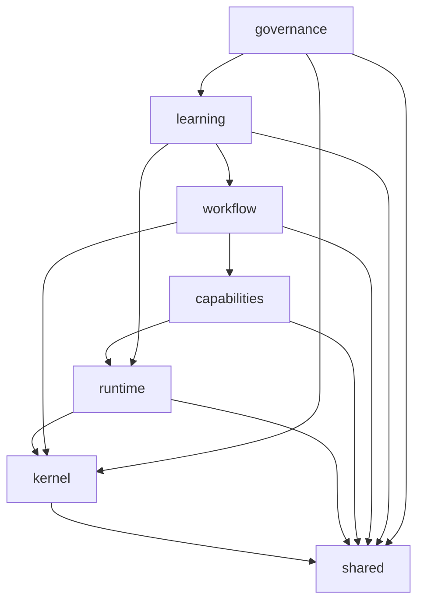

# Capítulo 32 — Estrutura de Diretórios

**Volume:** VIII — Infrastructure
**Status da especificação:** v0.1 (Draft)
**Depende de:** Capítulo 31 (Arquitetura Física)

---

## 32.0 Objetivo do capítulo

Especificar a estrutura de diretórios do **código-fonte** que implementa o Batman OS — distinta da estrutura de diretórios *desta especificação* (que já segue seu próprio padrão, descrito no `README.md` raiz). Este capítulo define onde, no repositório de implementação, cada componente lógico dos Volumes I–VII deve viver, de forma que a organização do código espelhe a organização da arquitetura.

## 32.1 Motivação

Sem uma convenção explícita, é comum que a estrutura de um código-base real diverja da arquitetura lógica ao longo do tempo — um "Decision Engine" no código pode acabar espalhado em três pastas diferentes depois de sucessivas manutenções. Fixar a estrutura aqui, referenciando diretamente os capítulos que definem cada componente, cria um mapeamento vivo entre especificação e implementação.

## 32.2 Estrutura de diretórios proposta

```
batman-os/
├── kernel/                          # Volume II
│   ├── mission-runtime/             # Cap. 6
│   ├── planning-engine/             # Cap. 7
│   ├── decision-engine/             # Cap. 8
│   ├── workflow-engine/             # Cap. 9
│   └── event-bus-scheduler/         # Cap. 10
│
├── runtime/                          # Volume III
│   ├── capability-engine/           # Cap. 11
│   ├── execution-engine/            # Cap. 12
│   ├── operational-memory/          # Cap. 13
│   └── concurrency/                 # Cap. 14
│
├── capabilities/                     # Volume IV
│   ├── operators/                   # Cap. 15 — implementações concretas de Operador
│   ├── catalog/                     # Cap. 16 — pipeline de certificação
│   ├── skills/                      # Cap. 17
│   ├── tools/                       # Cap. 18
│   └── cooperation/                 # Cap. 19
│
├── workflow/                         # Volume V
│   ├── missions/                    # Cap. 20
│   ├── playbooks/                   # Cap. 21 — Playbooks certificados, versionados
│   └── recovery/                    # Cap. 22
│
├── learning/                         # Volume VI
│   ├── knowledge-graph/             # Cap. 23
│   ├── rule-evolution/              # Cap. 24
│   └── workflow-evolution/          # Cap. 25
│                                     # Cap. 26 (Operational Learning) não tem pasta própria —
│                                     # é o ciclo, não um componente (consistente com Vol. VI, Cap. 26, seção 26.3)
│
├── governance/                       # Volume VII
│   ├── governance-engine/           # Cap. 27
│   ├── human-review/                # Cap. 28
│   ├── llm-escalation/              # Cap. 29
│   └── observability/               # Cap. 30
│
├── addenda/                          # Componentes de Anexos ainda `Proposed` — ver seção 32.4
│
├── infra/                            # Volume VIII
│   ├── deployment/                  # Cap. 31 — manifests de topologia física
│   └── security/                    # Cap. 33
│
└── shared/                           # Tipos e contratos compartilhados entre camadas
    ├── mission-types/                # MissionIntent, Mission, MissionState (Vol. II, Cap. 6)
    ├── knowledge-assets/             # Interfaces comuns (Vol. I, Cap. 4)
    └── evidence/                    # Evidence, tipos comuns de Evidence First
```

## 32.3 Regras de dependência entre pastas (enforced por lint arquitetural)

Consistente com a separação de camadas já estabelecida (ADR-0002, Volume II):



**Regra estrutural:** nenhuma pasta pode depender de uma pasta "acima" dela nesse grafo (ex.: `kernel` nunca importa de `governance` — consistente com a ADR-0012, Governance sem autoridade executiva direta sobre o Kernel). Essa regra é verificável automaticamente por um linter de dependências entre módulos, análogo ao já mencionado no Capítulo 27, AT-27.3 ("auditoria estática de dependências entre módulos").

## 32.4 A pasta `addenda/`: onde Anexos `Proposed` vivem sem contaminar a árvore principal

Enquanto um Anexo (`ADD-000X`, ver `ADDENDA.md`) permanece `Proposed` ou `UnderReview` (Vol. VII, Cap. 27, seção 27.6), qualquer código exploratório relacionado a ele vive isolado em `addenda/`, nunca dentro das pastas de volume correspondentes:

```
addenda/
├── add-0001-goal-engine/           # se implementado experimentalmente antes do aceite
├── add-0002-world-model/
├── add-0004-cognitive-roles/
└── add-0005-continuous-mission/
```

Somente quando um Anexo transiciona para `Accepted` (com `GovernanceDecision` registrada, Vol. VII, Cap. 27) seu código correspondente é promovido para a pasta de volume definitiva (ex.: `addenda/add-0002-world-model/` → `runtime/world-model/`), como uma operação explícita de "merge", nunca como um vazamento gradual e não decidido de código experimental para dentro da árvore principal.

## 32.5 Casos de falha e recuperação

| Cenário | Tratamento |
|---|---|
| Código de um Anexo `Proposed` é referenciado por um módulo fora de `addenda/` | Bloqueado pelo mesmo linter de dependências (seção 32.3) — trata-se de uma dependência não permitida, análoga a uma dependência de camada invertida |
| Nova funcionalidade não se encaixa claramente em nenhuma pasta existente | Sinaliza uma lacuna arquitetural real — deve gerar uma proposta de Anexo (`ADD-000X`) antes de ganhar uma pasta própria, nunca ser encaixada arbitrariamente em uma pasta existente por conveniência |

## 32.6 Testes de aceitação

1. **AT-32.1:** Nenhum módulo em `kernel/`, `runtime/`, `capabilities/`, `workflow/`, `learning/` ou `governance/` pode importar de `addenda/` — verificável por lint estático.
2. **AT-32.2:** O grafo de dependências entre pastas de nível superior (seção 32.3) nunca deve conter um ciclo — verificação automatizada no pipeline de CI.

## 32.7 KPIs deste componente

- **Número de módulos em `addenda/`** por período — mede volume de experimentação arquitetural em andamento.
- **Tempo médio entre criação de um módulo em `addenda/` e sua promoção (ou remoção)** — saúde do próprio processo de incubação de Anexos.

## 32.8 Status da Implementação

| Já existe | Precisa refatorar | Ainda não existe |
|---|---|---|
| — | — | Estrutura de repositório completa; linter de dependências entre pastas; processo de promoção `addenda/` → pasta definitiva |

---

**Capítulo anterior:** [Capítulo 31 — Arquitetura Física](./01-physical-architecture.md)
**Próximo capítulo:** [Capítulo 33 — Segurança e Isolamento](./03-security-isolation.md)
