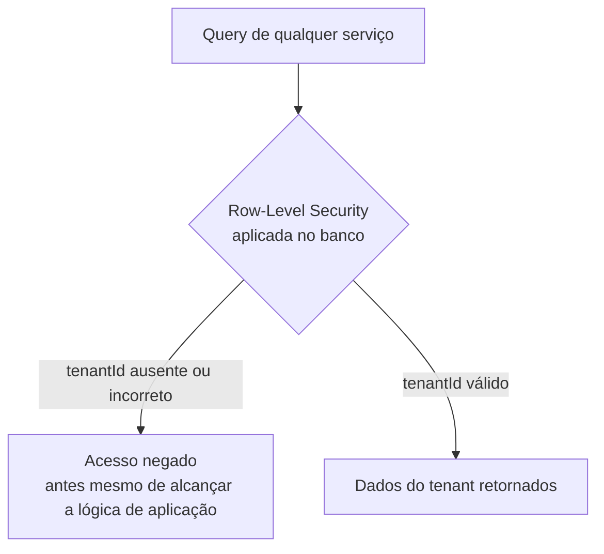

# Capítulo 33 — Segurança e Isolamento

**Volume:** VIII — Infrastructure
**Status da especificação:** v0.1 (Draft)
**Depende de:** Capítulo 32 (Estrutura de Diretórios); Volume III, Cap. 14; Volume IV, Cap. 15 e 18

---

## 33.0 Objetivo do capítulo

Fechar o Volume VIII consolidando, em nível de infraestrutura física, três garantias de segurança que a obra já exigiu logicamente em volumes anteriores mas nunca especificou em termos de implementação real: gestão de segredos (Volume IV, Cap. 18), isolamento multi-tenant (Volume III, Cap. 14, ADR-0005) e sandboxing de Operador (Volume IV, Cap. 15, ADR-0006).

## 33.1 Motivação

Uma Capability declarar `credentialsRef` em vez de uma credencial literal (Vol. IV, Cap. 18, seção 18.3) só é uma garantia real se existir, de fato, um cofre de segredos por trás dessa referência, com controle de acesso verificável. Da mesma forma, `tenantId` obrigatório (ADR-0005) só isola dados de verdade se o banco de dados subjacente aplicar isso estruturalmente, não apenas por convenção de query. Este capítulo fecha essa lacuna entre "exigido logicamente" e "garantido fisicamente".

## 33.2 Gestão de segredos (materializando o Cap. 18)

```typescript
interface SecretVaultIntegration {
  resolve(credentialsRef: CredentialRef): Promise<Credential>; // nunca cacheado em disco ou em log
  rotate(credentialsRef: CredentialRef): Promise<void>;
  auditAccess(credentialsRef: CredentialRef): AccessLogEntry[];
}
```

**Regras físicas obrigatórias:**
- Toda credencial resolvida por `resolve()` vive exclusivamente em memória do processo do Operador que a solicitou (Vol. IV, Cap. 15) — nunca escrita em log, em disco, ou propagada para o Event Bus (Vol. II, Cap. 10), mesmo que isso signifique que um evento de falha tenha menos contexto de debug disponível.
- Rotação de credenciais (`rotate`) nunca exige mudança de código de Operador — apenas invalidação e nova resolução via `credentialsRef`, consistente com a abstração já definida no Cap. 18.
- Todo acesso a uma credencial é auditável (`auditAccess`) e consumido pelo Governance Engine (Vol. VII, Cap. 27) como fonte adicional de `GovernanceAlert` em caso de padrão anômalo de acesso.

## 33.3 Isolamento multi-tenant, materializado no armazenamento

Retomando a ADR-0005 (Volume III): `tenantId` obrigatório é uma regra de contrato de dados. Fisicamente, isso se traduz em:



**Regra estrutural:** o isolamento de tenant não é responsabilidade exclusiva do código de aplicação (que já é obrigado, pela ADR-0005, a propagar `tenantId`) — é reforçado também na camada de armazenamento via Row-Level Security (ou partição física equivalente, Vol. VIII Cap. 31, seção 31.5), como defesa em profundidade. Um bug de aplicação que esqueça de filtrar por `tenantId` ainda seria bloqueado nesta camada.

## 33.4 Sandboxing de Operador, materializado

Retomando a `SandboxPolicy` (Volume IV, Cap. 15, seção 15.6):

| Campo lógico (Cap. 15) | Materialização física recomendada |
|---|---|
| `resourceLimits` | Limites de cgroup/container (CPU, memória) aplicados no processo do Operador |
| `networkPolicy: "none"` | Sem interface de rede no container/processo |
| `networkPolicy: "allowlist"` | Regras de firewall/egress explícitas por Operador, nunca uma política de rede compartilhada entre Operadores de criticidade distinta |
| `filesystemAccess: "scoped-temp"` | Volume efêmero, destruído ao final da invocação — nunca persiste entre execuções, o que reforça a idempotência já exigida no Vol. IV, Cap. 16, seção 16.5 |

## 33.5 Segurança da cadeia de suprimentos de Capabilities e Operadores

Um risco não explicitamente coberto em volumes anteriores: como garantir que o código de um Operador ou Capability, uma vez certificado (Vol. IV, Cap. 16), não é adulterado entre a certificação e a execução em produção.

```typescript
interface SupplyChainIntegrity {
  certifiedArtifactHash: string;      // hash do artefato no momento da certificação (Vol. IV, Cap. 16)
  runtimeArtifactHash: string;         // hash do artefato efetivamente carregado em produção
  verify(): boolean;                    // certifiedArtifactHash === runtimeArtifactHash
}
```

**Regra estrutural:** o Execution Engine (Vol. III, Cap. 12) deve verificar `SupplyChainIntegrity.verify()` antes de invocar qualquer Operador — uma falha de verificação é tratada como incidente de segurança de severidade máxima (`GovernanceAlert`, Vol. VII, Cap. 27), nunca como um erro de execução comum.

## 33.6 Casos de falha e recuperação

| Cenário | Tratamento |
|---|---|
| `SecretVaultIntegration.resolve()` falha (cofre indisponível) | Tratado como `failure` de execução (Vol. III, Cap. 12) — nunca um fallback para credencial em cache local ou hardcoded |
| Row-Level Security bloqueia uma query legítima por configuração incorreta de `tenantId` no contexto de execução | Tratado como incidente de disponibilidade, investigado com prioridade alta — mas nunca "corrigido" temporariamente desabilitando a RLS |
| `SupplyChainIntegrity.verify()` falha para um Operador em produção | Operador é movido para `Quarantined` (Vol. IV, Cap. 15, seção 15.7) imediatamente, antes de qualquer nova invocação — tratado com a mesma severidade de uma violação de permissão (Vol. IV, Cap. 15, seção 15.8) |

## 33.7 Testes de aceitação

1. **AT-33.1:** Nenhuma credencial resolvida via `SecretVaultIntegration` pode aparecer em nenhum evento publicado no Event Bus, log, ou snapshot de estado — verificável por scanner automatizado sobre o Event Store.
2. **AT-33.2:** Uma query executada sem `tenantId` correto no contexto de execução deve ser bloqueada pela Row-Level Security antes de alcançar qualquer lógica de aplicação — verificável por teste de penetração automatizado (complementa Vol. III, AT-14.1).
3. **AT-33.3:** Um artefato de Operador com hash divergente do certificado nunca deve ser executado — verificável por teste de adulteração deliberada em ambiente de staging.

## 33.8 KPIs deste componente

- **Número de tentativas de acesso a credencial fora de padrão esperado** — insumo direto de `GovernanceAlert`.
- **Taxa de verificação de integridade de artefato bem-sucedida** — deve ser 100%; qualquer desvio é incidente, não estatística a monitorar como tendência aceitável.
- **Cobertura de Row-Level Security** (proporção de tabelas com `tenantId` protegidas por RLS vs. apenas por convenção de aplicação) — meta estrutural é 100%.

## 33.9 Status da Implementação

| Já existe | Precisa refatorar | Ainda não existe |
|---|---|---|
| — | — | Integração com cofre de segredos; Row-Level Security em todo armazenamento com `tenantId`; verificação de integridade de artefato no Execution Engine |

---

## Encerramento do Volume VIII

Com este capítulo, a obra tem uma resposta física completa para tudo que os Volumes I–VII exigiram logicamente: onde cada componente roda e como escala (Cap. 31), como o código-fonte real espelha a arquitetura, inclusive o tratamento de Anexos ainda não aceitos (Cap. 32), e como as garantias de segurança e isolamento — segredos, multi-tenancy, sandboxing, integridade de cadeia de suprimentos — deixam de ser apenas contrato de dados e passam a ser reforçadas em profundidade na infraestrutura real.

O **Volume IX — Reference Implementation** parte desta topologia física para especificar uma implementação de referência concreta — os primeiros módulos reais a construir, em qual ordem, e um caso de uso ponta a ponta que exercita o sistema completo, dos 30 capítulos e dos Anexos aceitos até este ponto.

---

**Capítulo anterior:** [Capítulo 32 — Estrutura de Diretórios](./02-directory-structure.md)
**Próximo volume:** Volume IX — Reference Implementation (a iniciar)
