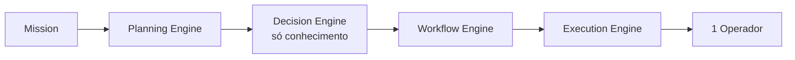

# Capítulo 34 — Implementação de Referência do Batman OS

**Volume:** IX — Reference Implementation
**Status da especificação:** v0.1 (Draft)
**Depende de:** Toda a obra (Volumes I–VIII)

---

## 34.0 Objetivo do capítulo

Especificar a ordem de construção de uma implementação de referência do Batman OS — não um novo componente arquitetural, mas um **roteiro de bootstrap**: o que construir primeiro, em que sequência, e qual é o menor sistema funcional ("walking skeleton") que já respeita todos os princípios do Volume I sem exigir que todos os 33 capítulos estejam implementados de uma vez.

## 34.1 Motivação

Uma especificação de 33 capítulos e 15 ADRs, se lida como "tudo precisa existir antes de qualquer coisa funcionar", é inconstruível na prática. Este capítulo resolve isso definindo fases de implementação que preservam, desde a primeira fase, os princípios inegociáveis do Volume I (Determinism First, Full Governance) — mesmo que em escopo reduzido — em vez de adiar governança para "depois que o sistema já estiver funcionando".

## 34.2 Princípio de faseamento: reduzir escopo, nunca reduzir disciplina

> **Regra estrutural:** cada fase de implementação pode cobrir menos `MissionType`s, menos Capabilities, um único tenant, ou nenhum Anexo aceito — mas nunca pode pular Evidence First, Full Governance ou a separação de camadas (ADR-0002). Um "MVP" do Batman OS que pule certificação ou auditoria não é uma versão reduzida do Batman OS — é um sistema diferente, fora de especificação.

## 34.3 Fase 0 — Walking Skeleton

O menor sistema que exercita a cadeia completa Mission → Planning → Decision → Workflow → Execution, de ponta a ponta, com escopo deliberadamente mínimo:

| Dimensão | Escopo da Fase 0 |
|---|---|
| Tenants | Um único tenant hardcoded (mas o campo `tenantId` já existe em todo dado — Vol. III, ADR-0005 nunca é retrofitting, é dia um) |
| MissionTypes | Um único tipo, de baixa criticidade |
| Capabilities | Uma ou duas, determinísticas, sem `sideEffects: irreversible` |
| Playbooks | Um único Playbook, certificado manualmente |
| Decision Engine | Apenas o caminho "resolvido por conhecimento" (Vol. II, Cap. 8, seção 8.2) — sem LLM Gateway, sem Human Review ainda |
| Learning Engine (Vol. VI) | Ausente — Operational Memory (Vol. III, Cap. 13) apenas registra, sem pipeline de promoção |
| Governance (Vol. VII) | Ausente como serviço — decisões de certificação são manuais e registradas em texto simples |

**Por que isto já é "Batman OS" e não um protótipo qualquer:** mesmo nesta escala mínima, o sistema já satisfaz Determinism First (mesma entrada, mesma saída), Mission Driven (nada roda fora de uma Missão) e Evidence First (toda decisão carrega evidência, mesmo vindo só de regra estática). O que falta são *capacidades*, não *disciplina*.

## 34.4 Fase 1 — Governança mínima viável

Adiciona o que a Fase 0 deliberadamente adiou:

- Certificação formal de Capability (Vol. IV, Cap. 16) substitui aprovação manual.
- Human Review (Vol. VII, Cap. 28) como processo real, ainda que com um único `ReviewerRole`.
- Escalonamento para humano no Decision Engine (Vol. II, Cap. 8) — ainda sem LLM.
- Multi-tenancy real (mais de um tenant, RLS aplicada — Vol. VIII, ADR-0014).

## 34.5 Fase 2 — Aprendizado

- Operational Memory passa a alimentar candidatos a promoção (Vol. III, Cap. 13, seção 13.6).
- Rule Evolution com shadow mode (Vol. VI, Cap. 24) — primeira regra promovida automaticamente do ponto de vista de pipeline, sempre com Human Review.
- Knowledge Graph (Vol. VI, Cap. 23) como projeção derivada.

## 34.6 Fase 3 — Escala e LLM

- LLM Gateway integrado ao Decision Engine (Vol. II, Cap. 8), com `LLMEscalationPolicy` (Vol. VII, Cap. 29) já versionada desde a primeira consulta — nunca introduzida "depois, informalmente".
- Workflow Evolution (Vol. VI, Cap. 25).
- Observability Engine completo (Vol. VII, Cap. 30) com os quatro dashboards.
- Arquitetura física plena (Vol. VIII, Cap. 31) com múltiplos serviços físicos — a Fase 0–2 pode ter rodado como um monólito único, desde que a separação lógica de camadas (ADR-0002) já existisse desde o início.

## 34.7 Anexos (`ADDENDA.md`) e as fases

Nenhuma fase acima pressupõe qualquer Anexo aceito. Se, ao longo da implementação real, um Anexo (World Model, Goal Engine, Continuous Mission) for formalmente aceito pelo processo do Capítulo 27, ele entra como uma fase adicional explícita, nunca retroativamente misturado a uma fase já descrita aqui — consistente com a estrutura de diretórios `addenda/` do Capítulo 32.

## 34.8 Casos de falha e recuperação

| Cenário | Tratamento |
|---|---|
| Pressão de prazo para pular certificação ou Human Review "só na Fase 0" | Rejeitado por definição (seção 34.2) — reduzir escopo é permitido, reduzir disciplina não |
| Fase 2 (aprendizado) implementada antes da Fase 1 (governança mínima) estar sólida | Não recomendado — Rule Evolution sem Human Review madura reintroduz exatamente o risco que a ADR-0004 (Vol. III) existe para prevenir |
| Necessidade real de multi-tenant antes do fim da Fase 0 | Aceitável adiantar — a Fase 1 é sequência recomendada, não bloqueio rígido; o que é rígido é a disciplina de certificação e evidência, não a ordem exata das capacidades |

## 34.9 Testes de aceitação

1. **AT-34.1:** O Walking Skeleton (Fase 0) deve passar em uma versão reduzida de todo teste de aceitação `AT-*` referente a Determinism First e Evidence First já especificado nos Volumes II e III, mesmo com escopo de Capability reduzido.
2. **AT-34.2:** Nenhuma fase subsequente pode remover uma garantia já estabelecida em uma fase anterior (ex.: Fase 2 não pode reintroduzir promoção de regra sem Human Review, que já era obrigatória desde a Fase 1).

## 34.10 KPIs deste componente

- **Tempo de cada fase até "critério de saída" satisfeito** — mede realismo do roteiro de bootstrap.
- **Número de testes de aceitação (`AT-*`) do corpo principal da obra já cobertos por fase** — mede fidelidade da implementação de referência à especificação.

## 34.11 Status da Implementação

| Já existe | Precisa refatorar | Ainda não existe |
|---|---|---|
| **Fase 0 — Walking Skeleton: implementada de verdade** (2026-07-04, `src/batman_os/cli/`) — primeiro lote real de 14 Capabilities migradas do Batman atual (`radar-preditivo/Batman/scan/rules/`), CLI `batman scan` executando Mission→Planning→Decision→Workflow→Execution contra um repositório real, validado por comparação de fingerprint byte-a-byte com o motor legado (`scripts/compare_migracao.py`, 14/14 códigos convergentes contra `radar-preditivo`) | Composição via grafo de Capabilities em vez de "um único Playbook certificado manualmente" (seção 34.3) — divergência aceita, não é um Playbook real ainda | Fases 1-3 completas; critérios de saída formais por fase (AT-34.1/34.2 não verificados como suíte automatizada)

---

**Capítulo anterior:** [Capítulo 33 — Segurança e Isolamento](../08-infrastructure/03-security-isolation.md)
**Próximo capítulo:** [Capítulo 35 — Casos de Uso Ponta a Ponta](./02-end-to-end-use-cases.md)
