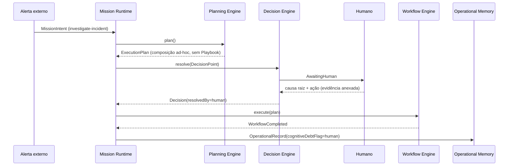
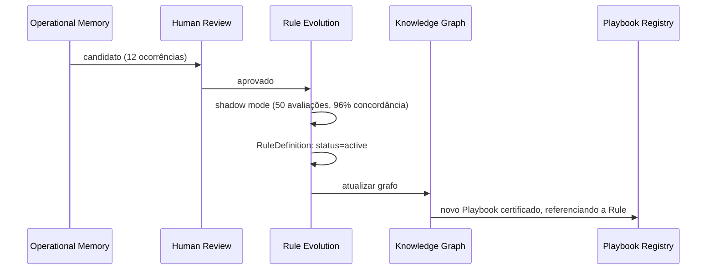
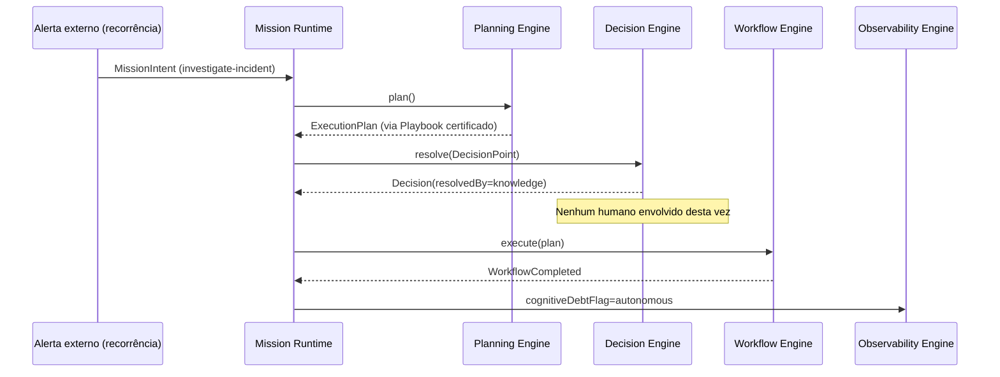

# Capítulo 35 — Casos de Uso Ponta a Ponta

**Volume:** IX — Reference Implementation
**Status da especificação:** v0.1 (Draft)
**Depende de:** Capítulo 34 (Implementação de Referência); toda a obra

---

## 35.0 Objetivo do capítulo

Fechar o Volume IX — e o núcleo técnico completo da obra — com um único caso de uso que atravessa, em sequência real, todos os componentes especificados nos Volumes II a VIII. Deliberadamente, retomamos o exemplo usado desde o Capítulo 1 ("timeout no Gunicorn"): a obra termina exercitando o mesmo cenário que a abriu, agora com cada etapa nomeada e rastreável a um capítulo específico.

## 35.1 O cenário

Um serviço de produção começa a apresentar timeouts intermitentes sob carga, atribuídos ao Gunicorn. Isso ocorrerá **repetidas vezes ao longo do tempo** — o caso de uso mostra explicitamente a primeira ocorrência (resolvida com apoio humano) e uma ocorrência posterior, depois que o conhecimento foi promovido (resolvida autonomamente), para tornar visível a própria tese do Capítulo 1.

## 35.2 Execução 1 — primeira ocorrência (Cognitive Debt alto)

| Passo | O que acontece | Capítulo exercitado |
|---|---|---|
| 1 | Um evento externo (alerta de monitoramento) gera um `MissionIntent` do tipo `investigate-incident` | Vol. II, Cap. 6 |
| 2 | Mission Runtime cria a Missão, estado `Created` | Vol. II, Cap. 6 |
| 3 | Planning Engine busca Playbook para `investigate-incident` + sintoma "timeout" — nenhum Playbook específico existe ainda; composição via grafo de Capabilities genéricas (`collect-logs`, `analyze-latency`) | Vol. II, Cap. 7 |
| 4 | Plano gerado contém um `DecisionPoint`: "causa raiz do timeout é desconhecida — qual ação tomar?" | Vol. II, Cap. 7 |
| 5 | Decision Engine consulta Knowledge Base — nenhuma regra cobre este padrão ainda; confiança insuficiente | Vol. II, Cap. 8 |
| 6 | Escalado para humano (`AwaitingHuman`) — SLA de missão monitorado | Vol. II, Cap. 8; Vol. V, Cap. 20 |
| 7 | Humano investiga, encontra: timeouts sempre ocorrem após uma alteração recente de configuração X; aplica correção manual (aumento de worker timeout) | — (trabalho humano, fora do sistema) |
| 8 | Decisão do humano é registrada como `Decision { resolvedBy: "human", evidence: [...] }` | Vol. II, Cap. 8 |
| 9 | Workflow Engine aplica a correção via Capability `apply-config-change`, com checkpoint | Vol. II, Cap. 9 |
| 10 | Missão conclui: `Completed`, `cognitiveDebtFlag: "human"` | Vol. II, Cap. 6 |
| 11 | `OperationalRecord` gravado — esta é a 1ª ocorrência deste padrão | Vol. III, Cap. 13 |

## 35.3 Entre execuções — o ciclo de aprendizado

Após a 12ª ocorrência do mesmo padrão (mesma classe de `DecisionPoint`, sempre resolvido por humano, sempre com o mesmo tipo de causa raiz), a Operational Memory identifica um candidato:

| Passo | O que acontece | Capítulo exercitado |
|---|---|---|
| 12 | `findPromotionCandidates` identifica o padrão: 12 ocorrências, `resolvedBy: human`, resultado consistente | Vol. III, Cap. 13, seção 13.6 |
| 13 | Candidato enviado a Human Review (`domain-expert`) | Vol. VII, Cap. 28 |
| 14 | Revisor aprova a proposta de regra: "se sintoma = timeout E alteração recente em config X, aumentar worker timeout automaticamente" | Vol. VII, Cap. 28 |
| 15 | `RuleDefinition` criada em `status: draft`, entra em shadow mode | Vol. VI, Cap. 24 |
| 16 | Após 50 avaliações em paralelo com 96% de concordância, regra promovida a `active` | Vol. VI, Cap. 24, seção 24.4 |
| 17 | Knowledge Graph atualizado: nova aresta `Rule -justified-by-> Evidence`, `Rule -promoted-from-> OperationalRecord` | Vol. VI, Cap. 23 |
| 18 | Um `Playbook` dedicado "investigate-gunicorn-timeout" é certificado, referenciando a nova regra e a Capability `apply-config-change` já existente | Vol. V, Cap. 21 |

## 35.4 Execução N — ocorrência posterior (Cognitive Debt reduzido)

| Passo | O que acontece | Capítulo exercitado |
|---|---|---|
| 19 | Novo alerta idêntico gera novo `MissionIntent` | Vol. II, Cap. 6 |
| 20 | Planning Engine encontra o Playbook "investigate-gunicorn-timeout" — casamento direto, sem composição ad-hoc | Vol. II, Cap. 7; Vol. V, Cap. 21 |
| 21 | Decision Engine consulta a `RuleDefinition` ativa — confiança suficiente, resolvido por conhecimento, **sem escalonamento humano** | Vol. II, Cap. 8 |
| 22 | Workflow Engine aplica a correção automaticamente | Vol. II, Cap. 9 |
| 23 | Missão conclui: `Completed`, `cognitiveDebtFlag: "autonomous"` | Vol. II, Cap. 6 |
| 24 | Observability Engine reflete a mudança: `resolvedByLLMPercentage` inalterado (nunca envolveu LLM), mas a proporção de missões `autonomous` para este `MissionType` sobe — Cognitive Debt cai | Vol. VII, Cap. 30 |

## 35.5 O que este caso de uso demonstra, capítulo a capítulo

Este único cenário, do início ao fim, exercita: Volume II inteiro (Cap. 6–10), Volume III (Cap. 12, 13), Volume V (Cap. 21), Volume VI inteiro (Cap. 23–26), Volume VII (Cap. 28, 30) — e ilustra exatamente a "hipótese Batman" descrita na abertura da obra (Volume I, Cap. 1, seção 1.4): o mesmo problema, resolvido uma vez com apoio humano, nunca mais precisa da mesma intervenção.

## 35.6 Casos de falha (variações deste mesmo cenário)

| Variação | O que muda | Capítulo relevante |
|---|---|---|
| A correção manual (passo 7) tivesse efeito colateral não revertido | Missão poderia terminar `PartiallyCompleted` com `DegradationRecord` | Vol. V, Cap. 22 |
| O padrão observado nas 12 ocorrências não fosse realmente causal (correlação espúria) | Revisor humano (passo 14) deveria rejeitar — este é exatamente o risco que a ADR-0004 e a discussão do ADD-0003 (rejeitado) endereçam | Vol. III, ADR-0004; ADD-0003 |
| A regra promovida (passo 16) apresentasse baixa concordância em shadow mode | Nunca atingiria `active`; retornaria para revisão com os dados de discordância como evidência adicional | Vol. VI, Cap. 24, seção 24.4 |

## 35.7 Testes de aceitação

1. **AT-35.1:** A implementação de referência deve ser capaz de reproduzir este cenário completo (Execução 1 → ciclo de aprendizado → Execução N) em ambiente de staging, com `replay` (Vol. II, Cap. 10) confirmando a trilha causal completa de ambas as execuções.
2. **AT-35.2:** `cognitiveDebtFlag` da Execução N deve ser `autonomous`, e o Observability Engine deve refletir a queda de Cognitive Debt para este `MissionType` especificamente (não apenas de forma agregada).

## 35.8 Status da Implementação

| Já existe | Precisa refatorar | Ainda não existe |
|---|---|---|
| Todos os componentes individuais, especificados nos Volumes II–VIII | — | O cenário completo como suíte de teste de integração de ponta a ponta na implementação de referência |

---

## Encerramento do Volume IX

Este capítulo demonstrou, com um único cenário rastreável, que a arquitetura especificada nos oito volumes anteriores não é apenas coerente capítulo a capítulo — ela produz o comportamento prometido desde a primeira página: um sistema que reduz continuamente a quantidade de perguntas que precisa fazer, sem nunca abrir mão de determinismo, evidência ou supervisão humana no momento em que o conhecimento muda de mãos.

## Encerramento do núcleo técnico da obra (Volumes I–IX)

Falta apenas o **Volume X — Appendices**, que não introduz nenhum conceito novo: consolida o glossário (já disperso desde o Volume I, Cap. 4), o índice completo de ADRs (0001–0015) e Anexos (ADD-0001–0006), as métricas e KPIs de toda a obra em um só lugar, e um roadmap de evolução para além do que este documento especifica.

---

**Capítulo anterior:** [Capítulo 34 — Implementação de Referência do Batman OS](./01-reference-implementation.md)
**Próximo volume:** Volume X — Appendices (a iniciar)
