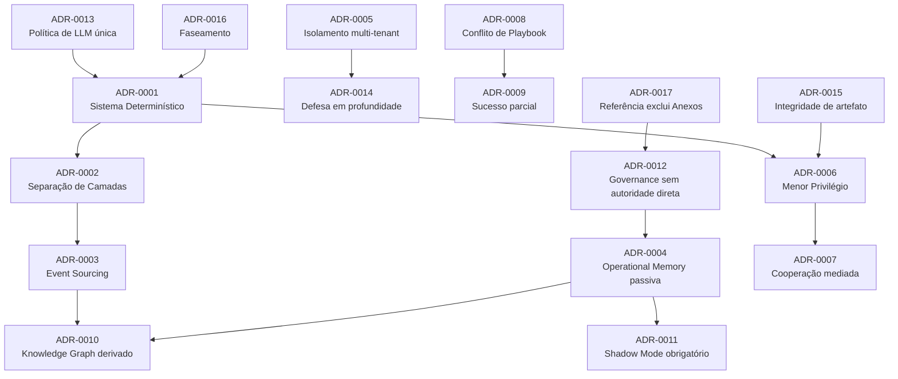

# Capítulo 37 — Índice de ADRs e Anexos

**Volume:** X — Appendices
**Status da especificação:** v0.1 (Draft)
**Depende de:** Todas as ADRs (0001–0017) e Anexos (ADD-0001–0006) da obra

---

## 37.0 Objetivo do capítulo

Consolidar em uma única tabela todas as 17 ADRs e 6 Anexos produzidos ao longo da obra — um índice de navegação e de auditoria rápida, não uma nova fonte de autoridade (mesma regra de precedência do Capítulo 36).

## 37.1 Índice completo de ADRs

| ADR | Título | Volume | Status |
|---|---|---|---|
| [ADR-0001](../01-foundation/ADR/ADR-0001-deterministic-cognitive-system.md) | Batman será um Sistema Cognitivo Determinístico | I | Accepted |
| [ADR-0002](../02-kernel/ADR/ADR-0002-separation-planning-decision-execution.md) | Separação estrita entre Planning, Decision e Execution | II | Accepted |
| [ADR-0003](../02-kernel/ADR/ADR-0003-event-sourcing.md) | Event Sourcing como padrão de auditabilidade | II | Accepted |
| [ADR-0004](../03-runtime/ADR/ADR-0004-operational-memory-vs-knowledge.md) | Operational Memory não é fonte de verdade comportamental | III | Accepted |
| [ADR-0005](../03-runtime/ADR/ADR-0005-multitenant-isolation.md) | Isolamento multi-tenant como propriedade estrutural | III | Accepted |
| [ADR-0006](../04-capabilities/ADR/ADR-0006-operator-least-privilege.md) | Menor privilégio e sandboxing obrigatório para Operadores | IV | Accepted |
| [ADR-0007](../04-capabilities/ADR/ADR-0007-mediated-cooperation.md) | Cooperação mediada como único padrão de comunicação | IV | Accepted |
| [ADR-0008](../05-workflow/ADR/ADR-0008-playbook-conflict-resolution.md) | Resolução determinística de conflito entre Playbooks | V | Accepted |
| [ADR-0009](../05-workflow/ADR/ADR-0009-partial-success-state.md) | Sucesso parcial como estado de primeira classe | V | Accepted |
| [ADR-0010](../06-learning/ADR/ADR-0010-knowledge-graph-derived-projection.md) | Knowledge Graph como projeção derivada, nunca fonte primária | VI | Accepted |
| [ADR-0011](../06-learning/ADR/ADR-0011-shadow-mode-mandatory.md) | Shadow mode obrigatório antes da ativação de qualquer regra | VI | Accepted |
| [ADR-0012](../07-governance/ADR/ADR-0012-governance-no-direct-authority.md) | Governance Engine sem autoridade executiva direta | VII | Accepted |
| [ADR-0013](../07-governance/ADR/ADR-0013-llm-policy-single-artifact.md) | Política de LLM Escalation como artefato único e revisável | VII | Accepted |
| [ADR-0014](../08-infrastructure/ADR/ADR-0014-defense-in-depth-tenant-isolation.md) | Defesa em profundidade para isolamento de tenant | VIII | Accepted |
| [ADR-0015](../08-infrastructure/ADR/ADR-0015-artifact-integrity-verification.md) | Verificação de integridade de artefato como bloqueio obrigatório | VIII | Accepted |
| [ADR-0016](../09-reference-implementation/ADR/ADR-0016-phasing-scope-not-discipline.md) | Faseamento reduz escopo, nunca disciplina | IX | Accepted |
| [ADR-0017](../09-reference-implementation/ADR/ADR-0017-reference-implementation-excludes-unaccepted-addenda.md) | Implementação de referência constrói apenas a especificação aceita | IX | Accepted |

## 37.2 Índice completo de Anexos

| Anexo | Título | Estende | Status |
|---|---|---|---|
| [ADD-0001](../02-kernel/ADDENDA/ADD-0001-goal-engine.md) | Goal Engine | Volume II | Proposed |
| [ADD-0002](../03-runtime/ADDENDA/ADD-0002-world-model.md) | World Model | Volume III | Proposed |
| [ADD-0003](../03-runtime/ADDENDA/ADD-0003-operational-memory-inference-rejected.md) | Operational Memory ativa | Volume III | **Rejected** |
| [ADD-0004](../04-capabilities/ADDENDA/ADD-0004-cognitive-roles-extension.md) | Papéis Cognitivos | Volume IV | Proposed |
| [ADD-0005](../05-workflow/ADDENDA/ADD-0005-continuous-mission.md) | Continuous Mission | Volume V | Proposed |
| [ADD-0006](../01-foundation/ADDENDA/ADD-0006-executable-cognitive-asset.md) | Patrimônio Cognitivo Executável | Volume I | Proposed |

## 37.3 Grafo de dependência entre ADRs

Algumas ADRs reforçam ou pressupõem outras — este grafo ajuda a avaliar o impacto de revisitar qualquer uma delas no futuro:

## 37.4 Como este índice trata Anexos rejeitados

O ADD-0003 permanece listado, com status `Rejected` explícito, seguindo a mesma disciplina de Evidence First aplicada a qualquer decisão da obra: uma proposta avaliada e descartada é, ela mesma, um registro de conhecimento — evita que a mesma discussão seja reaberta do zero sem contexto.

## 37.5 Testes de aceitação

1. **AT-37.1:** Todo ADR e Anexo referenciado em qualquer capítulo da obra deve aparecer neste índice — verificável por varredura automatizada de links cruzados.
2. **AT-37.2:** Nenhuma ADR pode ser listada como `Accepted` neste índice sem o texto correspondente também declarar `Status: Accepted` — verificação de consistência entre este capítulo e as fontes.

## 37.6 Status da Implementação

| Já existe | Precisa refatorar | Ainda não existe |
|---|---|---|
| Todas as 17 ADRs e 6 Anexos individualmente | — | Verificação automatizada de consistência deste índice contra as fontes |

---

**Capítulo anterior:** [Capítulo 36 — Glossário Consolidado](./01-consolidated-glossary.md)
**Próximo capítulo:** [Capítulo 38 — Métricas e KPIs Consolidados](./03-consolidated-metrics.md)
