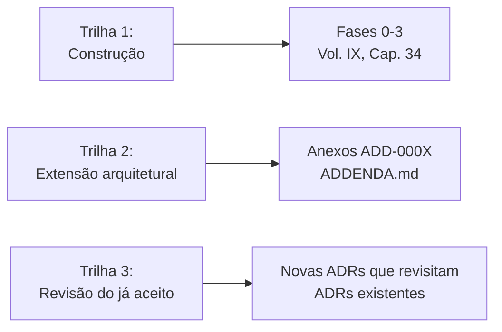

# Capítulo 39 — Roadmap de Evolução

**Volume:** X — Appendices
**Status da especificação:** v0.1 (Draft)
**Depende de:** Toda a obra

---

## 39.0 Objetivo do capítulo

Fechar a obra respondendo à pergunta que o Princípio 10 (Evolution Never Stops, Volume I) torna inevitável: o que vem depois deste documento? Este capítulo não é uma lista de tarefas de engenharia — é um mapa de **como** a obra e o sistema que ela descreve devem continuar evoluindo, usando exclusivamente os mecanismos que a própria obra já formalizou.

## 39.1 Três trilhas de evolução, nunca misturadas

**Regra estrutural:** nenhuma evolução futura deste sistema deve acontecer fora dessas três trilhas. "Construção" segue o roteiro do Volume IX. "Extensão" nasce como Anexo, nunca como edição direta de um capítulo (regra estabelecida na introdução do `ADDENDA.md`). "Revisão" de uma decisão já aceita exige uma nova ADR que referencie e avalie a anterior — nunca uma reversão silenciosa.

## 39.2 Prioridades imediatas entre os Anexos existentes

Dos seis Anexos hoje documentados (`ADDENDA.md`), a avaliação registrada nesta obra já sugere uma ordem natural de consideração, caso a Governança (Volume VII, Cap. 27) decida avançar com eles:

| Ordem sugerida | Anexo | Razão |
|---|---|---|
| 1 | ADD-0004 (Papéis Cognitivos) | Puramente aditivo, sem novo mecanismo de runtime — menor risco e menor esforço de aceite |
| 2 | ADD-0006 (Patrimônio Cognitivo Executável) | Mudança textual, sem impacto de código — mesmo raciocínio de baixo risco do item anterior |
| 3 | ADD-0002 (World Model) | Pré-requisito estrutural do ADD-0001 e parcialmente do ADD-0005 |
| 4 | ADD-0001 (Goal Engine) | Depende do World Model; exige ADR de mudança de contrato do Kernel (novo ponto de entrada) |
| 5 | ADD-0005 (Continuous Mission) | Pode ser adotado parcialmente (`scheduled`) antes do World Model, plenamente depois |

ADD-0003 (Operational Memory ativa) permanece `Rejected` e não entra nesta priorização — sua reavaliação exigiria evidência nova, não apenas reordenamento de prioridade.

## 39.3 O que este documento deliberadamente não especifica

Consistente com o Volume IX (a implementação de referência é uma, não a única possível): este roadmap não prescreve prazos, alocação de equipe, ou ferramental específico de nenhuma organização que venha a implementar o Batman OS. Isso está fora do escopo de uma especificação de arquitetura e pertence à camada de gestão de projeto de quem a adota.

## 39.4 Sinais de que a especificação em si precisa evoluir (não apenas o sistema)

Este documento é, ele mesmo, sujeito ao Princípio 10. Sinais de que um novo volume ou uma revisão estrutural da obra (não apenas um novo Anexo) seria necessária:

- Um Anexo aceito revela que a estrutura de 10 volumes não comporta bem sua extensão (ex.: o World Model crescer a ponto de merecer volume próprio, não apenas capítulos dentro do Volume III).
- Descoberta de uma classe inteira de problema não coberta por nenhum princípio do Volume I — o que exigiria revisão do próprio Capítulo 3, não apenas um Anexo.
- Acúmulo de múltiplas ADRs que revisam a mesma decisão repetidamente, sinalizando que o princípio subjacente (não apenas a decisão pontual) merece reexame.

## 39.5 Encerramento

A obra abriu com uma frase e fecha com a mesma tese, agora inteiramente especificada, implementável e — no Capítulo 35 — demonstrada: um sistema que reduz continuamente a quantidade de perguntas que precisa fazer, sem jamais abrir mão de determinismo, evidência ou supervisão humana no momento exato em que conhecimento novo entra no sistema. Os 39 capítulos, 17 ADRs e 6 Anexos deste documento não são o Batman OS — são a especificação que torna possível construí-lo com disciplina, e revisá-lo sem perder a disciplina que o define.

## 39.6 Status da Implementação

| Já existe | Precisa refatorar | Ainda não existe |
|---|---|---|
| As três trilhas de evolução, já praticadas ao longo da própria escrita desta obra | — | Qualquer evolução futura, por definição — este capítulo descreve o processo, não o conteúdo dela |

---

**Capítulo anterior:** [Capítulo 38 — Métricas e KPIs Consolidados](./03-consolidated-metrics.md)

---

## Encerramento do Volume X e da Obra

Com este capítulo, o **Batman OS Engineering Specification** está completo: 39 capítulos organizados em 10 volumes, 17 ADRs e 6 Anexos, cobrindo desde o diagnóstico do problema (Volume I) até uma implementação de referência demonstrada de ponta a ponta (Volume IX), consolidados aqui em glossário, índice e roadmap (Volume X).

**Voltar ao início:** [README.md](../README.md) · [SUMMARY.md](../SUMMARY.md) · [ADDENDA.md](../ADDENDA.md)
