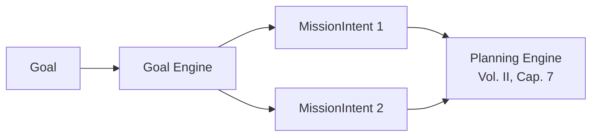

# ADD-0001 — Goal Engine

| Campo | Valor |
|---|---|
| **Status** | Proposed |
| **Estende** | Volume II — Kernel Architecture, imediatamente antes do Capítulo 6 (Mission Runtime) |
| **Não altera** | Nenhum capítulo existente. Este anexo introduz um componente novo que **precede** o Mission Runtime na cadeia causal, sem modificar seu contrato |
| **Princípios invocados** | Mission Driven, Knowledge First, Determinism First |

---

## 1. Motivação

A obra, do Capítulo 6 em diante, assume que um `MissionIntent` já existe, bem-formado, pronto para ser submetido ao Kernel (`submitMission`, Cap. 5, seção 5.7). Essa suposição é correta para integrações programáticas (um sistema externo que já sabe exatamente qual missão precisa), mas não cobre o caso de um **objetivo** expresso em linguagem natural ou de alto nível — "quero publicar uma nova versão", "quero que o sistema X fique mais seguro". Um objetivo não é uma missão: pode se decompor em uma, em várias, ou em nenhuma (se já satisfeito pelo estado atual do mundo — ver ADD-0002, World Model).

## 2. Por que isto é um componente novo, não uma extensão do Planning Engine

O Planning Engine (Volume II, Cap. 7) transforma um `MissionIntent` **já existente** em um `ExecutionPlan`. O Goal Engine opera uma camada antes: transforma um `Goal` (não necessariamente estruturado) em um ou mais `MissionIntent`s. Fundir essas responsabilidades violaria a mesma lógica que justificou a ADR-0002 (Volume II) — separação estrita entre camadas com contratos de entrada/saída distintos.



## 3. Estrutura de dados proposta

```typescript
interface Goal {
  id: GoalId;
  rawStatement: string;              // ex.: "publicar nova versão do serviço X"
  tenantId: TenantId;                 // Vol. III, Cap. 14 — isolamento desde a origem
  context?: Record<string, unknown>;  // metadados adicionais fornecidos por quem originou o Goal
  receivedAt: Timestamp;
}

interface GoalDecomposition {
  goalId: GoalId;
  resultingMissions: MissionIntent[];
  decompositionMethod: "known-pattern" | "capability-composition" | "escalated";
  evidence: Evidence[];               // Evidence First — toda decomposição é justificada
}
```

## 4. Algoritmo de decomposição (determinístico por padrão, nunca "por adivinhação")

```
function decompose(goal: Goal, worldModel: WorldModel, registry: PlaybookRegistry): GoalDecomposition {
  1. knownPattern = GoalPatternRepository.findMatching(goal)
     // análogo ao Playbook matching do Vol. II Cap. 7 — casamento estrutural, não semântico livre
  2. if knownPattern exists:
        missions = instantiateFromPattern(knownPattern, goal, worldModel)
        return { resultingMissions: missions, decompositionMethod: "known-pattern" }
  3. candidates = composeFromMissionTypeGraph(goal, worldModel, registry)
     // análogo à composição via grafo de Capabilities (Vol. II, Cap. 7, seção 7.4)
  4. if candidates found:
        return { resultingMissions: candidates, decompositionMethod: "capability-composition" }
  5. // Nenhum padrão conhecido nem composição possível — mesma disciplina do Planning Engine:
     // o Goal Engine NUNCA invoca um LLM para "adivinhar" a decomposição como caminho primário.
  6. escalate(goal)  // Human Last / LLM Last, reaproveitando a hierarquia do Decision Engine (Vol. II, Cap. 8)
  return { resultingMissions: [], decompositionMethod: "escalated", evidence: [...] }
}
```

**Ponto crítico, coerente com a ADR-0001 (Volume I):** um Goal cuja decomposição não é coberta por um `GoalPattern` conhecido não é "resolvido" com uma chamada criativa a um LLM como primeira tentativa — ele segue exatamente a mesma hierarquia Knowledge → Human → LLM já formalizada no Decision Engine. O Goal Engine é, estruturalmente, mais um consumidor dessa hierarquia, não uma exceção a ela.

## 5. Relação com o World Model (ADD-0002)

A decomposição de um Goal frequentemente depende de saber o que já existe no mundo (ex.: "publicar nova versão do serviço X" precisa saber se o serviço X existe, em qual ambiente, com quais dependências). Por isso este anexo depende estruturalmente do ADD-0002 — o Goal Engine é o primeiro e mais óbvio consumidor do World Model, mas não o único (ver seção 5 do ADD-0002).

## 6. Casos de falha

| Cenário | Tratamento |
|---|---|
| Goal não decomposto por padrão conhecido nem composição, e escalação humana não esclarece uma decomposição viável | Goal permanece sem missões resultantes, registrado como gap de conhecimento — nunca força uma decomposição arbitrária só para "produzir alguma missão" |
| Goal decomposto em missões que already existem/rodam (idempotência de objetivo) | Consulta ao World Model deve detectar isso antes de criar missões duplicadas — comportamento a especificar em conjunto com ADD-0002 |

## 7. Testes de aceitação (propostos)

1. **AT-ADD1.1:** Dado o mesmo `Goal` e o mesmo estado do World Model, `decompose()` deve produzir o mesmo conjunto de `MissionIntent`s (Determinism First).
2. **AT-ADD1.2:** Nenhuma decomposição pode ocorrer sem `evidence` associada, mesmo quando resolvida por `known-pattern`.

## 8. Status da Implementação

| Já existe | Precisa refatorar | Ainda não existe |
|---|---|---|
| — | — | Goal Engine completo; `GoalPatternRepository`; integração com World Model (ADD-0002) |

---

**Para aceitar este anexo:** ele exigiria, no mínimo, uma ADR formal (análoga à ADR-0002) definindo onde exatamente o Goal Engine se encaixa no contrato do Kernel (Cap. 5, seção 5.7) — hoje `submitMission` é o único ponto de entrada; aceitar este anexo implica adicionar `submitGoal` como uma nova porta de entrada, o que precisa ser avaliado com o mesmo rigor de qualquer mudança de contrato público.
