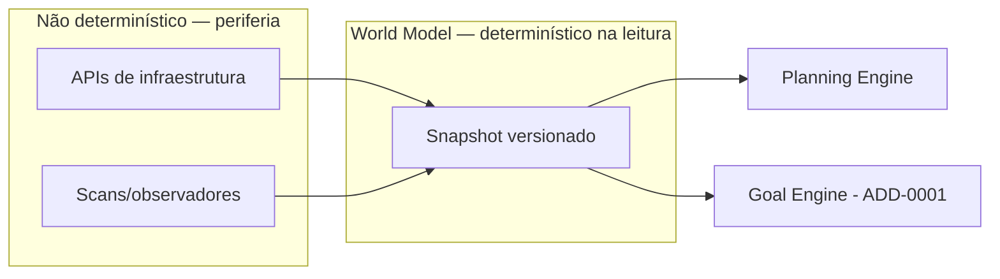

# ADD-0002 — World Model

| Campo | Valor |
|---|---|
| **Status** | Proposed |
| **Estende** | Volume III — Runtime (novo componente); consultado por Volume II, Cap. 7 (Planning Engine) e pelo ADD-0001 (Goal Engine) |
| **Não altera** | Nenhum capítulo existente. O Planning Engine (Cap. 7) continua funcionando exatamente como especificado mesmo sem o World Model — este anexo propõe uma **nova fonte de consulta opcional**, não uma dependência obrigatória retroativa |
| **Princípios invocados** | Knowledge First, Determinism First, Full Governance |

---

## 1. Motivação

Toda a obra, até aqui, trata o "mundo" (projetos, ambientes, serviços, dependências, usuários, Operadores disponíveis) como algo implícito no `MissionIntent` ou nas `Capabilities`/`Tools` registradas. Isso funciona para missões pontuais, mas cria um problema real: o Planning Engine não tem como responder "este serviço existe?" ou "quais serviços dependem deste?" sem essa informação estar embutida manualmente em cada Playbook — o que é frágil e não escala à medida que o número de sistemas geridos pelo Batman cresce.

## 2. Definição proposta

> O **World Model** é uma representação versionada e consultável do estado conhecido do ambiente operado pelo Batman — não um catálogo de capacidades do próprio Batman (isso já é o Capability Registry, Vol. III Cap. 11), mas um mapa do que existe **fora** dele.

## 3. Distinção crítica com componentes já existentes

| | World Model (proposto) | Capability Registry (Vol. III, Cap. 11) | Operational Memory (Vol. III, Cap. 13) |
|---|---|---|---|
| O que descreve | O ambiente externo (serviços, projetos, topologia) | O que o Batman **sabe fazer** | O que **aconteceu** em execuções passadas |
| Muda por | Observação/sincronização do ambiente real | Certificação de novas Capabilities | Toda execução de missão |
| Consultado por | Goal Engine (ADD-0001), Planning Engine | Planning Engine, Execution Engine | Decision Engine |

Esta tabela por si só já expõe por que o World Model **não é** uma extensão da Operational Memory: um não substitui o outro, eles respondem perguntas categoricamente diferentes ("o que existe" vs. "o que já aconteceu").

## 4. Estrutura de dados proposta

```typescript
interface WorldEntity {
  id: EntityId;
  kind: "project" | "environment" | "service" | "resource" | "user" | "operator-availability";
  attributes: Record<string, unknown>;
  relationships: WorldRelationship[];
  lastObservedAt: Timestamp;          // World Model é sempre "conhecimento a partir de observação", nunca em tempo real garantido
  confidence: "confirmed" | "stale" | "inferred";
}

interface WorldRelationship {
  kind: "depends-on" | "runs-in" | "owned-by" | "member-of";
  targetEntityId: EntityId;
}

interface WorldModel {
  getEntity(id: EntityId): WorldEntity;
  queryByKind(kind: WorldEntity["kind"], filter?: FieldFilter): WorldEntity[];
  getDependencyGraph(entityId: EntityId, depth?: number): WorldEntity[];
  isStale(id: EntityId, maxAge: Duration): boolean;
}
```

**Nota crítica de honestidade epistêmica:** todo `WorldEntity` carrega `confidence` e `lastObservedAt` explícitos. O World Model **nunca** é tratado como verdade em tempo real — é sempre "o melhor conhecimento disponível na última observação", e todo consumidor (Planning Engine, Goal Engine) deve tratar `stale`/`inferred` como sinal para, no mínimo, elevar a decisão à hierarquia Human Last / LLM Last (Vol. II, Cap. 8) em vez de confiar cegamente.

## 5. Como o World Model é populado (sem violar Determinism First)

O World Model **não é** onde o não-determinismo entra — a coleta de dados sobre o ambiente pode usar fontes variadas (APIs de infraestrutura, scans, integrações), mas a leitura pelo Planning Engine e Goal Engine é sempre determinística sobre o snapshot vigente: mesmo `WorldModel.version()` (análogo ao `RegistryVersion` do Capability Registry, Vol. III Cap. 11) produz sempre a mesma resposta para a mesma consulta.



Esta separação espelha deliberadamente o mesmo padrão já usado para isolar o LLM Gateway (ADR-0001, Volume I): a fonte pode ser incerta, mas a interface de consulta não é.

## 6. Casos de falha

| Cenário | Tratamento |
|---|---|
| Consulta a uma entidade com `confidence: stale` além de um limiar configurado | Planning Engine/Goal Engine devem tratar como conhecimento insuficiente — nunca planejar como se fosse `confirmed` |
| World Model totalmente indisponível | Planning Engine deve poder operar em modo degradado, assumindo apenas o que está explícito no `MissionIntent`, exatamente como funciona hoje sem este anexo — nunca bloquear todo planejamento por dependência de um componente ainda proposto |
| Entidade referenciada em um Playbook é removida do World Model (ex.: serviço descomissionado) | Deve disparar revisão do Playbook afetado — mecanismo a integrar com o Knowledge Graph (Vol. VI, Cap. 23, `impactAnalysis`) |

## 7. Testes de aceitação (propostos)

1. **AT-ADD2.1:** Duas consultas a `getEntity(id)` no mesmo `WorldModel.version()` devem retornar exatamente o mesmo resultado.
2. **AT-ADD2.2:** Planejamento nunca deve tratar uma entidade `stale` com a mesma confiança que uma `confirmed` — verificável por teste onde a mesma missão produz planos distintos (ou escalação) dependendo do `confidence`.

## 8. Status da Implementação

| Já existe | Precisa refatorar | Ainda não existe |
|---|---|---|
| — | — | World Model completo; integração com Planning Engine (Cap. 7) e Goal Engine (ADD-0001); mecanismo de detecção de staleness |

---

**Para aceitar este anexo:** exigiria uma ADR formal decidindo se o World Model é um serviço centralizado único ou particionado por tenant desde a origem (consistente com a ADR-0005, Volume III) — esta última é a opção mais coerente com o restante da obra, mas precisa ser decidida explicitamente, não assumida.
