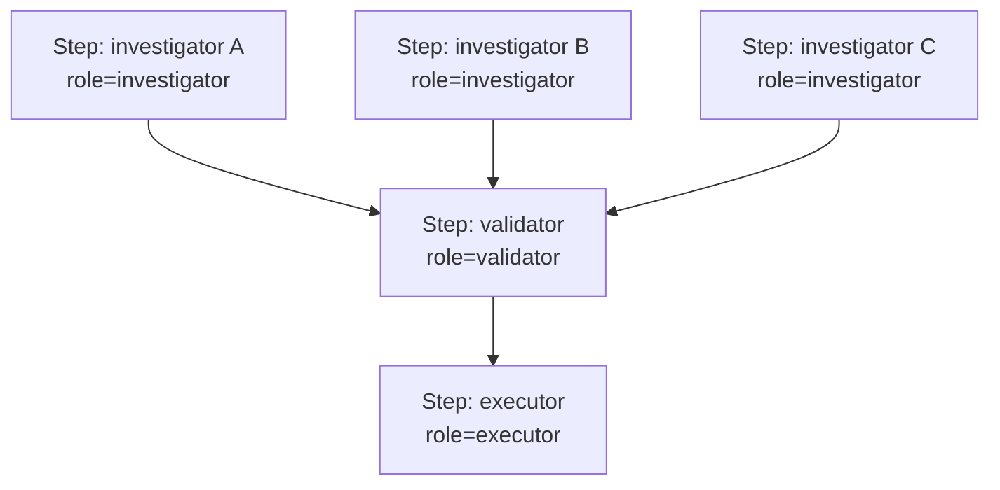

# ADD-0004 — Papéis Cognitivos (Extensão da Cooperação entre Operadores)

| Campo | Valor |
|---|---|
| **Status** | Proposed |
| **Estende** | Volume IV, Capítulo 19 (Cooperação entre Operadores) |
| **Não altera** | Nenhum capítulo existente, incluindo o Scheduler (Volume II, Cap. 10) — este anexo propõe uma camada de **papéis** dentro de missões já orquestradas pelo Workflow Engine, não um segundo Scheduler paralelo |
| **Princípios invocados** | Mission Driven, Full Governance, Determinism First |

---

## 1. Motivação e por que isto não é um "Cognitive Scheduler" separado

A proposta original sugeria um "Scheduler Cognitivo" que decidiria "quem investiga, quem valida, quem espera" entre Operadores. Avaliando essa ideia contra o que já existe: o Scheduler (Vol. II, Cap. 10) já resolve **quando e com qual paralelismo** despachar passos entre missões concorrentes — introduzir um segundo Scheduler paralelo para decidir papéis **dentro** de uma mesma missão duplicaria a responsabilidade de despacho em dois lugares, violando a mesma lógica que levou à ADR-0003 (Volume II, uma única fonte de verdade via event sourcing) e à ADR-0010 (Volume VI, Knowledge Graph como projeção única, nunca segunda fonte de verdade).

O que a proposta descreve — investigador, validador, quem espera — é melhor modelado como **papéis cooperativos explícitos dentro do grafo de dependências de um `ExecutionPlan`**, já existente (Vol. II, Cap. 7) e já orquestrado pelo único Scheduler existente.

## 2. Estrutura proposta: CooperativeRole

```typescript
type CooperativeRole = "investigator" | "validator" | "executor" | "observer";

interface PlanStepWithRole {
  // estende PlanStep (Vol. II, Cap. 7) sem alterar seu contrato —
  // role é um campo adicional opcional, ignorável por qualquer
  // consumidor que não o compreenda (retrocompatibilidade)
  stepId: StepId;
  role: CooperativeRole;
  waitsForRole?: CooperativeRole[]; // ex.: um "validator" aguarda todos os "investigator" do mesmo grupo
}
```

**Ponto crítico:** `waitsForRole` **não introduz um novo mecanismo de espera** — ele é açúcar sintático sobre o `dependsOn` que o `PlanStep` já possui (Vol. II, Cap. 7, seção 7.3). Um Playbook (Vol. V, Cap. 21) que declara papéis cooperativos ainda gera um `ExecutionPlan` com grafo de dependências explícito e determinístico — os papéis apenas tornam a *intenção* de composição legível e reutilizável entre Playbooks, sem adicionar um caminho de execução paralelo ao já especificado.

## 3. Diagrama: um grupo investigador → validador, expresso via papéis



Isto é estruturalmente idêntico a um fan-in já especificado no Volume IV, Capítulo 19, seção 19.3.2 — a única diferença é que o `role` documenta a *função* de cada passo no grafo, o que ajuda na certificação de Playbooks (Cap. 21) e na leitura humana do plano, sem introduzir nenhum mecanismo de runtime novo.

## 4. O que este anexo explicitamente não propõe

- Não propõe que o Scheduler (Vol. II, Cap. 10) tenha lógica de "atenção" ou prioridade baseada em papel — prioridade continua vindo exclusivamente de criticidade de missão (Vol. V, Cap. 20, seção 20.3) e aging (Vol. II, Cap. 10, seção 10.3.3).
- Não propõe que um Operador "acorde" ou "durma" de forma diferente do que já é possível com o ciclo de vida de Operador existente (`Active`/`Quarantined`, Vol. IV, Cap. 15, seção 15.7).

## 5. Casos de falha

| Cenário | Tratamento |
|---|---|
| `waitsForRole` referencia um papel que não existe no mesmo grupo de passos | Rejeitado na certificação do Playbook (Vol. V, Cap. 21, seção 21.6) — mesma disciplina já aplicada a `dependsOn` inválido |
| Consumidor legado do `ExecutionPlan` que não reconhece o campo `role` | Deve ignorá-lo com segurança — retrocompatibilidade explícita, já que `role` é estritamente informativo sobre um grafo de dependências que já era, por si só, suficiente para a execução correta |

## 6. Testes de aceitação (propostos)

1. **AT-ADD4.1:** Um `ExecutionPlan` com `role` anotado deve produzir exatamente o mesmo comportamento de execução que o mesmo plano sem anotação de papel — os papéis são estritamente informativos.
2. **AT-ADD4.2:** `waitsForRole` deve ser validado, na certificação do Playbook, como equivalente a uma relação de `dependsOn` correta e acíclica.

## 7. Status da Implementação

| Já existe | Precisa refatorar | Ainda não existe |
|---|---|---|
| O grafo de dependências subjacente (Vol. II, Cap. 7) já suporta tudo que este anexo precisa | — | Campo `role` e `waitsForRole` como açúcar sintático sobre `PlanStep`; validação de papéis na certificação de Playbook |

---

**Para aceitar este anexo:** por ser puramente aditivo e não introduzir mecanismo novo de runtime (apenas anotação sobre o que já existe), este é o anexo desta leva com o caminho de aceitação mais simples — não exige uma ADR de mudança de contrato, apenas uma atualização de schema do `PlanStep` documentada como extensão retrocompatível.
