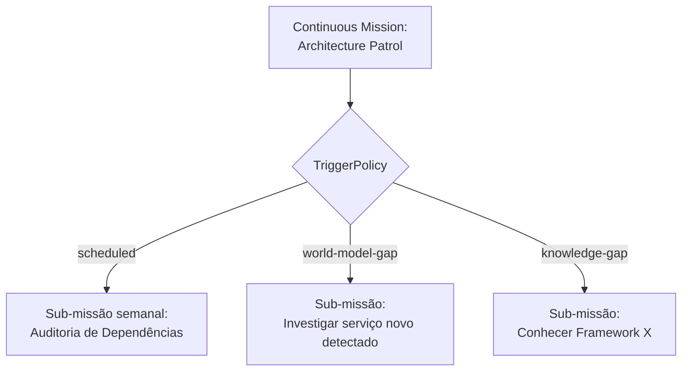

# ADD-0005 — Continuous Mission (Patrol / Curiosidade)

| Campo | Valor |
|---|---|
| **Status** | Proposed |
| **Estende** | Volume V, Capítulo 20 (Missões: Modelagem Formal) |
| **Não altera** | A máquina de estados do Volume II, Capítulo 6 permanece exatamente como especificada — este anexo propõe um novo `MissionType` que **usa** essa máquina de estados repetidamente via sub-missões, nunca uma segunda máquina de estados paralela |
| **Princípios invocados** | Mission Driven, Evolution Never Stops, Zero Cognitive Debt |

---

## 1. Motivação

Toda a obra, até aqui, modela trabalho como reativo: uma Missão nasce em resposta a um evento externo ou humano (Cap. 1, "hipótese Batman"). A proposta original identifica corretamente uma lacuna: alguns tipos de trabalho legítimo (varredura de segurança contínua, auditoria de dívida técnica, acompanhamento de novidades tecnológicas) não têm um gatilho externo discreto — são inerentemente contínuos.

## 2. Por que isto não exige uma segunda máquina de estados

A tentação de design mais direta seria criar um novo estado "sempre rodando" na máquina de estados da Missão (Vol. II, Cap. 6). Isso foi avaliado e rejeitado como abordagem: a máquina de estados atual (`Created → ... → Completed/Failed/Cancelled`) é fim-a-fim por construção, e todo o aparato de Cognitive Debt (Vol. I, Cap. 4), SLA (Vol. V, Cap. 20) e auditoria (`replay`, Vol. II, Cap. 10) pressupõe missões que terminam. Introduzir um estado "eterno" quebraria essas garantias sem necessidade.

Em vez disso, este anexo propõe modelar uma Continuous Mission como um **`MissionType` com `allowsSubMissions: true`** (Vol. V, Cap. 20, seção 20.2) cujo próprio ciclo de vida é, ele mesmo, uma sequência regular de sub-missões finitas — cada sub-missão passa pela máquina de estados normal, sem exceção.

## 3. Estrutura proposta

```typescript
interface ContinuousMissionDefinition {
  id: MissionTypeId;               // ex.: "security-patrol"
  triggerPolicy: TriggerPolicy;
  spawnsSubMissionType: MissionTypeId; // toda sub-missão gerada é uma missão comum, já especificada
  maxConcurrentSubMissions: number;
}

type TriggerPolicy =
  | { kind: "scheduled"; cadence: CronExpression }
  | { kind: "world-model-gap"; entityKind: WorldEntity["kind"] } // depende do ADD-0002
  | { kind: "knowledge-gap"; domain: string };                    // "curiosidade" — seção 4
```

## 4. "Curiosidade" como um tipo de TriggerPolicy, não como componente novo

A proposta original descrevia "curiosidade" (ex.: "nunca analisei Redis", "novo framework apareceu") como um conceito à parte. Avaliando estruturalmente: isso é **o mesmo mecanismo de Continuous Mission**, apenas com um gatilho diferente — `knowledge-gap` em vez de `scheduled` ou `world-model-gap`. Não há necessidade de um componente novo; há necessidade de que o catálogo de `TriggerPolicy` inclua esse tipo, e que exista uma fonte de sinal para ele.



**Fonte de sinal para `knowledge-gap`:** o candidato mais natural é o próprio Knowledge Graph (Vol. VI, Cap. 23) — uma consulta que identifica Skills, Tools ou tecnologias mencionadas no World Model (ADD-0002) sem nenhuma Capability ou Skill correspondente no catálogo. Isso conecta "curiosidade" diretamente ao mecanismo de detecção de gap já existente (Vol. II, Cap. 7, seção 7.4.1), em vez de inventar um novo detector.

## 5. Relação com Cognitive Debt

Sub-missões geradas por Continuous Mission são contabilizadas em Cognitive Debt exatamente como qualquer outra (Vol. I, Cap. 4, seção 4.9.1) — isso é importante e deliberado: se uma Continuous Mission gera muitas sub-missões que sempre acabam escalando para humano ou LLM, isso é um sinal legítimo de Cognitive Debt alto **naquele domínio específico** (Vol. VI, Cap. 26, seção 26.4), não uma categoria isenta de medição.

## 6. Casos de falha

| Cenário | Tratamento |
|---|---|
| Continuous Mission gera sub-missões mais rápido do que podem ser processadas (`maxConcurrentSubMissions` excedido) | Novas sub-missões enfileiradas normalmente pelo Scheduler (Vol. II, Cap. 10) — nunca descartadas silenciosamente, apenas atrasadas conforme fairness já especificado |
| `world-model-gap` dispara repetidamente para a mesma entidade sem resolução | Sinaliza necessidade de revisão humana do próprio `TriggerPolicy` — taxa de disparo é um KPI de saúde (seção 7) |
| Continuous Mission nunca gera nenhuma sub-missão em longo período | Não é necessariamente falha — pode indicar que o domínio patrulhado está genuinamente estável; sinalizado apenas como dado, não como alarme automático |

## 7. Testes de aceitação (propostos)

1. **AT-ADD5.1:** Toda sub-missão gerada por uma Continuous Mission deve seguir a máquina de estados padrão (Vol. II, Cap. 6) sem exceção nem novo estado.
2. **AT-ADD5.2:** O Cognitive Debt de sub-missões geradas por Continuous Mission deve ser consultável separadamente por `MissionTypeId` de origem (consistente com Vol. VI, Cap. 26, AT-26.1).

## 8. KPIs propostos

- **Taxa de sub-missões geradas por Continuous Mission que resolvem autonomamente** vs. escalam — Cognitive Debt segmentado por Patrol.
- **Cobertura de `world-model-gap`**: proporção de entidades do World Model (ADD-0002) sem nenhuma Capability/Skill associada, ao longo do tempo — deve tender a diminuir se o Patrol estiver funcionando.

## 9. Status da Implementação

| Já existe | Precisa refatorar | Ainda não existe |
|---|---|---|
| Máquina de estados de sub-missão (Vol. II, Cap. 6); mecanismo de sub-missão (Vol. IV, Cap. 19, seção 19.3.3) | — | `ContinuousMissionDefinition`; `TriggerPolicy` scheduler; integração com Knowledge Graph para `knowledge-gap` |

---

**Para aceitar este anexo:** depende parcialmente do ADD-0002 (World Model) para o gatilho `world-model-gap` funcionar plenamente — pode ser aceito de forma incremental, começando apenas com `scheduled`, e estendido depois.
